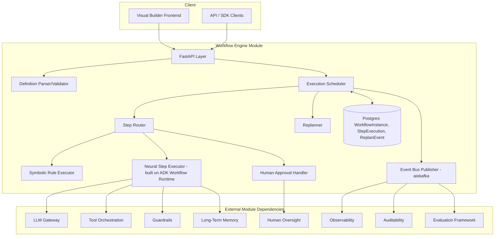
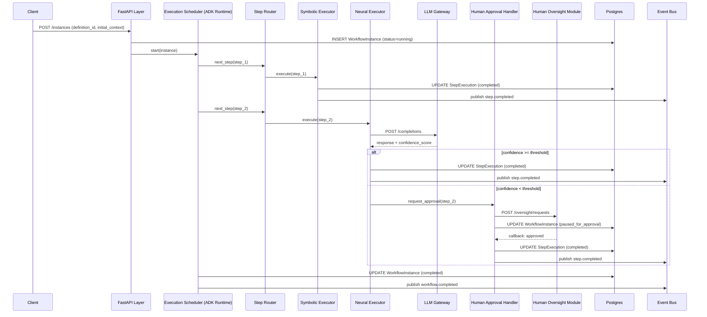
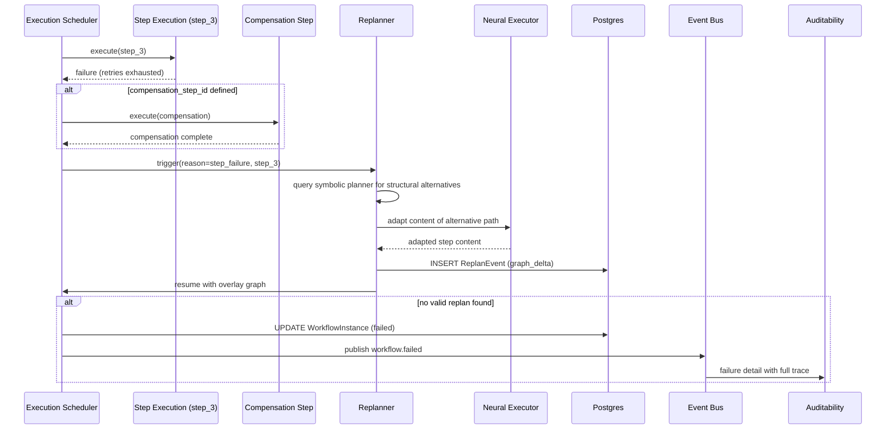
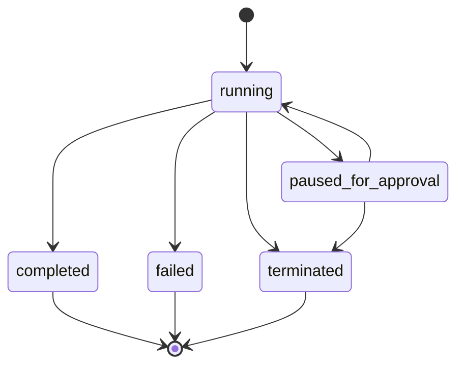
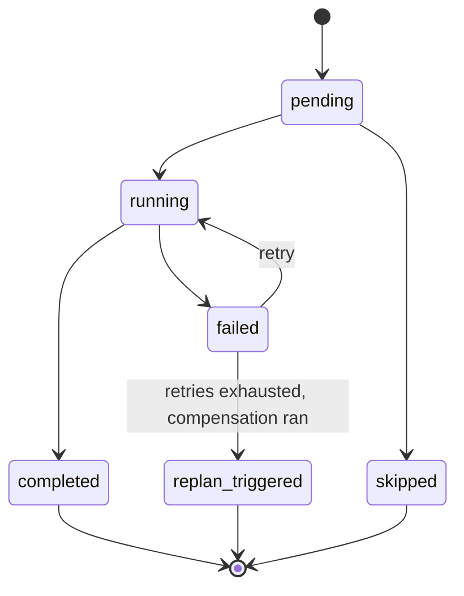

# Module 1: Workflow Engine — Complete Module Specification

This is the single, cohesive specification for the Workflow Engine module: what it does and why a customer buys it, what makes it better than a generic workflow engine, and the full low-level design needed to build, deploy and test it independently. Earlier separate documents covering this module's overview and differentiator features are superseded by this file.

## Overview and Commercial Value

| Description | Inputs | Outputs | Value | Key Metrics |
|---|---|---|---|---|
| Executes agent workflows as DAGs/graphs with drag-and-drop authoring, neurosymbolic step routing and confidence-gated autonomy | Workflow definition, trigger event, runtime context | Execution trace, step outputs, human-approval requests | Lets non-technical teams build and change workflows without engineering, while regulated steps stay deterministic; core reason a customer buys the platform over stitching frameworks together | Steps/sec, workflow success rate, human-approval wait time |

## Differentiator Features

Baseline (table stakes, expected in any competing platform): DAG execution, drag-and-drop builder, human-in-the-loop checkpoints, retry/compensation logic.

What makes this module genuinely better, not a generic equivalent:

- **Neurosymbolic step routing.** Deterministic symbolic rules decide which steps must follow fixed logic (regulatory, financial calculation, eligibility) versus which steps hand off to neural/LLM reasoning for ambiguous judgement. This is the pattern your own 3S Engine work already validates, and it is exactly what the industry is converging on for explainability in regulated sectors.
- **Workflow simulation sandbox (digital twin).** Run a proposed workflow change against replayed historical traffic before deploying, surfacing predicted failure points and cost delta.
- **Adaptive replanning mid-execution.** If a step fails or context changes, the engine replans the remaining DAG rather than failing the whole workflow, using a symbolic planner for the structural change and the LLM for content adaptation.
- **Confidence-gated autonomy levels.** Each workflow step carries a configurable autonomy threshold; below a confidence score it escalates to human review, above it proceeds unattended. This becomes a sellable governance feature, not just a technical one.

## Low-Level Design

Revision note: this design uses technical and sequence diagrams, a concrete telemetry/logging/tracing/alerting specification, and names the actual open source stack (Python, Google ADK, and supporting frameworks) rather than describing components abstractly.

### Level 1: Module Overview, Boundaries and Tech Stack

### Purpose

Executes agent workflows defined as directed graphs, combining deterministic symbolic step routing with neural/LLM-driven steps, human-in-the-loop checkpoints, and confidence-gated autonomy.

### Chosen Stack

| Concern | Choice | Why |
|---|---|---|
| Language/runtime | Python 3.12 | Matches the rest of the agent ecosystem, first-class ADK support |
| Agent/workflow runtime | Google ADK 2.0 (`google-adk` Python package), specifically its Workflow Runtime | ADK 2.0's Workflow Runtime is a graph-based execution engine natively supporting routing, fan-out/fan-in, loops, retry, state management, dynamic nodes, human-in-the-loop and nested workflows, which is exactly this module's required behaviour rather than something to build from scratch on top of a generic state machine library. Its Task API also gives us structured agent-to-agent delegation for free, useful when a step delegates to another platform agent. |
| API layer | FastAPI | Async-native, OpenAPI schema generation for free (feeds the SDK/Developer Portal module directly), strong typing via Pydantic |
| Symbolic rule engine | `durable-rules` or `Nools`-equivalent Python rule engine, alternatively a lightweight custom rule DSL compiled to Python callables if third-party engine proves too heavyweight | Deterministic evaluation, explainable by design |
| State store | PostgreSQL 16, accessed via SQLAlchemy 2.0 (async) | Transactional guarantees for WorkflowInstance/StepExecution, row-level locking for scheduler coordination |
| Event bus | Kafka (or Redpanda as a lighter-weight drop-in) via `aiokafka` | Durable async event delivery to Observability, Auditability, Evaluation Framework |
| Tracing | OpenTelemetry Python SDK, using the GenAI semantic conventions; ADK 2.0 ships built-in OTel instrumentation that we extend rather than replace | Vendor-neutral, integrates with Grafana Tempo/Jaeger/Datadog per customer's existing stack |
| Metrics | `prometheus-client` (Python), scraped by Prometheus, visualised in Grafana | Industry-standard, works in any cloud (cloud-agnostic requirement) |
| Logging | `structlog` configured for JSON output, correlated via trace_id | Structured logs are queryable and correlate directly to traces |
| Alerting | Prometheus Alertmanager rules, evaluated against the metrics above | Declarative, version-controlled alert definitions |
| Testing | `pytest`, `pytest-asyncio`, `testcontainers-python` (for real Postgres/Kafka in integration tests), ADK's built-in eval framework for any embedded agent behaviour | |

### Deployability and Testability Contract

Unchanged from v1: this module runs and tests fully with LLM Gateway, Tool Orchestration, Guardrails, Observability, Auditability, Human Oversight and Long-Term Memory stubbed via a docker-compose profile. Real Postgres and Kafka run locally via `testcontainers` in the integration test tier; unit tests use in-memory fakes only.

---

### Level 2: Component Architecture and Diagrams

### 2.1 Architecture Diagram



### 2.2 Sub-components

| Component | Responsibility | Built on |
|---|---|---|
| Definition Parser/Validator | Parses and validates workflow schema, checks for cycles/dead ends | Pydantic models, `networkx` for cycle detection |
| Execution Scheduler | Determines next runnable step(s), manages parallel branches and timeouts | ADK 2.0 Workflow Runtime graph executor |
| Step Router | Classifies each step symbolic/neural/human at runtime | Custom logic reading step config, wraps ADK routing primitives |
| Symbolic Rule Executor | Evaluates deterministic rules | Python rule engine (see stack table) |
| Neural Step Executor | Invokes LLM/tool/agent calls for ambiguous-judgement steps | ADK `Agent` and `Task API` for delegation, calling out to LLM Gateway rather than a model provider directly |
| Human Approval Handler | Raises and tracks approval requests | ADK's native human-in-the-loop node type, wired to Human Oversight module |
| Replanner | Structural and content adaptation on failure | Symbolic planner (rule engine) plus ADK Agent call for content adaptation |
| State Store Adapter | Persistence, optimistic concurrency | SQLAlchemy 2.0 async, row-level locking |
| Event Bus Publisher | Async lifecycle event emission | `aiokafka` producer |

---

### Level 3: Detailed Design

### 3.1 Data Model

Unchanged from v1 (WorkflowDefinition, WorkflowInstance, StepExecution, ApprovalRequest, ReplanEvent), implemented as SQLAlchemy 2.0 declarative models with Alembic migrations.

| Entity | Key fields |
|---|---|
| WorkflowDefinition | id, name, version, status (draft/published/deprecated), graph_schema (JSON), tenant_id, created_by, created_at, published_at |
| WorkflowInstance | id, definition_id, definition_version, status, current_step_ids, context (JSONB), tenant_id, started_at, completed_at, trace_id |
| StepExecution | id, instance_id, step_id, execution_mode, status, input_snapshot, output, confidence_score, retry_count, started_at, completed_at |
| ApprovalRequest | id, step_execution_id, human_oversight_ref_id, status, requested_at, resolved_at |
| ReplanEvent | id, instance_id, trigger_reason, original_step_id, new_graph_delta, created_at |

### 3.2 Workflow Definition Schema

```json
{
  "nodes": [
    {
      "id": "step_1",
      "type": "task",
      "execution_mode": "symbolic | neural | human | auto",
      "confidence_threshold": 0.85,
      "config": {
        "symbolic_rule_ref": "rule_id (if execution_mode=symbolic)",
        "agent_ref": "agent_id (if execution_mode=neural)",
        "tool_refs": ["tool_id_1"],
        "approval_policy_ref": "policy_id (if execution_mode=human)"
      },
      "retry_policy": {
        "max_retries": 3,
        "backoff_strategy": "exponential",
        "compensation_step_id": "step_1_compensate"
      },
      "timeout_seconds": 30
    }
  ],
  "edges": [
    { "from": "step_1", "to": "step_2", "condition": "expression or null for unconditional" }
  ],
  "entry_point": "step_1",
  "termination_points": ["step_final"]
}
```

This schema maps directly onto an ADK 2.0 Workflow Runtime graph definition at load time. The Definition Parser translates our platform-level schema (which adds `execution_mode`, `confidence_threshold`, tenant-scoping and `approval_policy_ref`) into the underlying ADK graph representation, so the platform schema stays a stable public contract even if the underlying ADK graph representation changes across ADK versions.

### 3.3 API Surface

| Endpoint | Method | Request (key fields) | Response (key fields) | Notes |
|---|---|---|---|---|
| `/v1/workflow-engine/definitions` | POST | name, graph_schema | id, version, status | Creates a draft definition |
| `/v1/workflow-engine/definitions/{id}/publish` | POST | (none) | status, published_at | Validates graph before publishing; immutable after |
| `/v1/workflow-engine/definitions/{id}` | GET | (none) | full WorkflowDefinition | |
| `/v1/workflow-engine/instances` | POST | definition_id, definition_version (optional), initial_context | id, status, trace_id | Starts execution |
| `/v1/workflow-engine/instances/{id}` | GET | (none) | full WorkflowInstance with step summaries | |
| `/v1/workflow-engine/instances/{id}/steps` | GET | (none) | StepExecution[] | |
| `/v1/workflow-engine/instances/{id}/pause` | POST | reason | status | Operator-triggered pause |
| `/v1/workflow-engine/instances/{id}/resume` | POST | (none) | status | |
| `/v1/workflow-engine/instances/{id}/terminate` | POST | reason | status | Terminal, not resumable |
| `/v1/workflow-engine/instances/{id}/approvals/{approval_id}/callback` | POST | decision, resolved_by | status | Called by Human Oversight module on resolution |

FastAPI auto-generates the OpenAPI spec from these routers, consumed directly by the SDK and Developer Portal module.

### 3.4 Sequence Diagram: Standard Execution with Neural Step and Human Checkpoint



### 3.5 Sequence Diagram: Step Failure Triggering Replan



### 3.6 State Diagrams





---

### Level 4: Telemetry, Logging, Tracing, Alerting, Configuration and Testing

### 4.1 Tracing (OpenTelemetry, GenAI semantic conventions)

Every WorkflowInstance gets a root trace (`trace_id` generated at creation, propagated as a header/context value to every downstream call: LLM Gateway, Tool Orchestration, Guardrails, Human Oversight). Span naming follows the OTel GenAI semantic conventions plus platform-specific extensions:

| Span name | Attributes |
|---|---|
| `workflow.instance.execute` | `workflow.instance_id`, `workflow.definition_id`, `workflow.definition_version`, `tenant.id` |
| `workflow.step.execute` | `workflow.step_id`, `workflow.execution_mode`, `workflow.confidence_score` (neural only), `workflow.retry_count` |
| `gen_ai.agent.invoke` (ADK-emitted, extended) | `gen_ai.agent.name`, `gen_ai.request.model`, `gen_ai.usage.input_tokens`, `gen_ai.usage.output_tokens` |
| `workflow.replan.trigger` | `workflow.replan.reason`, `workflow.replan.original_step_id` |
| `workflow.approval.request` | `workflow.approval.step_execution_id`, `workflow.approval.timeout_seconds` |

ADK 2.0's built-in OTel instrumentation is used for the `gen_ai.*` spans emitted inside the Neural Step Executor; the module's own spans wrap around these so a full trace shows workflow-level context and agent-level detail in one continuous tree, exportable to Grafana Tempo, Jaeger, Langfuse or Arize depending on what the customer already runs (cloud-agnostic requirement satisfied via standard OTLP export).

### 4.2 Logging

`structlog` configured for JSON line output, every log entry carries: `trace_id`, `tenant_id`, `workflow_instance_id`, `step_id` (where applicable), `event`, `level`. No prompt or response content is logged at INFO level (goes to trace span attributes instead, subject to Guardrails redaction policy); DEBUG level may include truncated content behind a per-tenant feature flag for troubleshooting, never enabled by default in production.

| Level | Example events |
|---|---|
| ERROR | Step execution failure after retries exhausted, replan failure, database write failure |
| WARN | Confidence below threshold triggering human escalation, retry attempt, approval timeout |
| INFO | Workflow instance created/completed, step started/completed, replan triggered |
| DEBUG | Full step input/output snapshot (feature-flagged only) |

### 4.3 Metrics (Prometheus)

| Metric | Type | Labels |
|---|---|---|
| `workflow_steps_total` | Counter | `tenant_id`, `execution_mode`, `status` |
| `workflow_step_duration_seconds` | Histogram | `tenant_id`, `execution_mode` |
| `workflow_orchestration_overhead_seconds` | Histogram | `tenant_id` (measures scheduler time excluding downstream call time, validated against the sub-50ms target) |
| `workflow_instances_active` | Gauge | `tenant_id`, `status` |
| `workflow_approval_wait_seconds` | Histogram | `tenant_id` |
| `workflow_replan_total` | Counter | `tenant_id`, `trigger_reason`, `outcome` |
| `workflow_event_publish_failures_total` | Counter | `tenant_id`, `destination` |

### 4.4 Alerting (Prometheus Alertmanager rules, examples)

| Alert | Condition | Severity |
|---|---|---|
| WorkflowOrchestrationOverheadHigh | p95 of `workflow_orchestration_overhead_seconds` > 0.05 for 5 minutes | Warning |
| WorkflowStepFailureRateHigh | `rate(workflow_steps_total{status="failed"}[5m])` / `rate(workflow_steps_total[5m])` > 0.05 | Critical |
| WorkflowEventPublishFailing | `increase(workflow_event_publish_failures_total[10m])` > 0 | Warning (does not block execution, but must be surfaced since Auditability/Observability data is at risk) |
| WorkflowApprovalBacklog | `workflow_instances_active{status="paused_for_approval"}` > tenant-configured threshold | Warning |
| WorkflowReplanExhaustion | `rate(workflow_replan_total{outcome="no_valid_replan"}[15m])` > 0 | Critical |

Alert routing (which team, which channel, escalation policy) is left to the customer's own Alertmanager configuration; this module ships the alert rule definitions as a versioned YAML file, not a hardcoded destination.

### 4.5 Configuration Schema

```yaml
workflow_engine:
  tenant_id: "<tenant>"
  execution:
    default_confidence_threshold: 0.85   # hot-reloadable
    max_parallel_steps_per_instance: 10
    default_step_timeout_seconds: 30
    default_retry_policy:
      max_retries: 3
      backoff_strategy: exponential      # exponential | fixed | none
  replanning:
    enabled: true                        # hot-reloadable
    max_replan_attempts_per_instance: 2
  human_oversight:
    default_approval_timeout_seconds: 86400
    escalation_on_timeout: true
  simulation_sandbox:
    enabled: true                        # feature flag
  event_publishing:
    destinations: ["observability", "auditability", "evaluation_framework"]
    async_delivery: true
    retry_on_publish_failure: true
  telemetry:
    otlp_endpoint: "<customer-configured, e.g. http://tempo:4317>"
    log_level: "INFO"                    # hot-reloadable
    debug_content_logging: false         # feature flag, per-tenant, default false
```

Configuration is validated against a JSON Schema (via Pydantic Settings) at load time; invalid configuration fails startup, but hot-reloadable values change at runtime via the config API without restart, with change events published to Auditability.

### 4.6 Deployment Specification

- Packaged as a stateless container image (multi-stage `Dockerfile`, Python 3.12-slim base); all state in Postgres and Kafka.
- Horizontal scaling: multiple Execution Scheduler instances coordinate via `SELECT FOR UPDATE SKIP LOCKED` on pending work items, avoiding double-execution.
- `/healthz` verifies Postgres and Kafka connectivity separately, reporting degraded rather than binary pass/fail.
- Resource profile target: 2 vCPU / 4GB baseline, horizontal autoscale on queue depth (pending steps), not CPU alone, since the workload is I/O-bound.
- Deployable via Kubernetes (Helm chart) on any cloud, or via the Deployment Strategy module's canary pipeline.

### 4.7 Versioning and Integration Contracts

Unchanged from v1: API versioned via URL path, WorkflowDefinition versions immutable, event schemas additive-only within a major version. Integration contracts to LLM Gateway, Tool Orchestration, Guardrails, Human Oversight, Observability, Auditability, Evaluation Framework and Long-Term Memory are each defined as a versioned OpenAPI or async event schema stored in a shared schema registry.

### 4.8 Testing Strategy

| Level | Tooling |
|---|---|
| Unit | `pytest`, `pytest-asyncio`, in-memory fakes |
| Contract | `schemathesis` against the OpenAPI spec; consumer-driven contract tests for the async event schemas |
| Integration (isolated) | `docker-compose` with stub modules, `testcontainers-python` for real Postgres and Kafka |
| Integration (cross-module) | Shared nightly environment, not part of this module's own CI gate |
| Chaos | `toxiproxy` for simulated dependency latency/failure, ADK's own eval harness for agent-level behaviour under degraded conditions |
| Load | `locust` against the FastAPI layer, validated against the orchestration overhead target |

### 4.9 Configurability Principle

Every behaviour that could reasonably differ by tenant or workflow is exposed as configuration, following a tiered override order: platform default to tenant to definition to step. Confidence thresholds, retry/backoff policy, replanning enablement, simulation sandbox, event publishing destinations and approval timeout/escalation all follow this pattern. This resolution order is the standard other modules should follow for platform-wide consistency.

### 4.10 Non-Functional Targets

| Attribute | Target |
|---|---|
| Orchestration overhead per step transition | Under 50ms (excludes downstream call time) |
| Availability | 99.9% for the API layer, independent of downstream module availability where possible |
| Data durability | WorkflowInstance and StepExecution durable on write (synchronous Postgres commit) before acknowledging step completion |
| Multi-tenancy isolation | Enforced at the database query layer (tenant_id predicate on every query), verified by automated isolation tests in CI |
| Horizontal scalability | Linear scaling of Execution Scheduler instances up to database connection pool limits |
