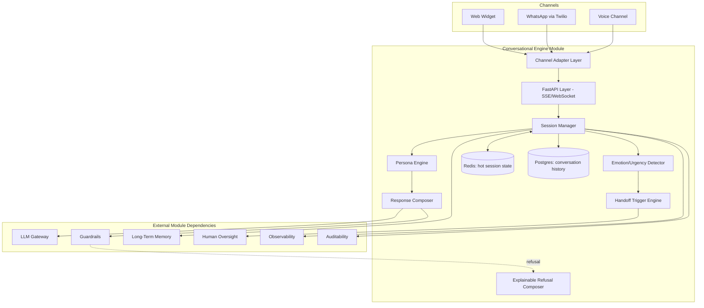
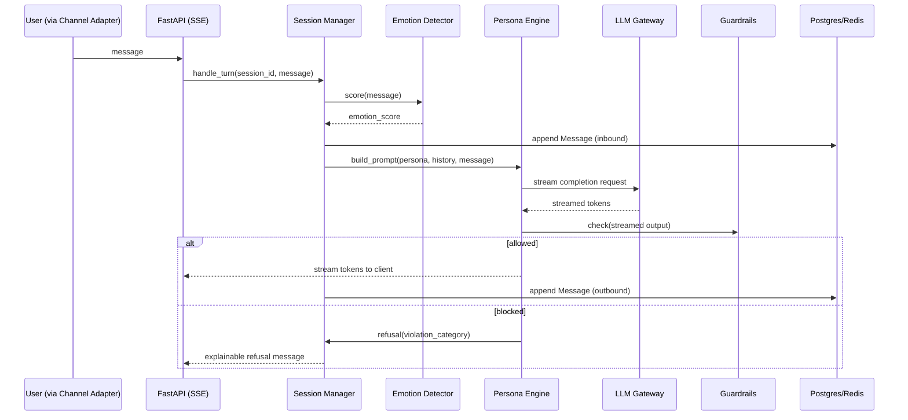
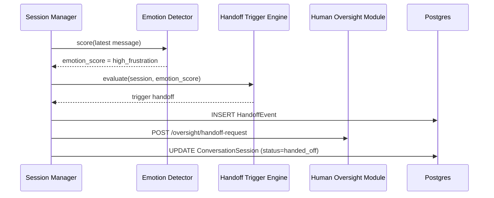
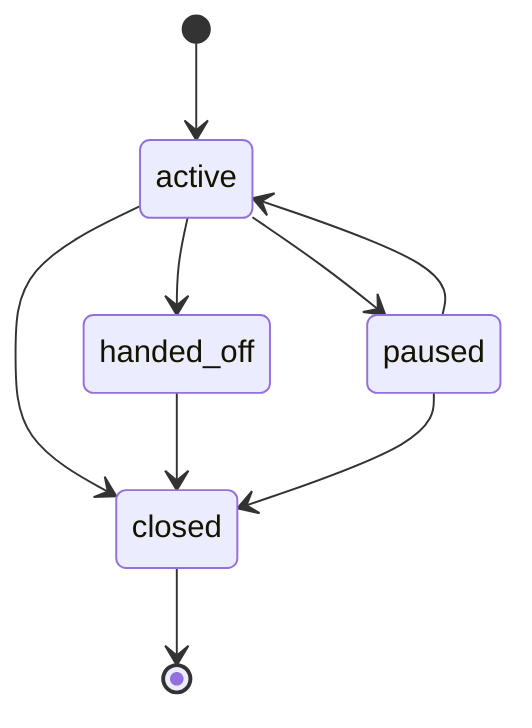

# Module 2: Conversational Engine — Complete Module Specification

## Overview and Commercial Value

| Description | Inputs | Outputs | Value | Key Metrics |
|---|---|---|---|---|
| Multi-turn dialogue management with persona control, multi-channel adaptation, emotional/urgency-aware routing and cross-session identity continuity | User utterance, session ID, channel type, conversation history | Response (text/audio), updated dialogue state, handoff signal | Consistent conversational quality across channels without rebuilding logic per channel; the module customers interact with most, so its polish drives renewal | Turn completion rate, handoff rate, session length |

## Differentiator Features

Baseline (table stakes): multi-turn state, persona control, multi-channel support, handoff triggers.

What makes this module genuinely better:

- **Emotional and urgency-aware routing.** Detects escalating frustration or urgency signals and re-prioritises handoff or response strategy, not just intent, so a customer in distress gets faster escalation than a routine query.
- **Cross-session identity continuity.** Recognises a returning user across channels (web, voice, WhatsApp) and resumes context without re-asking, drawing on Long-Term Memory rather than treating every channel as a fresh start.
- **Explainable refusal.** When the engine declines a request (policy, guardrail, out of scope), it gives a reason traceable to a specific rule, useful for both UX (the user understands why) and audit (compliance can see exactly which rule fired).

## Low-Level Design

### Level 1: Module Overview, Boundaries and Tech Stack

**Purpose.** Owns the dialogue layer: turn management, streaming response delivery, persona/tone enforcement, channel adaptation, and the decision of when to hand off to a human or another agent. Delegates actual language generation to LLM Gateway, retrieval to Agentic RAG/Context Engineering, and policy decisions to Guardrails; this module orchestrates those calls within a conversation, it does not duplicate their logic.

**Chosen stack**

| Concern | Choice | Why |
|---|---|---|
| Language/runtime | Python 3.12 | Consistency with the rest of the platform |
| Agent runtime | Google ADK 2.0 `Agent` with session/state primitives | ADK's session management and streaming response handling map directly onto multi-turn dialogue needs, avoiding a bespoke state machine |
| API/streaming layer | FastAPI with Server-Sent Events (SSE) for text streaming, WebSocket for voice/bidirectional channels | SSE is simpler and sufficient for most text UIs; WebSocket needed for low-latency voice turn-taking |
| Session state (hot) | Redis | Sub-millisecond read/write for active session state, natural TTL for session expiry |
| Conversation history (durable) | PostgreSQL 16 via SQLAlchemy 2.0 async | Durable record for audit, analytics and cross-session continuity lookups |
| Emotion/urgency detection | Lightweight classifier (fine-tuned small model or LLM-based classification call via LLM Gateway), not a separate heavyweight service | Keeps latency low; this is a signal, not the primary generation path |
| Channel adapters | Pluggable adapter pattern; Twilio SDK for WhatsApp/voice, custom widget SDK for web | Each channel's quirks isolated behind a common internal interface |
| Testing | `pytest`, `pytest-asyncio`, `testcontainers-python` for Redis/Postgres, `ADK` eval harness for persona/tone regression | |

**Deployability and testability contract.** Runs and tests fully with LLM Gateway, Guardrails, Long-Term Memory, Human Oversight (for handoff), Observability and Auditability stubbed. Real Redis and Postgres via `testcontainers` in integration tests.

### Level 2: Component Architecture and Diagrams



**Sub-components**

| Component | Responsibility | Built on |
|---|---|---|
| Channel Adapter Layer | Normalises inbound/outbound messages per channel | Twilio SDK, custom web SDK, common internal message schema |
| Session Manager | Owns session lifecycle, coordinates the turn | ADK `Agent` session primitives |
| Persona Engine | Applies tone/persona configuration to prompts sent to LLM Gateway | Config-driven prompt templating |
| Emotion/Urgency Detector | Scores each inbound message for frustration/urgency | Lightweight classifier or LLM Gateway call with a small model |
| Response Composer | Assembles the outbound turn, applies streaming | ADK streaming response handling |
| Handoff Trigger Engine | Decides when to escalate to human or another agent | Rule-based on emotion score, explicit request, or repeated guardrail refusals |
| Explainable Refusal Composer | Turns a Guardrails block decision into a user-facing, rule-traceable message | Template mapped to Guardrails violation category |

### Level 3: Detailed Design

**Data model**

| Entity | Key fields |
|---|---|
| ConversationSession | id, tenant_id, channel, user_ref (opaque identity, not raw PII), status (active/paused/handed_off/closed), persona_config_ref, created_at, last_activity_at, trace_id |
| Message | id, session_id, direction (inbound/outbound), content, emotion_score, guardrail_check_result, created_at |
| HandoffEvent | id, session_id, trigger_reason (emotion/explicit/repeated_refusal), target (human/agent_id), created_at |
| PersonaConfig | id, tenant_id, name, tone_settings (JSONB), allowed_topics, denied_topics |

**API surface**

| Endpoint | Method | Request | Response | Notes |
|---|---|---|---|---|
| `/v1/conversational-engine/sessions` | POST | channel, persona_config_ref, initial_context | id, status | Creates a session |
| `/v1/conversational-engine/sessions/{id}/messages` | POST | content | streamed response (SSE) or single response | Main turn endpoint |
| `/v1/conversational-engine/sessions/{id}` | GET | (none) | full session with message history | |
| `/v1/conversational-engine/sessions/{id}/handoff` | POST | reason | status, handoff_event_id | Manual or triggered handoff |
| `/v1/conversational-engine/sessions/{id}/close` | POST | (none) | status | |

**Sequence: standard turn with streaming response**



**Sequence: escalating frustration triggering handoff**



**State diagram**



### Level 4: Telemetry, Logging, Tracing, Alerting, Configuration and Testing

**Tracing.** Root trace per session (`trace_id`), one span per turn (`conversation.turn.process`) with attributes `session.id`, `channel`, `emotion_score`, `guardrail_result`. Nested `gen_ai.*` spans from the LLM Gateway call inherit the same trace context.

**Logging.** `structlog` JSON, fields: `trace_id`, `tenant_id`, `session_id`, `channel`, `event`, `level`. Message content logged at DEBUG only, feature-flagged per tenant, never by default.

**Metrics (Prometheus)**

| Metric | Type | Labels |
|---|---|---|
| `conversation_turns_total` | Counter | `tenant_id`, `channel`, `outcome` (completed/refused/error) |
| `conversation_turn_duration_seconds` | Histogram | `tenant_id`, `channel` |
| `conversation_time_to_first_token_seconds` | Histogram | `tenant_id`, `channel` |
| `conversation_handoff_total` | Counter | `tenant_id`, `trigger_reason` |
| `conversation_sessions_active` | Gauge | `tenant_id`, `channel` |

**Alerting**

| Alert | Condition | Severity |
|---|---|---|
| ConversationTimeToFirstTokenHigh | p95 of `conversation_time_to_first_token_seconds` > 0.3 for 5 minutes | Warning |
| ConversationHandoffRateSpike | `rate(conversation_handoff_total[15m])` more than 2x the 24h baseline | Warning |
| ConversationRefusalRateHigh | Refused-turn ratio > 10% over 15 minutes | Warning (may indicate a guardrail misconfiguration, not necessarily bad) |

**Configuration**

```yaml
conversational_engine:
  tenant_id: "<tenant>"
  session:
    ttl_seconds: 1800              # hot-reloadable, Redis session expiry
    cross_channel_continuity: true # feature flag, requires Long-Term Memory
  persona:
    default_persona_config_ref: "<id>"
  handoff:
    emotion_score_threshold: 0.75  # hot-reloadable
    repeated_refusal_threshold: 3
  streaming:
    protocol: "sse"                # sse | websocket, per channel override
  telemetry:
    otlp_endpoint: "<customer-configured>"
    debug_content_logging: false
```

**Deployment.** Stateless container, horizontal autoscale on active session count and turn throughput. `/healthz` checks Redis, Postgres and LLM Gateway reachability separately.

**Testing**

| Level | Tooling |
|---|---|
| Unit | `pytest`, `pytest-asyncio` |
| Contract | `schemathesis` against OpenAPI spec |
| Integration (isolated) | `docker-compose` with stubbed LLM Gateway/Guardrails/Long-Term Memory, `testcontainers` for Redis/Postgres |
| Persona/tone regression | ADK eval harness with a fixed persona test suite, run in CI |
| Load | `locust`, targeting time-to-first-token and concurrent session limits |

**Non-functional targets**

| Attribute | Target |
|---|---|
| Time to first token | Under 300ms |
| Full turn (text) | Under 2s |
| Availability | 99.9% |
| Cross-channel continuity lookup | Under 100ms |
