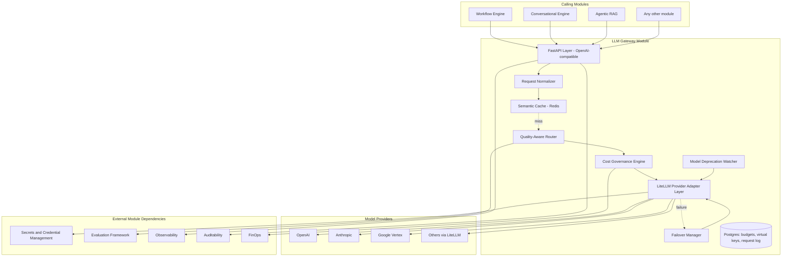
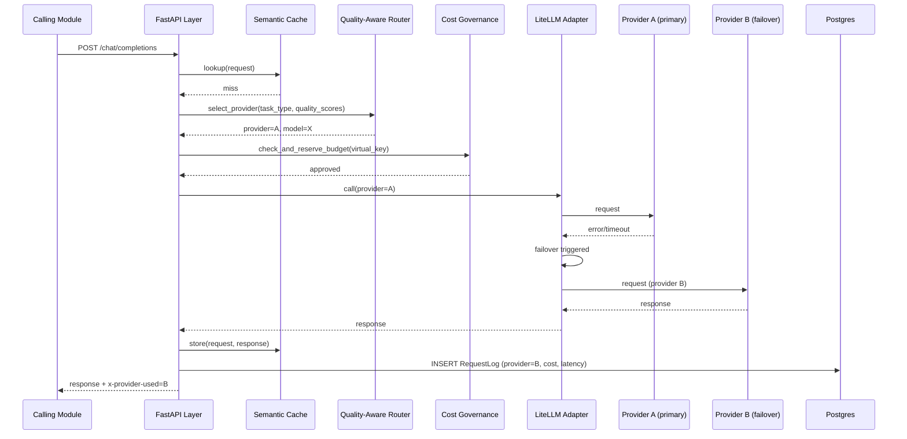
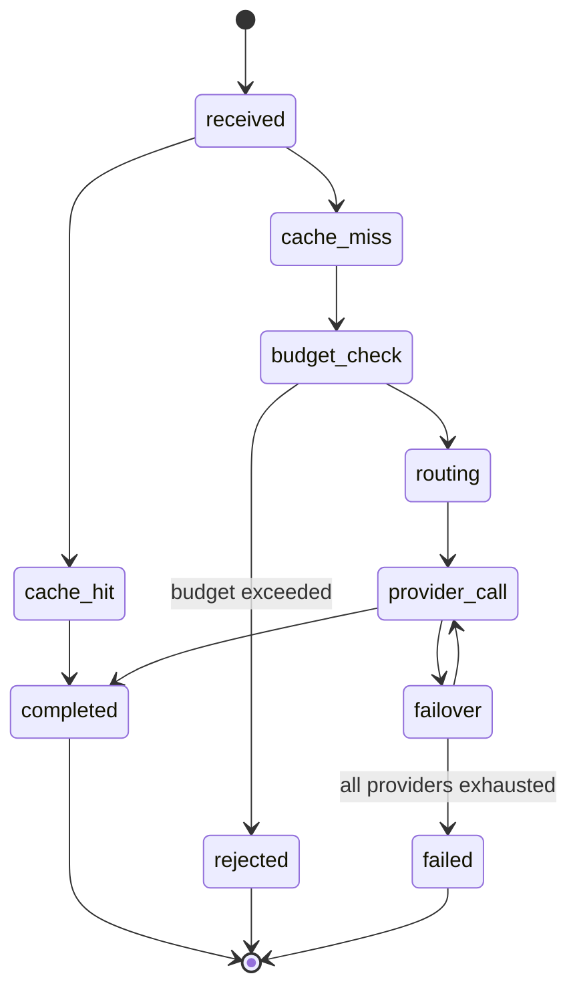

# Module 3: LLM Gateway — Complete Module Specification

## Overview and Commercial Value

| Description | Inputs | Outputs | Value | Key Metrics |
|---|---|---|---|---|
| Single entry point routing to 20+ model providers with failover, quality-aware routing and semantic caching | Model request, budget context | Model response, provider used, cost, cache flag | Removes vendor lock-in and gives cost control immediately visible to finance stakeholders | Requests/sec, cache hit rate, cost per request, provider availability |

## Differentiator Features

Baseline (table stakes): multi-provider routing, failover, cost governance, caching.

What makes this module genuinely better:

- **Quality-aware routing, not just cost/latency routing.** Routes based on live quality scores per provider/model per task type, learned from the Evaluation Framework's own scoring, not just static published benchmarks.
- **Model deprecation early-warning.** Detects when a provider is about to sunset a model version and pre-stages a migration path automatically, avoiding the production breakage that hits teams who only find out from an error response.
- **Semantic caching with staleness awareness.** Cache invalidates based on detected drift in underlying data, not just a fixed TTL, avoiding a common production failure mode where stale cached answers persist past their useful life.

## Low-Level Design

### Level 1: Module Overview, Boundaries and Tech Stack

**Purpose.** The only module permitted to call model providers directly. Every other module that needs LLM inference goes through this gateway, never to a provider SDK directly, which is what makes provider swaps, cost governance and quality routing possible platform-wide.

**Chosen stack**

| Concern | Choice | Why |
|---|---|---|
| Language/runtime | Python 3.12 | Consistency with the platform; async I/O is sufficient for gateway overhead targets given the dominant cost is provider latency, not our own processing |
| Provider abstraction | LiteLLM (open source) as the underlying multi-provider adapter layer | Mature, actively maintained, unifies 100+ providers behind one interface, avoids reinventing provider-specific request/response translation |
| API layer | FastAPI, OpenAI-compatible request/response schema | Lets any existing OpenAI-SDK-based client point at this gateway with a base URL change, a genuine adoption accelerant |
| Cache | Redis with vector similarity search (RedisVL or similar) for semantic caching | Sub-millisecond lookups, native support for both exact-match and semantic similarity caching in one store |
| Cost/budget state | PostgreSQL 16 via SQLAlchemy 2.0 async | Transactional budget decrement, auditable spend history |
| Quality score feed | Consumed from Evaluation Framework via event bus, stored in Redis for fast routing-time lookup | Routing decisions must be sub-millisecond; Postgres would be too slow for the hot path |
| Secrets (provider API keys) | Delegated to Secrets and Credential Management module, never stored locally | Avoids duplicating a security-sensitive concern |
| Testing | `pytest`, `pytest-asyncio`, `respx` for mocking provider HTTP calls, `testcontainers` for Redis/Postgres | |

**Deployability and testability contract.** Runs and tests fully with all model providers mocked via `respx`, Secrets and Credential Management stubbed to return fake keys, Evaluation Framework's quality feed stubbed with canned scores.

### Level 2: Component Architecture and Diagrams



**Sub-components**

| Component | Responsibility | Built on |
|---|---|---|
| Request Normalizer | Converts caller request into internal canonical form | Pydantic models |
| Semantic Cache | Checks for cached response by exact or semantic match | Redis + RedisVL |
| Quality-Aware Router | Picks provider/model based on quality score, cost, latency and availability | Custom scoring function, weights configurable |
| Cost Governance Engine | Checks and decrements budget before allowing the call | Postgres transactional budget table |
| Failover Manager | Retries against an alternate provider on failure | LiteLLM's built-in failover, wrapped with platform-specific retry policy |
| LiteLLM Provider Adapter Layer | Actual provider API calls | LiteLLM library |
| Model Deprecation Watcher | Periodically checks provider changelogs/APIs for sunset notices | Scheduled job, alerts DepWatch findings to platform operators |

### Level 3: Detailed Design

**Data model**

| Entity | Key fields |
|---|---|
| VirtualKey | id, tenant_id, provider_scope, budget_policy_ref, status (active/revoked), created_at |
| BudgetPolicy | id, tenant_id, period (daily/monthly), limit_amount, current_spend, alert_threshold_pct |
| RequestLog | id, tenant_id, virtual_key_id, provider, model, input_tokens, output_tokens, cost, cache_hit, latency_ms, created_at |
| ProviderConfig | id, provider_name, endpoint, priority, health_status, deprecation_notices (JSONB) |

**API surface**

| Endpoint | Method | Request | Response | Notes |
|---|---|---|---|---|
| `/v1/llm-gateway/chat/completions` | POST | OpenAI-compatible schema plus optional `routing_hints` | OpenAI-compatible response plus `x-provider-used`, `x-cache-hit`, `x-cost` headers | Streaming supported via SSE |
| `/v1/llm-gateway/embeddings` | POST | OpenAI-compatible schema | embeddings response | |
| `/v1/llm-gateway/admin/virtual-keys` | POST/GET | tenant_id, budget_policy_ref | VirtualKey | Admin-scoped |
| `/v1/llm-gateway/admin/budgets/{id}` | GET | (none) | current spend, limit, alert status | |
| `/v1/llm-gateway/admin/providers` | GET | (none) | provider health and deprecation notices | |

**Sequence: request with cache miss, quality-aware routing, and provider failover**



**State diagram: request lifecycle**



### Level 4: Telemetry, Logging, Tracing, Alerting, Configuration and Testing

**Tracing.** Spans follow OTel GenAI semantic conventions natively: `gen_ai.client.chat` per call, attributes `gen_ai.request.model`, `gen_ai.response.model` (may differ on failover), `gen_ai.usage.input_tokens`, `gen_ai.usage.output_tokens`, plus platform extensions `llm_gateway.cache_hit`, `llm_gateway.provider_used`, `llm_gateway.cost`.

**Logging.** `structlog` JSON: `trace_id`, `tenant_id`, `virtual_key_id`, `provider`, `model`, `cache_hit`, `cost`, `latency_ms`, `event`. Prompt/response content never logged at INFO; DEBUG only, feature-flagged, and always subject to the same redaction policy as Guardrails.

**Metrics (Prometheus)**

| Metric | Type | Labels |
|---|---|---|
| `llm_gateway_requests_total` | Counter | `tenant_id`, `provider`, `model`, `outcome` |
| `llm_gateway_request_duration_seconds` | Histogram | `provider`, `model` |
| `llm_gateway_overhead_seconds` | Histogram | (gateway-added latency only, excludes provider inference time) |
| `llm_gateway_cache_hit_ratio` | Gauge | `tenant_id` |
| `llm_gateway_cost_total` | Counter | `tenant_id`, `provider`, `model` |
| `llm_gateway_failover_total` | Counter | `from_provider`, `to_provider` |
| `llm_gateway_budget_utilisation_ratio` | Gauge | `tenant_id`, `budget_policy_id` |

**Alerting**

| Alert | Condition | Severity |
|---|---|---|
| LLMGatewayOverheadHigh | p95 of `llm_gateway_overhead_seconds` > 0.015 for 5 minutes | Warning |
| LLMGatewayProviderDown | Provider health check failing for 2 consecutive minutes | Critical |
| LLMGatewayBudgetNearLimit | `llm_gateway_budget_utilisation_ratio` > alert_threshold_pct | Warning |
| LLMGatewayCacheHitRateDrop | 24h cache hit ratio drops more than 30% relative to 7-day baseline | Warning (may indicate staleness detection over-triggering) |
| LLMGatewayDeprecationNoticeDetected | Model Deprecation Watcher finds a new sunset notice | Informational, routed to platform operators |

**Configuration**

```yaml
llm_gateway:
  tenant_id: "<tenant>"
  routing:
    strategy: "quality_weighted"     # quality_weighted | cost_optimised | latency_optimised
    quality_weight: 0.5              # hot-reloadable, must sum sensibly with cost/latency weights
    cost_weight: 0.3
    latency_weight: 0.2
  cache:
    semantic_cache_enabled: true
    similarity_threshold: 0.92       # hot-reloadable
    staleness_detection_enabled: true
  failover:
    max_provider_attempts: 3
    provider_priority_override: []   # optional per-tenant provider preference order
  budget:
    enforce_hard_limit: true         # if false, alert only, do not block
  telemetry:
    otlp_endpoint: "<customer-configured>"
    debug_content_logging: false
```

**Deployment.** Stateless container, horizontal autoscale on requests/sec. `/healthz` checks Redis, Postgres and at least one provider reachability. Given this module sits on the hot path for nearly every other module, deploy with a higher replica floor and stricter SLO than most other modules.

**Testing**

| Level | Tooling |
|---|---|
| Unit | `pytest`, `pytest-asyncio` |
| Contract | `schemathesis` against the OpenAI-compatible OpenAPI spec, verifying drop-in compatibility |
| Integration (isolated) | `respx` to mock all provider HTTP calls, `testcontainers` for Redis/Postgres |
| Failover/chaos | `toxiproxy` simulating provider timeout/error, verifying failover and budget-check behaviour under failure |
| Load | `locust`, validated against the sub-15ms gateway overhead target at target requests/sec |

**Non-functional targets**

| Attribute | Target |
|---|---|
| Gateway overhead per request | Under 15ms (excludes provider inference time) |
| Availability | 99.95% (higher than most modules given hot-path position) |
| Cache lookup latency | Under 5ms |
| Budget check latency | Under 10ms |
