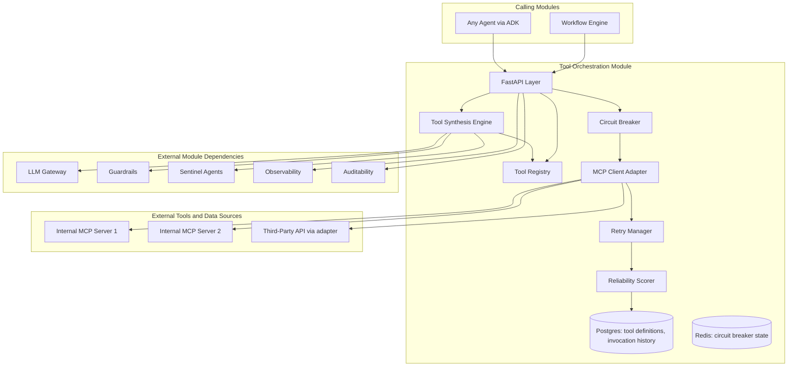
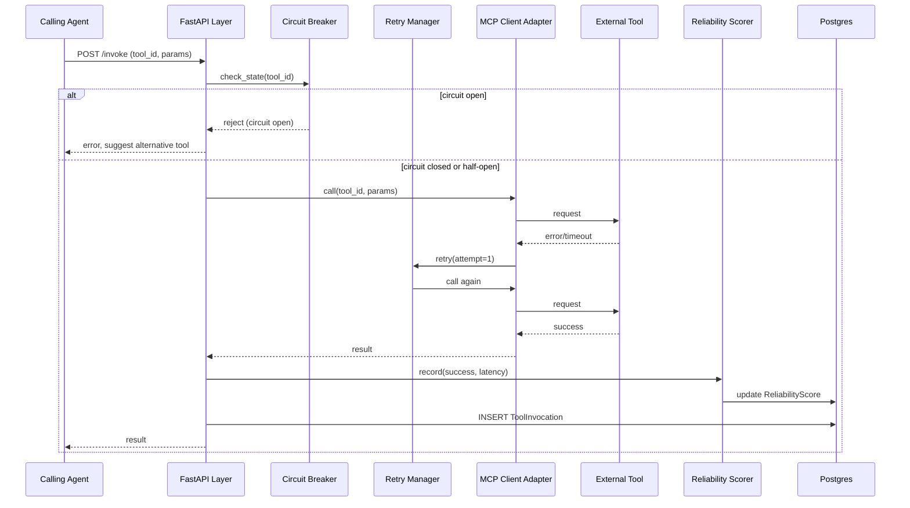
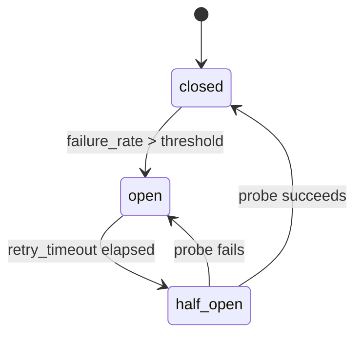

# Module 4: Tool Orchestration — Complete Module Specification

## Overview and Commercial Value

| Description | Inputs | Outputs | Value | Key Metrics |
|---|---|---|---|---|
| Discovery, invocation, retry and reliability-scored routing for external tools | Tool call request, agent context | Tool result, retry status, execution metadata | Reduces agent failure from flaky third-party tools without manual intervention | Tool success rate, retries per call, latency by tool |

## Differentiator Features

Baseline (table stakes): tool discovery, invocation, retries.

What makes this module genuinely better:

- **Tool reliability scoring feeding routing decisions.** Flaky third-party tools are automatically deprioritised in favour of equivalent alternatives, learned from real invocation history rather than a static preference list someone has to maintain.
- **Just-in-time tool synthesis.** For narrow, well-specified gaps, the platform can compose a new tool from existing primitives (an API call plus a transform, for example) rather than requiring a developer to build one, subject to Guardrail and Sentinel Agent review before activation, so this stays a safe capability rather than an open door.

## Low-Level Design

### Level 1: Module Overview, Boundaries and Tech Stack

**Purpose.** The single point through which every agent action against an external tool passes. Agents never call a third-party API directly; they call this module, which handles discovery, invocation, retries, reliability scoring and (for well-specified gaps) synthesis of new tools from existing primitives.

**Chosen stack**

| Concern | Choice | Why |
|---|---|---|
| Language/runtime | Python 3.12 | Platform consistency |
| Tool protocol | Model Context Protocol (MCP), via the official `mcp` Python SDK, and Google ADK's native MCP toolset integration | MCP is the emerging cross-industry standard for agent-to-tool connections; building on it rather than a proprietary tool interface is what makes tools portable across the ecosystem, not locked to this platform |
| API layer | FastAPI | Consistency, OpenAPI generation for the Developer Portal |
| Tool registry | PostgreSQL 16 via SQLAlchemy 2.0 async | Durable tool definitions, reliability score history |
| Circuit breaker state | Redis | Fast read/write for per-tool circuit state, natural TTL for half-open retry windows |
| Tool synthesis (guarded) | Constrained code generation via LLM Gateway, output passed through Guardrails and a Sentinel Agent review step before the synthesised tool is registered and made callable | Keeps this capability powerful but bounded; nothing synthesised is ever auto-activated without review |
| Testing | `pytest`, `pytest-asyncio`, `respx` for mocking tool HTTP endpoints, `testcontainers` for Redis/Postgres | |

**Deployability and testability contract.** Runs and tests fully with LLM Gateway, Guardrails, and Sentinel Agents stubbed. Third-party tool endpoints mocked via `respx` in isolated tests; a small set of real, safe public test APIs used in a separate integration suite to validate MCP protocol behaviour end to end.

### Level 2: Component Architecture and Diagrams



**Sub-components**

| Component | Responsibility | Built on |
|---|---|---|
| Tool Registry | Stores tool definitions, schemas, and reliability scores | Postgres, exposed via MCP resource listing |
| MCP Client Adapter | Handles the actual MCP protocol calls to registered tool servers | `mcp` Python SDK |
| Reliability Scorer | Computes a rolling reliability score per tool from invocation history | Scheduled aggregation job plus real-time update on each invocation |
| Circuit Breaker | Trips on repeated tool failure, prevents cascading retries against a known-bad tool | Redis-backed state machine (closed/open/half-open) |
| Retry Manager | Applies per-tool retry policy | Exponential backoff, configurable per tool |
| Tool Synthesis Engine | Composes a new tool from existing primitives for narrow gaps, gated by review | LLM Gateway call plus Guardrails plus Sentinel Agent approval before registration |

### Level 3: Detailed Design

**Data model**

| Entity | Key fields |
|---|---|
| ToolDefinition | id, tenant_id, name, mcp_server_ref, schema (JSON, input/output), status (active/deprecated/pending_review), synthesised (boolean), created_at |
| ToolInvocation | id, tool_id, agent_ref, workflow_instance_id (nullable), status, retry_count, latency_ms, created_at |
| ReliabilityScore | tool_id, rolling_success_rate, rolling_avg_latency_ms, last_updated_at |
| CircuitBreakerState | tool_id, state (closed/open/half_open), opened_at, next_retry_at |

**API surface**

| Endpoint | Method | Request | Response | Notes |
|---|---|---|---|---|
| `/v1/tool-orchestration/tools` | GET | filter by tenant, status | ToolDefinition[] | Discovery endpoint |
| `/v1/tool-orchestration/tools/{id}` | GET | (none) | full ToolDefinition with reliability score | |
| `/v1/tool-orchestration/invoke` | POST | tool_id, parameters, agent_ref | result, status, retry_count | Main invocation endpoint |
| `/v1/tool-orchestration/synthesise` | POST | gap_description, available_primitives | proposed ToolDefinition (status=pending_review) | Requires subsequent Guardrails/Sentinel approval before status becomes active |
| `/v1/tool-orchestration/tools/{id}/approve` | POST | approved_by | status=active | Used for synthesised tools after review |

**Sequence: tool call with retry and circuit breaker**



**State diagram: circuit breaker**



### Level 4: Telemetry, Logging, Tracing, Alerting, Configuration and Testing

**Tracing.** `tool.invoke` span per call, attributes `tool.id`, `tool.name`, `tool.retry_count`, `tool.circuit_state`, `tool.reliability_score`. Nested MCP protocol span for the actual wire call.

**Logging.** `structlog` JSON: `trace_id`, `tenant_id`, `tool_id`, `agent_ref`, `status`, `retry_count`, `event`. Tool call parameters logged at INFO only if the tool is marked non-sensitive; sensitive tools (flagged in ToolDefinition) redact parameters, full detail available at DEBUG behind the same feature flag pattern used elsewhere.

**Metrics (Prometheus)**

| Metric | Type | Labels |
|---|---|---|
| `tool_invocations_total` | Counter | `tenant_id`, `tool_id`, `outcome` |
| `tool_invocation_duration_seconds` | Histogram | `tool_id` |
| `tool_retries_total` | Counter | `tool_id` |
| `tool_circuit_breaker_state` | Gauge | `tool_id` (0=closed, 1=half_open, 2=open) |
| `tool_reliability_score` | Gauge | `tool_id` |
| `tool_synthesis_requests_total` | Counter | `tenant_id`, `outcome` (approved/rejected) |

**Alerting**

| Alert | Condition | Severity |
|---|---|---|
| ToolCircuitBreakerOpen | `tool_circuit_breaker_state == 2` for any tool for 5 minutes | Warning |
| ToolReliabilityScoreLow | `tool_reliability_score` < 0.8 sustained over 1 hour | Warning |
| ToolSynthesisRejectionSpike | Synthesis rejection rate > 50% over 24h | Informational (may indicate the feature needs tuning) |

**Configuration**

```yaml
tool_orchestration:
  tenant_id: "<tenant>"
  circuit_breaker:
    failure_threshold: 0.5          # hot-reloadable
    open_duration_seconds: 60
  retry:
    default_max_retries: 3
    default_backoff_strategy: exponential
  synthesis:
    enabled: false                  # feature flag, default off, opt-in per tenant
    require_sentinel_approval: true # cannot be disabled if synthesis is enabled
  telemetry:
    otlp_endpoint: "<customer-configured>"
```

**Deployment.** Stateless container, horizontal autoscale on invocation throughput. `/healthz` checks Postgres and Redis; individual tool health is tracked separately via circuit breaker state, not part of module-level health.

**Testing**

| Level | Tooling |
|---|---|
| Unit | `pytest`, `pytest-asyncio` |
| Contract | `schemathesis` against OpenAPI spec, MCP protocol conformance tests against the `mcp` SDK's own test suite |
| Integration (isolated) | `respx` mocking tool endpoints, `testcontainers` for Redis/Postgres |
| Circuit breaker/chaos | `toxiproxy` simulating tool failure patterns, verifying breaker trips and recovers correctly |
| Synthesis safety | Dedicated test suite verifying no synthesised tool ever reaches `active` status without a recorded Guardrails pass and Sentinel approval |

**Non-functional targets**

| Attribute | Target |
|---|---|
| Dispatch overhead | Under 20ms (excludes actual tool execution time) |
| Availability | 99.9% |
| Circuit breaker decision latency | Under 5ms |
