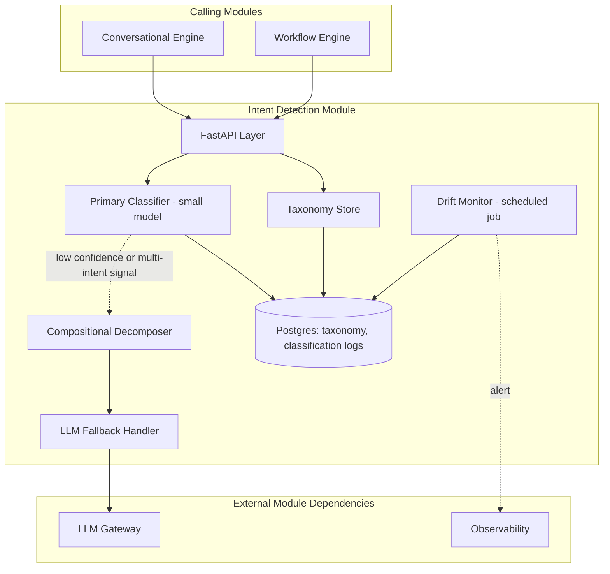
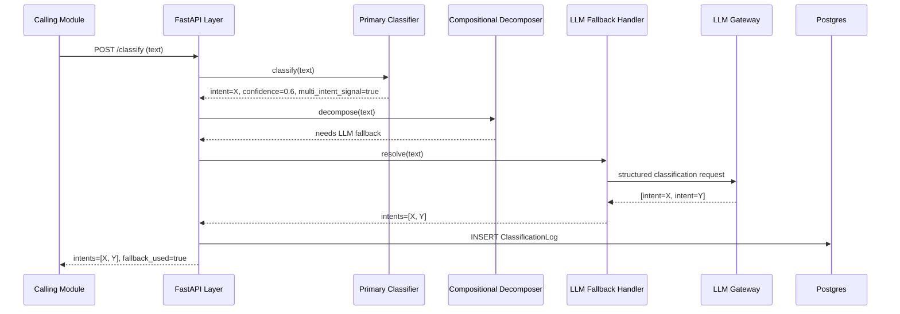
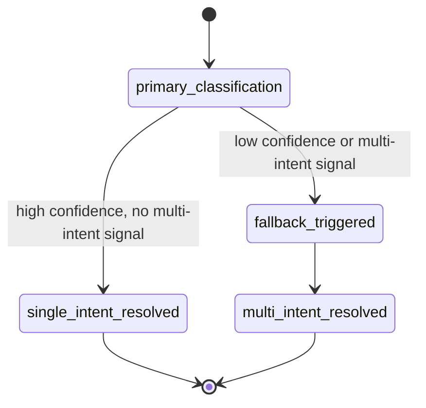

# Module 5: Intent Detection — Complete Module Specification

## Overview and Commercial Value

| Description | Inputs | Outputs | Value | Key Metrics |
|---|---|---|---|---|
| Classifies input into intents, handles compositional multi-goal utterances, monitors intent drift | Raw input, context, taxonomy | Intent label(s), confidence, fallback flag | Correct routing from the first message, fewer failed conversations | Classification accuracy, false-positive rate, drift alerts |

## Differentiator Features

Baseline (table stakes): single-intent classification, confidence scoring, fallback handling.

What makes this module genuinely better:

- **Compositional intent detection for multi-goal utterances.** A single message containing two or three distinct intents (common in financial services conversations, e.g. "update my address and check my mortgage balance") is decomposed rather than forced into a single label, so downstream routing can dispatch to multiple workflows correctly.
- **Intent drift monitoring.** Flags when real user intents are shifting away from the trained taxonomy, before accuracy visibly degrades, so retraining or taxonomy updates happen proactively rather than after a customer complains about misrouted conversations.

## Low-Level Design

### Level 1: Module Overview, Boundaries and Tech Stack

**Purpose.** The first classification step in most conversational and workflow paths: given raw input and context, determines what the user is actually trying to do, so the Conversational Engine or Workflow Engine can route correctly. This module does not generate responses or execute actions; it only classifies and hands off.

**Chosen stack**

| Concern | Choice | Why |
|---|---|---|
| Language/runtime | Python 3.12 | Platform consistency |
| Primary classifier | Fine-tuned small model (e.g. a distilled transformer classifier) for latency-critical single-intent classification, with an LLM-based fallback via LLM Gateway for compositional/ambiguous cases | Small model keeps the common case fast and cheap; LLM fallback handles the harder compositional cases without needing every request to pay LLM latency and cost |
| API layer | FastAPI | Consistency |
| Taxonomy store | PostgreSQL 16 | Versioned intent taxonomy per tenant, auditable changes |
| Drift monitoring | Statistical drift detection (e.g. population stability index or embedding-distribution comparison) run as a scheduled job against classification logs | Off the hot path; drift detection does not need to be real-time per request |
| Testing | `pytest`, labelled test set per tenant taxonomy, `testcontainers` for Postgres | |

**Deployability and testability contract.** Runs and tests fully with LLM Gateway stubbed for the compositional fallback path. The primary small classifier model is bundled/versioned with the module itself so unit and integration tests do not depend on any external model-serving dependency.

### Level 2: Component Architecture and Diagrams



**Sub-components**

| Component | Responsibility | Built on |
|---|---|---|
| Primary Classifier | Fast single-pass classification against the tenant's taxonomy | Fine-tuned small transformer model, served locally or via a lightweight inference server |
| Compositional Decomposer | Detects and splits multi-goal utterances | Rule-based signal detection (multiple verb phrases, conjunctions) triggering LLM fallback |
| LLM Fallback Handler | Handles ambiguous or compositional cases | LLM Gateway call with structured output request (list of intents) |
| Taxonomy Store | Versioned intent definitions per tenant | Postgres |
| Drift Monitor | Detects distributional shift in real traffic vs training data | Scheduled batch job, statistical comparison |

### Level 3: Detailed Design

**Data model**

| Entity | Key fields |
|---|---|
| IntentTaxonomy | id, tenant_id, version, intents (JSON: name, description, examples), status (active/deprecated) |
| ClassificationLog | id, tenant_id, input_hash (not raw content, for privacy), intents_detected (array), confidence_scores, fallback_used (boolean), created_at |
| DriftReport | id, tenant_id, taxonomy_version, drift_score, flagged_intents, created_at |

**API surface**

| Endpoint | Method | Request | Response | Notes |
|---|---|---|---|---|
| `/v1/intent-detection/classify` | POST | text, tenant_id, taxonomy_version (optional, defaults latest active) | intents[] (name, confidence), fallback_used | Main classification endpoint |
| `/v1/intent-detection/taxonomies` | POST | tenant_id, intents | id, version | Creates a new taxonomy version |
| `/v1/intent-detection/taxonomies/{id}/activate` | POST | (none) | status | |
| `/v1/intent-detection/drift-reports` | GET | tenant_id, date_range | DriftReport[] | |

**Sequence: classification with compositional decomposition**



**State diagram: classification path**



### Level 4: Telemetry, Logging, Tracing, Alerting, Configuration and Testing

**Tracing.** `intent.classify` span, attributes `intent.taxonomy_version`, `intent.fallback_used`, `intent.confidence`, `intent.count` (number of intents detected).

**Logging.** `structlog` JSON: `trace_id`, `tenant_id`, `taxonomy_version`, `fallback_used`, `event`. Raw input text never logged; only a hash is retained for deduplication/analysis, per privacy-by-design.

**Metrics (Prometheus)**

| Metric | Type | Labels |
|---|---|---|
| `intent_classifications_total` | Counter | `tenant_id`, `fallback_used` |
| `intent_classification_duration_seconds` | Histogram | `tenant_id`, `fallback_used` |
| `intent_confidence_score` | Histogram | `tenant_id` |
| `intent_drift_score` | Gauge | `tenant_id`, `taxonomy_version` |

**Alerting**

| Alert | Condition | Severity |
|---|---|---|
| IntentClassificationLatencyHigh | p95 of `intent_classification_duration_seconds` > 0.1 (non-fallback) | Warning |
| IntentFallbackRateHigh | Fallback ratio > 30% over 1 hour | Warning (may indicate taxonomy needs expansion) |
| IntentDriftDetected | `intent_drift_score` exceeds tenant-configured threshold | Warning, routed to platform operators for taxonomy review |

**Configuration**

```yaml
intent_detection:
  tenant_id: "<tenant>"
  classification:
    confidence_threshold: 0.7        # hot-reloadable, below this triggers fallback
    multi_intent_detection_enabled: true
  drift_monitoring:
    enabled: true
    check_frequency: "daily"
    alert_threshold: 0.15
  telemetry:
    otlp_endpoint: "<customer-configured>"
```

**Deployment.** Stateless container for the API/orchestration layer; the small classifier model served either co-located (for lowest latency) or via a lightweight model-serving sidecar, configurable per deployment. Horizontal autoscale on classification throughput.

**Testing**

| Level | Tooling |
|---|---|
| Unit | `pytest`, fixed labelled test set per taxonomy |
| Contract | `schemathesis` against OpenAPI spec |
| Integration (isolated) | LLM Gateway stubbed, real small classifier model loaded locally |
| Accuracy regression | CI gate comparing classification accuracy against a held-out labelled set on every model or taxonomy change |
| Load | `locust`, validated against the sub-100ms target for non-fallback classification |

**Non-functional targets**

| Attribute | Target |
|---|---|
| Classification latency (primary path) | Under 100ms |
| Classification latency (fallback path) | Bounded by LLM Gateway response time |
| Availability | 99.9% |
