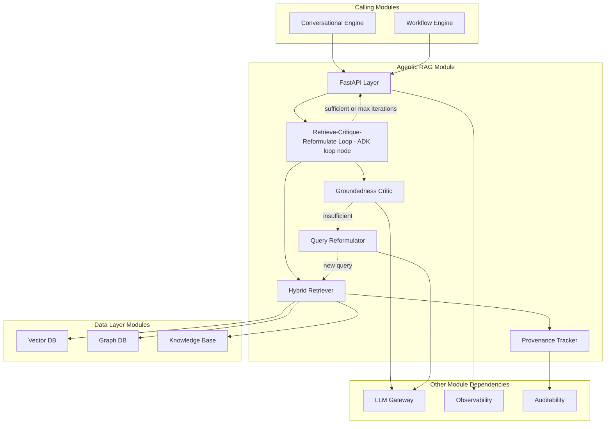
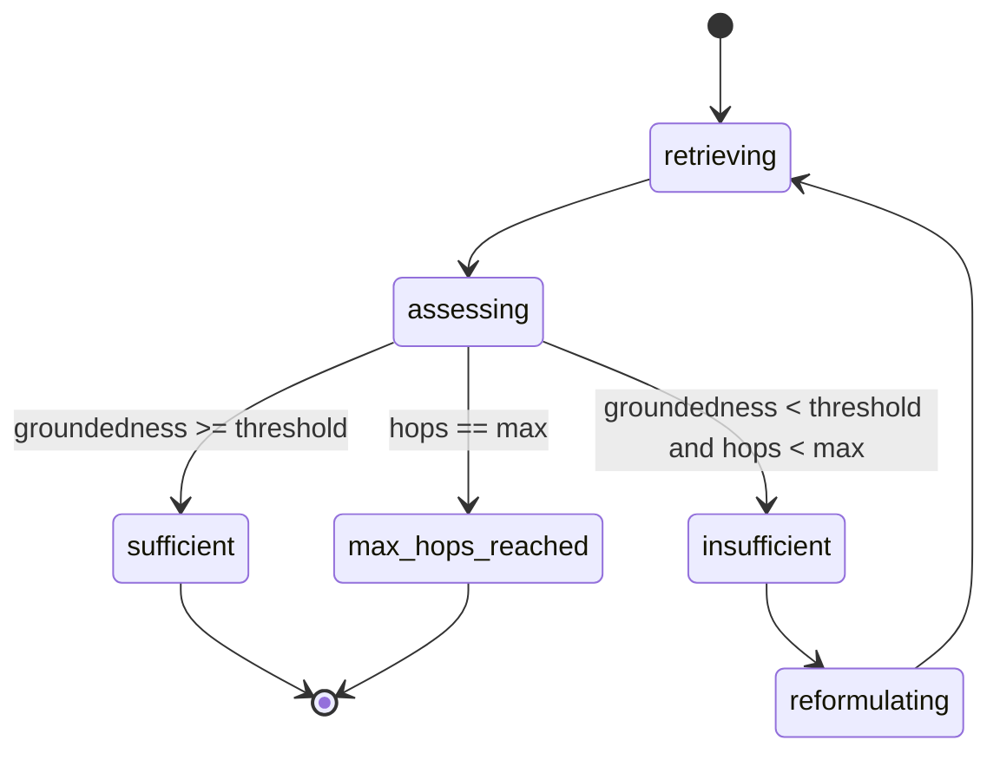

# Module 6: Agentic RAG — Complete Module Specification

## Overview and Commercial Value

| Description | Inputs | Outputs | Value | Key Metrics |
|---|---|---|---|---|
| Multi-hop, self-correcting retrieval that reformulates queries, checks groundedness and re-retrieves when needed | Query, retrieval context, source corpus references | Retrieved passages, groundedness score, synthesized context | Materially lower hallucination rate than standard RAG, provable to customers via groundedness metrics | Retrieval precision/recall, groundedness score, hop count per query |

## Differentiator Features

Baseline (table stakes): multi-hop retrieval, groundedness scoring, query reformulation.

What makes this module genuinely better:

- **Self-correcting retrieval loops.** The retriever critiques its own retrieved context, reformulates the query, and re-retrieves before ever reaching the LLM, reducing hallucination at the source rather than catching it downstream in Guardrails after generation has already happened.
- **Provenance-first retrieval.** Every retrieved fact carries a citation chain back to source document and version, feeding directly into Auditability without extra engineering, which matters for any regulated customer who needs to show where an answer came from.
- **Hybrid symbolic-vector retrieval.** Structured business rules (eligibility criteria, regulatory thresholds) are retrieved via symbolic lookup, not approximated by vector similarity, improving precision on exactly the facts where being approximately right is not good enough.

## Low-Level Design

### Level 1: Module Overview, Boundaries and Tech Stack

**Purpose.** Given a query and a scope of source material, retrieves the most relevant, groundable context for an LLM to reason over, iterating on its own retrieval when the first pass is insufficient. Does not generate the final answer itself; hands synthesized context to the calling module (typically Conversational Engine or Workflow Engine) which then calls LLM Gateway for generation.

**Chosen stack**

| Concern | Choice | Why |
|---|---|---|
| Language/runtime | Python 3.12 | Platform consistency |
| Orchestration of the retrieve-critique-reformulate loop | Google ADK 2.0 `Agent` with a bounded loop (ADK's Workflow Runtime loop node type) | The self-correction loop is naturally expressed as an ADK loop node with a termination condition (groundedness threshold met or max iterations reached), avoiding a bespoke control-flow implementation |
| Retrieval backends | Vector DB module (dense retrieval), Graph DB module (relationship/causal retrieval), symbolic lookup against Knowledge Base module for structured facts | Reuses platform modules rather than duplicating storage; this module is a retrieval orchestrator, not a storage layer |
| Groundedness scoring | LLM Gateway call with a structured groundedness-checking prompt, or a dedicated smaller NLI-style model for lower latency/cost on high-volume paths | Configurable per tenant based on cost/latency/accuracy tradeoff |
| Query reformulation | LLM Gateway call | Reuses the platform's model access rather than a separate provider integration |
| Testing | `pytest`, `pytest-asyncio`, fixture corpora with known-answer test sets, `testcontainers` for any local vector/graph store used in isolated tests | |

**Deployability and testability contract.** Runs and tests fully with Vector DB, Graph DB, Knowledge Base, and LLM Gateway stubbed, using canned retrieval results and groundedness scores to validate the loop logic without needing real embeddings or a real corpus.

### Level 2: Component Architecture and Diagrams



**Sub-components**

| Component | Responsibility | Built on |
|---|---|---|
| Hybrid Retriever | Queries Vector DB, Graph DB and Knowledge Base's symbolic lookup in parallel, merges results | Fan-out query pattern, result fusion (reciprocal rank fusion or similar) |
| Groundedness Critic | Scores whether retrieved context actually supports answering the query | LLM Gateway structured call or dedicated NLI model |
| Query Reformulator | Generates a revised query when groundedness is insufficient | LLM Gateway call, informed by what was missing in the prior attempt |
| Provenance Tracker | Attaches source document, version and location to every retrieved fact | Metadata carried through from Knowledge Base/Vector DB/Graph DB responses |
| Retrieve-Critique-Reformulate Loop | Orchestrates the above until groundedness threshold met or max iterations reached | ADK 2.0 Workflow Runtime loop node |

### Level 3: Detailed Design

**Data model**

| Entity | Key fields |
|---|---|
| RetrievalRequest | id, tenant_id, query, scope (corpus references), max_hops, groundedness_threshold, created_at |
| RetrievalHop | id, request_id, hop_number, reformulated_query (nullable for hop 1), retrieved_items (JSONB with provenance), groundedness_score, created_at |
| RetrievalResult | request_id, final_context (synthesized), total_hops, final_groundedness_score, provenance_chain (JSONB) |

**API surface**

| Endpoint | Method | Request | Response | Notes |
|---|---|---|---|---|
| `/v1/agentic-rag/retrieve` | POST | query, scope, max_hops (default 3), groundedness_threshold (default tenant config) | synthesized_context, groundedness_score, hop_count, provenance_chain | Main retrieval endpoint |
| `/v1/agentic-rag/requests/{id}` | GET | (none) | full RetrievalRequest with all hops | For debugging/audit |

**Sequence: multi-hop self-correcting retrieval**

```mermaid
sequenceDiagram
    participant CALLER as Calling Module
    participant API as FastAPI Layer
    participant LOOP as Loop Controller
    participant RET as Hybrid Retriever
    participant VDB as Vector DB
    participant CRIT as Groundedness Critic
    participant LLMGW as LLM Gateway
    participant REFORM as Query Reformulator

    CALLER->>API: POST /retrieve (query)
    API->>LOOP: start(query, max_hops=3)
    LOOP->>RET: retrieve(query)
    RET->>VDB: vector search
    VDB-->>RET: passages
    RET-->>LOOP: retrieved_items (hop 1)
    LOOP->>CRIT: assess_groundedness(query, retrieved_items)
    CRIT->>LLMGW: groundedness check
    LLMGW-->>CRIT: score=0.6 (below threshold 0.85)
    CRIT-->>LOOP: insufficient
    LOOP->>REFORM: reformulate(query, gaps_identified)
    REFORM->>LLMGW: reformulation request
    LLMGW-->>REFORM: revised_query
    REFORM-->>LOOP: revised_query
    LOOP->>RET: retrieve(revised_query)
    RET-->>LOOP: retrieved_items (hop 2)
    LOOP->>CRIT: assess_groundedness(revised_query, retrieved_items)
    CRIT-->>LOOP: score=0.9 (sufficient)
    LOOP-->>API: final context, groundedness=0.9, hops=2
    API-->>CALLER: synthesized_context, provenance_chain
```

**State diagram: retrieval loop**



### Level 4: Telemetry, Logging, Tracing, Alerting, Configuration and Testing

**Tracing.** `rag.retrieval.request` root span, `rag.hop` child span per hop with attributes `rag.hop_number`, `rag.groundedness_score`, `rag.reformulated`. Provenance chain attached as span attributes/events so a trace alone can answer "what sources fed this answer."

**Logging.** `structlog` JSON: `trace_id`, `tenant_id`, `hop_count`, `final_groundedness_score`, `event`. Query text logged at INFO if the tenant's data classification allows; sensitive-corpus tenants can restrict to DEBUG-only, feature-flagged.

**Metrics (Prometheus)**

| Metric | Type | Labels |
|---|---|---|
| `rag_retrievals_total` | Counter | `tenant_id`, `outcome` (sufficient/max_hops_reached) |
| `rag_hop_count` | Histogram | `tenant_id` |
| `rag_groundedness_score` | Histogram | `tenant_id` |
| `rag_retrieval_duration_seconds` | Histogram | `tenant_id`, `hop_number` |

**Alerting**

| Alert | Condition | Severity |
|---|---|---|
| RAGGroundednessLow | Median `rag_groundedness_score` drops below tenant threshold over 1 hour | Warning, may indicate corpus staleness |
| RAGMaxHopsRateHigh | Ratio of `max_hops_reached` outcomes > 20% over 1 hour | Warning, may indicate corpus coverage gap |
| RAGRetrievalLatencyHigh | p95 of `rag_retrieval_duration_seconds` (full request) > 2s | Warning |

**Configuration**

```yaml
agentic_rag:
  tenant_id: "<tenant>"
  retrieval:
    max_hops: 3                      # hot-reloadable
    groundedness_threshold: 0.85     # hot-reloadable
    hybrid_retrieval_enabled: true   # vector + graph + symbolic fan-out
  critic:
    method: "llm"                    # llm | dedicated_nli_model
  telemetry:
    otlp_endpoint: "<customer-configured>"
```

**Deployment.** Stateless container, horizontal autoscale on retrieval request throughput. Depends on Vector DB and Graph DB being reachable; `/healthz` checks both plus LLM Gateway.

**Testing**

| Level | Tooling |
|---|---|
| Unit | `pytest`, `pytest-asyncio` |
| Contract | `schemathesis` against OpenAPI spec |
| Integration (isolated) | Vector DB/Graph DB/Knowledge Base/LLM Gateway stubbed with canned responses |
| Retrieval quality regression | Fixture corpora with known-answer test sets, CI gate on groundedness and hop-count regression |
| Load | `locust`, validated against the under-800ms single-hop target |

**Non-functional targets**

| Attribute | Target |
|---|---|
| Single-hop retrieval | Under 800ms |
| Multi-hop retrieval | Scales with hop count, each additional hop adds its own retrieval plus critique latency |
| Availability | 99.9% |
