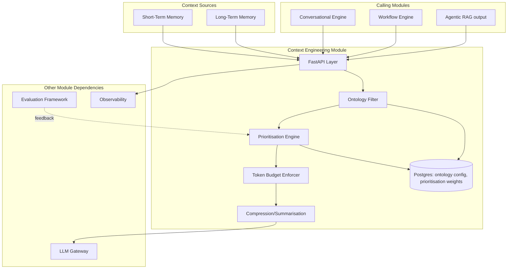
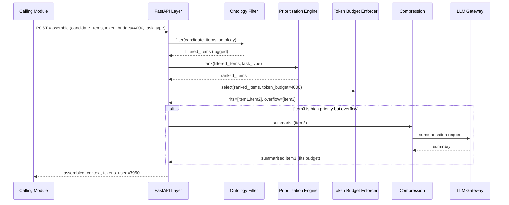
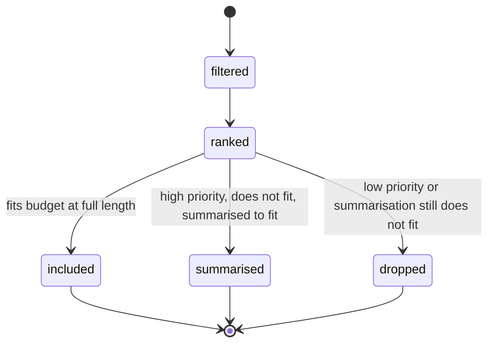

# Module 7: Context Engineering — Complete Module Specification

## Overview and Commercial Value

| Description | Inputs | Outputs | Value | Key Metrics |
|---|---|---|---|---|
| Assembles, compresses and prunes context within token budget using ontology constraints | Candidate context items, token budget, task type | Assembled context, tokens used | Cheaper, more accurate model calls since irrelevant context never reaches the LLM | Token utilisation rate, truncation rate, quality delta |

## Differentiator Features

Baseline (table stakes): token budgeting, compression, pruning.

What makes this module genuinely better:

- **Task-aware context shaping.** Learns which context elements actually influenced correct answers historically (via Evaluation Framework feedback) and prioritises those types for future assembly, rather than applying a fixed, one-size-fits-all pruning heuristic to every task type.
- **Ontology-constrained context.** Uses a lightweight domain ontology (roles, entities, policies) to filter and structure retrieved context before it reaches the model, an approach showing strong hallucination-reduction results in production enterprise systems, because the model receives structured, bounded context rather than an undifferentiated pile of text.

## Low-Level Design

### Level 1: Module Overview, Boundaries and Tech Stack

**Purpose.** The final assembly step before a prompt goes to LLM Gateway: takes candidate context (from Agentic RAG, Short-Term Memory, Long-Term Memory, Workflow context) and shapes it into the actual prompt context within a token budget, prioritising what matters most for the specific task. This module does not retrieve content itself; it consumes retrieved candidates and decides what survives into the final prompt.

**Chosen stack**

| Concern | Choice | Why |
|---|---|---|
| Language/runtime | Python 3.12 | Platform consistency |
| Tokenisation | `tiktoken` (or the tokenizer matching the target model family, resolved dynamically per LLM Gateway routing decision) | Accurate token counting is essential to the budget enforcement this module exists to do |
| Ontology definitions | Lightweight domain ontology stored as versioned config (roles, entities, policy tags), not a full formal ontology engine | Keeps this pragmatic and fast rather than requiring heavyweight ontology tooling; the goal is structured filtering, not formal reasoning (that belongs to the Workflow Engine's symbolic layer) |
| Prioritisation learning | Consumes scored feedback from Evaluation Framework via the event bus, stored as a lightweight prioritisation model (feature-weighted scoring, not a full ML pipeline initially) | Keeps this explainable and tunable rather than an opaque black box deciding what context matters |
| API layer | FastAPI | Consistency |
| Testing | `pytest`, `pytest-asyncio`, fixture context sets with known optimal assemblies | |

**Deployability and testability contract.** Runs and tests fully with Evaluation Framework's feedback feed stubbed with canned prioritisation signals. This module has no persistent datastore of its own beyond ontology config and prioritisation weights, keeping it simple to deploy and test in isolation.

### Level 2: Component Architecture and Diagrams



**Sub-components**

| Component | Responsibility | Built on |
|---|---|---|
| Ontology Filter | Tags and filters candidate context items against the tenant's domain ontology (roles, entities, policy relevance) | Config-driven tagging rules |
| Prioritisation Engine | Ranks filtered context items by learned/configured importance for the current task type | Feature-weighted scoring, updated from Evaluation Framework feedback |
| Token Budget Enforcer | Selects the highest-priority items that fit within the token budget | Greedy knapsack-style selection against token counts |
| Compression/Summarisation | For items that don't fit at full length but are still high-priority, summarises rather than drops entirely | LLM Gateway call for summarisation, used sparingly given its own token cost |

### Level 3: Detailed Design

**Data model**

| Entity | Key fields |
|---|---|
| OntologyConfig | id, tenant_id, version, roles (JSON), entity_types (JSON), policy_tags (JSON) |
| PrioritisationWeights | id, tenant_id, task_type, feature_weights (JSONB), last_updated_at |
| ContextAssembly | id, request_ref, task_type, items_included (JSONB with source and token count), items_dropped (JSONB), items_summarised (JSONB), total_tokens_used, created_at |

**API surface**

| Endpoint | Method | Request | Response | Notes |
|---|---|---|---|---|
| `/v1/context-engineering/assemble` | POST | candidate_items[] (source, content, metadata), token_budget, task_type | assembled_context, tokens_used, items_dropped_count | Main assembly endpoint |
| `/v1/context-engineering/ontologies` | POST | tenant_id, roles, entity_types, policy_tags | id, version | |
| `/v1/context-engineering/weights/{task_type}` | GET | (none) | current feature_weights | For transparency/debugging |

**Sequence: context assembly within token budget**



**State diagram: item disposition per assembly**



### Level 4: Telemetry, Logging, Tracing, Alerting, Configuration and Testing

**Tracing.** `context.assemble` span, attributes `context.task_type`, `context.tokens_used`, `context.items_included_count`, `context.items_dropped_count`, `context.items_summarised_count`.

**Logging.** `structlog` JSON: `trace_id`, `tenant_id`, `task_type`, `tokens_used`, `items_dropped_count`, `event`. Full item content not logged (already logged at source, e.g. Agentic RAG); this module logs metadata about the assembly decision, not the content itself.

**Metrics (Prometheus)**

| Metric | Type | Labels |
|---|---|---|
| `context_assemblies_total` | Counter | `tenant_id`, `task_type` |
| `context_token_utilisation_ratio` | Histogram | `tenant_id`, `task_type` (tokens_used / token_budget) |
| `context_truncation_rate` | Histogram | `tenant_id`, `task_type` (items_dropped / items_candidate) |
| `context_assembly_duration_seconds` | Histogram | `tenant_id` |
| `context_summarisation_invocations_total` | Counter | `tenant_id` |

**Alerting**

| Alert | Condition | Severity |
|---|---|---|
| ContextTruncationRateHigh | Truncation rate > 40% sustained over 1 hour for a task type | Warning, may indicate the token budget is too small for the task |
| ContextAssemblyLatencyHigh | p95 of `context_assembly_duration_seconds` > 0.05 (excludes summarisation calls) | Warning |
| ContextSummarisationCostHigh | Summarisation invocation rate spikes relative to 7-day baseline | Informational, cost-awareness signal feeding FinOps |

**Configuration**

```yaml
context_engineering:
  tenant_id: "<tenant>"
  ontology:
    active_version: "<version>"
  prioritisation:
    learning_enabled: true           # consume Evaluation Framework feedback
    default_task_type_weights: {}    # fallback weights if no learned weights exist yet
  budget:
    default_token_budget: 4000       # hot-reloadable, overridable per call
    summarisation_enabled: true
  telemetry:
    otlp_endpoint: "<customer-configured>"
```

**Deployment.** Stateless container (no significant local state beyond cached ontology/weights config), horizontal autoscale on assembly request throughput.

**Testing**

| Level | Tooling |
|---|---|
| Unit | `pytest`, fixture context sets with known optimal assemblies to verify prioritisation logic |
| Contract | `schemathesis` against OpenAPI spec |
| Integration (isolated) | LLM Gateway and Evaluation Framework feedback stubbed |
| Quality regression | CI gate comparing assembly decisions against a fixed benchmark set when ontology or weighting logic changes |
| Load | `locust`, validated against the sub-50ms assembly target (excluding summarisation calls) |

**Non-functional targets**

| Attribute | Target |
|---|---|
| Assembly latency (no summarisation needed) | Under 50ms |
| Assembly latency (with summarisation) | Bounded by LLM Gateway summarisation call latency |
| Availability | 99.9% |
