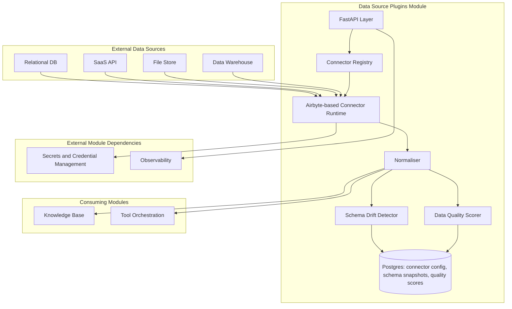
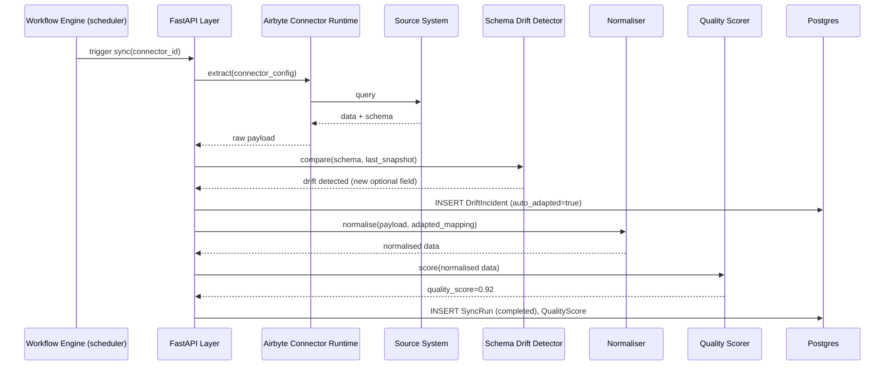
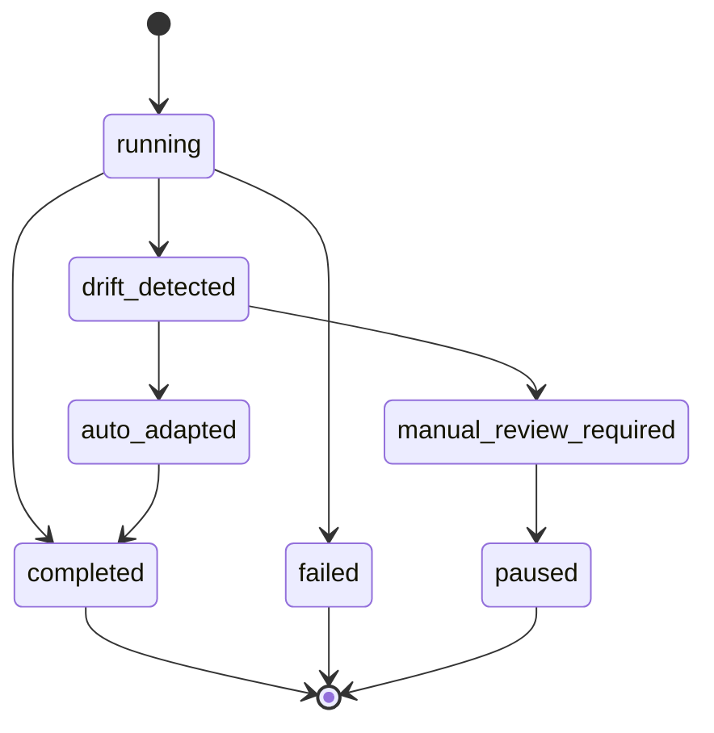

# Module 8: Data Source Plugins — Complete Module Specification

## Overview and Commercial Value

| Description | Inputs | Outputs | Value | Key Metrics |
|---|---|---|---|---|
| Pre-built connectors with schema drift auto-adaptation and data quality scoring | Connector config, credentials, query/sync request | Normalised data, sync status | Fast time-to-value for customers with existing systems, no bespoke integration project per source | Sync success rate, freshness lag, drift incidents |

## Differentiator Features

Baseline (table stakes): pre-built connectors to common relational DBs, SaaS APIs, file stores, data warehouses.

What makes this module genuinely better:

- **Schema drift auto-adaptation.** Detects source schema changes and proposes/auto-applies mapping updates rather than silently breaking downstream agents, which is the single most common failure mode in production data integrations.
- **Data quality scoring at ingestion.** Feeds a trust score that downstream agents can weigh when deciding how much to rely on a given source, so an agent can treat a stale or low-quality feed with appropriate caution rather than trusting all sources equally.

## Low-Level Design

### Level 1: Module Overview, Boundaries and Tech Stack

**Purpose.** Owns connectivity to external data systems on behalf of the platform: relational databases, SaaS APIs, file stores, data warehouses. Normalises whatever it pulls into a common internal schema, scores its quality, and hands off to whichever module needs it (typically Knowledge Base for document-shaped data, or directly to an agent via Tool Orchestration for structured queries).

**Chosen stack**

| Concern | Choice | Why |
|---|---|---|
| Language/runtime | Python 3.12 | Platform consistency |
| Connector framework | Airbyte's open source connector catalogue (Airbyte Protocol / PyAirbyte) as the base for common connectors, with thin platform-specific wrappers for normalisation and quality scoring | Airbyte already maintains 300+ production-grade open source connectors; building on it rather than hand-rolling each connector is a large build-time saving and keeps connectors current as source APIs change |
| Orchestration of sync jobs | Managed via the Workflow Engine module for scheduling/retries where syncs are long-running, direct synchronous calls for point queries | Reuses existing platform scheduling rather than a second scheduler |
| Schema diffing | `deepdiff` or a custom JSON-schema comparison against the last-known schema snapshot, stored per connector | Lightweight, no need for a heavyweight schema registry at this layer |
| Credential handling | Delegated entirely to Secrets and Credential Management module | No credentials stored locally, ever |
| Data quality scoring | Rule-based checks (completeness, freshness, format validity) plus configurable custom checks per tenant | Explainable scoring, not an opaque ML model, since customers will want to know why a source scored low |
| Testing | `pytest`, `pytest-asyncio`, `testcontainers` for a real Postgres source in integration tests, WireMock-style HTTP mocking for SaaS API connectors | |

**Deployability and testability contract.** Runs and tests fully with Secrets and Credential Management stubbed to return fake credentials, and with source systems either mocked (SaaS APIs) or run as ephemeral test containers (databases).

### Level 2: Component Architecture and Diagrams



**Sub-components**

| Component | Responsibility | Built on |
|---|---|---|
| Connector Registry | Tracks configured connectors per tenant, their type and sync schedule | Postgres |
| Airbyte-based Connector Runtime | Executes the actual extraction from source systems | Airbyte Protocol / PyAirbyte connectors |
| Normaliser | Converts source-specific payloads into the platform's common internal schema | Per-source-type mapping logic |
| Schema Drift Detector | Compares incoming schema against last-known snapshot, flags or auto-adapts | `deepdiff`-based comparison |
| Data Quality Scorer | Applies completeness/freshness/format checks | Rule-based scoring engine |

### Level 3: Detailed Design

**Data model**

| Entity | Key fields |
|---|---|
| ConnectorConfig | id, tenant_id, source_type, connection_config (non-secret fields only), secrets_ref (pointer to Secrets module), sync_schedule, status (active/paused/error) |
| SchemaSnapshot | id, connector_id, schema (JSON), captured_at, version |
| SyncRun | id, connector_id, status (running/completed/failed), records_synced, started_at, completed_at |
| QualityScore | id, connector_id, sync_run_id, completeness_score, freshness_score, format_validity_score, overall_score, computed_at |
| DriftIncident | id, connector_id, schema_diff (JSON), auto_adapted (boolean), resolved_by (nullable), created_at |

**API surface**

| Endpoint | Method | Request | Response | Notes |
|---|---|---|---|---|
| `/v1/data-source-plugins/connectors` | POST | tenant_id, source_type, connection_config, secrets_ref | ConnectorConfig | |
| `/v1/data-source-plugins/connectors/{id}/sync` | POST | (none) | SyncRun (async, poll for status) | Triggers a sync |
| `/v1/data-source-plugins/connectors/{id}/query` | POST | query parameters | normalised data payload | Point query, synchronous |
| `/v1/data-source-plugins/connectors/{id}/quality` | GET | (none) | latest QualityScore | |
| `/v1/data-source-plugins/connectors/{id}/drift-incidents` | GET | (none) | DriftIncident[] | |

**Sequence: scheduled sync with schema drift detected and auto-adapted**



**State diagram: sync run lifecycle**



### Level 4: Telemetry, Logging, Tracing, Alerting, Configuration and Testing

**Tracing.** `data_source.sync` span, attributes `connector.id`, `connector.source_type`, `sync.records_count`, `sync.drift_detected`, `sync.quality_score`.

**Logging.** `structlog` JSON: `trace_id`, `tenant_id`, `connector_id`, `source_type`, `event`, `level`. Actual source data content never logged; only counts and quality metadata.

**Metrics (Prometheus)**

| Metric | Type | Labels |
|---|---|---|
| `data_source_syncs_total` | Counter | `tenant_id`, `source_type`, `outcome` |
| `data_source_sync_duration_seconds` | Histogram | `source_type` |
| `data_source_freshness_lag_seconds` | Gauge | `connector_id` (time since last successful sync) |
| `data_source_quality_score` | Gauge | `connector_id` |
| `data_source_drift_incidents_total` | Counter | `connector_id`, `auto_adapted` |

**Alerting**

| Alert | Condition | Severity |
|---|---|---|
| DataSourceSyncFailing | 3 consecutive failed syncs for a connector | Critical |
| DataSourceFreshnessLagHigh | `data_source_freshness_lag_seconds` exceeds tenant-configured SLA | Warning |
| DataSourceQualityScoreLow | `data_source_quality_score` < 0.7 | Warning |
| DataSourceDriftManualReviewPending | A DriftIncident sits in `manual_review_required` for over 24h | Warning |

**Configuration**

```yaml
data_source_plugins:
  tenant_id: "<tenant>"
  drift:
    auto_adapt_enabled: true         # hot-reloadable; if false, always requires manual review
    auto_adapt_scope: "additive_only" # additive_only | additive_and_type_widening
  quality:
    completeness_weight: 0.4
    freshness_weight: 0.3
    format_validity_weight: 0.3
    quality_gate_threshold: 0.6      # syncs below this are flagged, not blocked by default
  telemetry:
    otlp_endpoint: "<customer-configured>"
```

**Deployment.** Sync workers can scale horizontally and independently of the API layer, since sync jobs are long-running and I/O-bound against source systems. `/healthz` checks Postgres and Secrets and Credential Management reachability.

**Testing**

| Level | Tooling |
|---|---|
| Unit | `pytest`, `pytest-asyncio` |
| Contract | `schemathesis` against OpenAPI spec |
| Integration (isolated) | `testcontainers` for a real Postgres source, HTTP mocking for SaaS connectors, Secrets module stubbed |
| Drift detection | Fixture schema pairs (additive, breaking, type-widening) verifying correct auto-adapt vs manual-review classification |
| Load | `locust` for point-query throughput; sync jobs tested for correctness and duration, not raw throughput |

**Non-functional targets**

| Attribute | Target |
|---|---|
| Point query latency | Under 500ms |
| Sync job duration | Connector and data-volume dependent; tracked per connector, not a fixed platform target |
| Availability | 99.9% for the API/query layer |
