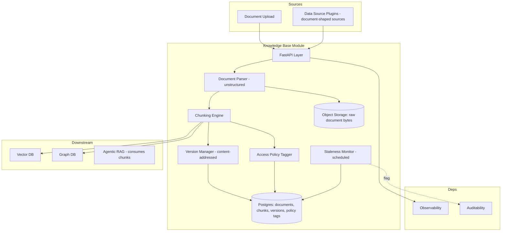
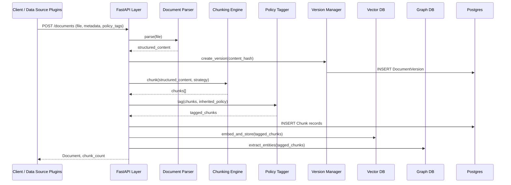
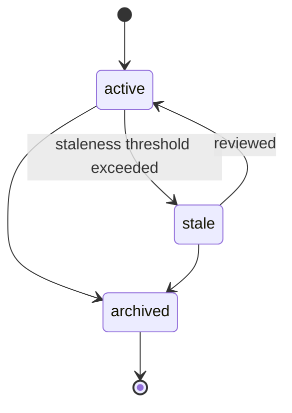

# Module 9: Knowledge Base / Document Management — Complete Module Specification

## Overview and Commercial Value

| Description | Inputs | Outputs | Value | Key Metrics |
|---|---|---|---|---|
| Ingests, chunks, versions and manages source-of-truth documents feeding Agentic RAG | Raw documents, metadata, access policy | Chunked/indexed content, version history | Gives customers control over what agents "know" and when, essential for regulated content accuracy | Ingestion throughput, chunk quality score, staleness rate |

## Differentiator Features

Baseline (table stakes): document ingestion, chunking, indexing, versioning.

What makes this module genuinely better:

- **Chunk-level access policy tagging.** Rather than access control only at the document level, each chunk carries its own policy tags, so Agentic RAG retrieval can be filtered precisely to what a given user/agent is entitled to see, not an all-or-nothing document permission.
- **Version-aware retrieval support.** Every chunk retains its document version lineage, so Agentic RAG's provenance chain can state not just which document but which version of it, essential for regulated customers who need to show what was true when.
- **Staleness-driven re-ingestion triggers.** Documents past a configurable staleness threshold are flagged for review rather than silently continuing to feed answers, closing a common gap where outdated source material quietly degrades agent accuracy.

## Low-Level Design

### Level 1: Module Overview, Boundaries and Tech Stack

**Purpose.** The system of record for unstructured source-of-truth content. Ingests documents, chunks and versions them, applies access policy at chunk level, and feeds Vector DB (embeddings) and Graph DB (entity extraction, where applicable) so Agentic RAG has something to retrieve. This module owns document lifecycle; it does not perform retrieval itself.

**Chosen stack**

| Concern | Choice | Why |
|---|---|---|
| Language/runtime | Python 3.12 | Platform consistency |
| Document parsing | `unstructured` (open source) for multi-format parsing (PDF, DOCX, HTML, etc.), `pypdf` for PDF-specific needs | Mature open source library handling the format variety enterprise documents actually come in, rather than building per-format parsers |
| Chunking strategy | Configurable: fixed-size, semantic (embedding-similarity-based), or structural (heading-aware) via `unstructured`'s partitioning plus a custom semantic chunker | Different document types need different chunking; this is exposed as tenant/document-type configuration, not hardcoded |
| Version control | Content-addressed storage (hash-based) plus explicit version metadata in Postgres | Efficient storage of near-duplicate revisions, clear lineage |
| Metadata/policy store | PostgreSQL 16 via SQLAlchemy 2.0 async | Transactional, queryable |
| Embedding generation | Delegated to Vector DB module (this module sends chunked text, Vector DB owns embedding and storage) | Avoids duplicating embedding logic across modules |
| Testing | `pytest`, fixture documents across formats, `testcontainers` for Postgres | |

**Deployability and testability contract.** Runs and tests fully with Vector DB and Graph DB stubbed (this module can be tested purely on ingestion, chunking, versioning and policy-tagging correctness without a real embedding or graph backend).

### Level 2: Component Architecture and Diagrams



**Sub-components**

| Component | Responsibility | Built on |
|---|---|---|
| Document Parser | Extracts text/structure from raw document formats | `unstructured`, `pypdf` |
| Chunking Engine | Splits parsed content into retrievable chunks per configured strategy | Fixed-size, semantic or structural chunker |
| Version Manager | Tracks document revisions, content-addressed dedup | Hash-based storage plus Postgres metadata |
| Access Policy Tagger | Applies policy tags at chunk level | Config-driven tagging rules, inherits document-level policy by default with chunk-level override |
| Staleness Monitor | Scheduled job flagging documents past their staleness threshold | Batch job against `last_reviewed_at` metadata |

### Level 3: Detailed Design

**Data model**

| Entity | Key fields |
|---|---|
| Document | id, tenant_id, title, source_type (upload/sync), current_version_id, status (active/stale/archived), last_reviewed_at, created_at |
| DocumentVersion | id, document_id, content_hash, blob_ref, version_number, created_at, created_by |
| Chunk | id, document_version_id, content, chunk_index, policy_tags (JSONB), token_count |
| PolicyTag | id, tenant_id, name, description |

**API surface**

| Endpoint | Method | Request | Response | Notes |
|---|---|---|---|---|
| `/v1/knowledge-base/documents` | POST | file (multipart) or source_ref, metadata, policy_tags | Document, DocumentVersion, chunk_count | Ingests and chunks a new document |
| `/v1/knowledge-base/documents/{id}/versions` | POST | file, metadata | new DocumentVersion | Creates a new version of an existing document |
| `/v1/knowledge-base/documents/{id}` | GET | (none) | Document with version history | |
| `/v1/knowledge-base/chunks` | GET | document_version_id or policy_tag filter | Chunk[] | Used internally by Vector DB/Graph DB ingestion, not typically called by end agents directly |
| `/v1/knowledge-base/documents/{id}/review` | POST | reviewed_by | last_reviewed_at updated, status reset from stale to active | |

**Sequence: document ingestion and chunk propagation**



**State diagram: document lifecycle**



### Level 4: Telemetry, Logging, Tracing, Alerting, Configuration and Testing

**Tracing.** `knowledge_base.ingest` span, attributes `document.id`, `document.version`, `chunk.count`, `chunking.strategy`.

**Logging.** `structlog` JSON: `trace_id`, `tenant_id`, `document_id`, `version_id`, `event`. Document content never logged; only metadata and counts.

**Metrics (Prometheus)**

| Metric | Type | Labels |
|---|---|---|
| `knowledge_base_documents_ingested_total` | Counter | `tenant_id`, `source_type` |
| `knowledge_base_ingestion_duration_seconds` | Histogram | `document_size_bucket` |
| `knowledge_base_chunks_per_document` | Histogram | `tenant_id` |
| `knowledge_base_stale_documents_ratio` | Gauge | `tenant_id` |

**Alerting**

| Alert | Condition | Severity |
|---|---|---|
| KnowledgeBaseIngestionFailureRateHigh | Ingestion failure rate > 5% over 1 hour | Warning |
| KnowledgeBaseStaleDocumentsRatioHigh | `knowledge_base_stale_documents_ratio` exceeds tenant-configured threshold | Warning, routed to content owners |
| KnowledgeBaseIngestionLatencyHigh | p95 ingestion duration exceeds tenant SLA for document size bucket | Warning |

**Configuration**

```yaml
knowledge_base:
  tenant_id: "<tenant>"
  chunking:
    default_strategy: "semantic"     # fixed_size | semantic | structural
    default_chunk_size_tokens: 512
    overlap_tokens: 50
  staleness:
    default_threshold_days: 180      # hot-reloadable, overridable per document
    auto_flag_enabled: true
  policy:
    default_inheritance: "document_level" # chunk-level tags override this default
  telemetry:
    otlp_endpoint: "<customer-configured>"
```

**Deployment.** Ingestion workers scale independently of the API layer given parsing/chunking can be CPU-intensive for large documents; object storage for raw bytes is cloud-agnostic (S3-compatible interface, works against AWS S3, GCS, Azure Blob via standard adapters).

**Testing**

| Level | Tooling |
|---|---|
| Unit | `pytest`, fixture documents per format (PDF, DOCX, HTML) |
| Contract | `schemathesis` against OpenAPI spec |
| Integration (isolated) | Vector DB/Graph DB stubbed, `testcontainers` for Postgres and object storage (e.g. MinIO for S3-compatible testing) |
| Chunking quality | Fixed benchmark documents with expected chunk boundaries, regression-tested on chunker changes |
| Load | `locust` for ingestion throughput across document sizes |

**Non-functional targets**

| Attribute | Target |
|---|---|
| Ingestion latency | Under 5 seconds per page (aligned with the platform's document extraction target) |
| Availability | 99.9% |
| Version storage efficiency | Content-addressed dedup should keep near-duplicate revision storage overhead low, tracked but not hard-targeted |
