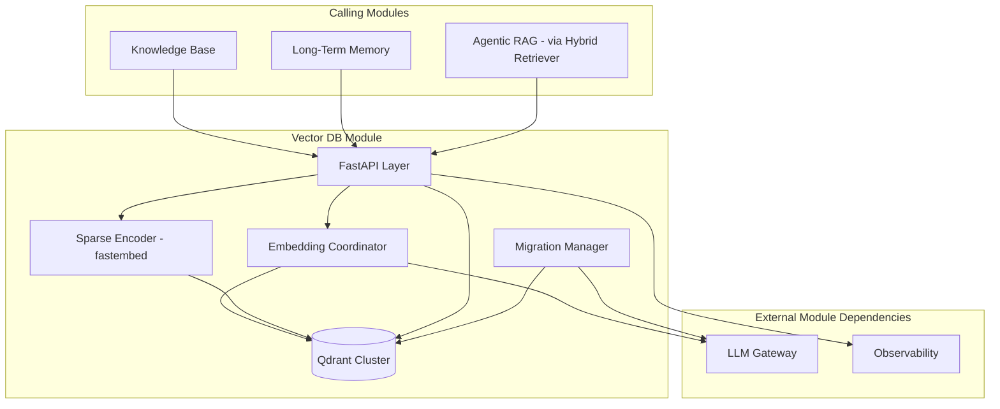
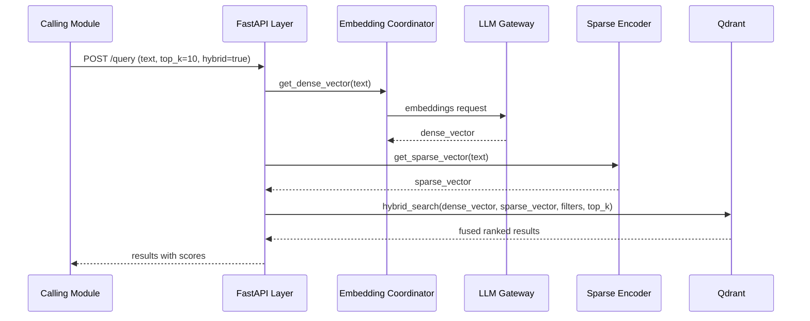
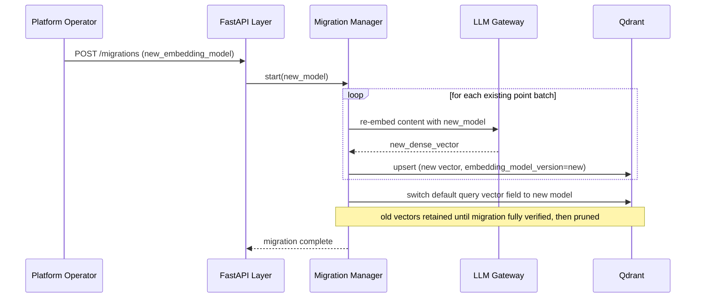

# Module 10: Vector DB — Complete Module Specification

## Overview and Commercial Value

| Description | Inputs | Outputs | Value | Key Metrics |
|---|---|---|---|---|
| Hybrid dense-sparse-graph embedding storage with automatic model migration | Text/embeddings, query, filters | Ranked results with scores | Single query surface instead of stitching three separate systems together | Query latency p50/p95/p99, recall@k |

## Differentiator Features

Baseline (table stakes): embedding storage, approximate nearest neighbour (ANN) search, metadata filtering.

What makes this module genuinely better:

- **Hybrid dense-sparse retrieval in one query.** Vector similarity plus keyword (BM25-style) search combined in a single query with fusion ranking, rather than requiring the calling module to run two separate queries against two separate systems and merge results itself.
- **Automatic embedding model migration.** When a better embedding model becomes available, the module background-reindexes and performs a zero-downtime cutover, rather than leaving customers stuck on an ageing embedding model because migration is too disruptive to attempt.

## Low-Level Design

### Level 1: Module Overview, Boundaries and Tech Stack

**Purpose.** Stores and retrieves embeddings for semantic search, on behalf of Knowledge Base (document chunks) and any other module needing vector similarity search (e.g. Long-Term Memory's semantic layer). Owns the embedding generation step for content handed to it (calling LLM Gateway for the actual embedding model call), and owns the storage/query layer.

**Chosen stack**

| Concern | Choice | Why |
|---|---|---|
| Language/runtime | Python 3.12 | Platform consistency |
| Vector database | Qdrant (open source), self-hostable on any cloud, supports hybrid dense+sparse search natively | Cloud-agnostic requirement rules out a cloud-proprietary vector service; Qdrant is open source, has native hybrid search support (avoiding a bolted-together BM25-plus-vector implementation), and has a mature Python client |
| Embedding generation | Delegated to LLM Gateway (embeddings endpoint), this module never calls an embedding provider directly | Consistency with the platform's single-entry-point principle for all model calls |
| API layer | FastAPI wrapping Qdrant's client | Consistent platform API surface rather than exposing Qdrant's native API directly to other modules |
| Sparse vector generation | BM25-style sparse encoding via `fastembed`'s sparse models (open source, integrates natively with Qdrant) | Keeps sparse encoding in-process, no separate keyword-search system to maintain |
| Re-indexing coordination | Background job orchestrated via Workflow Engine for long-running migrations | Reuses existing platform scheduling |
| Testing | `pytest`, `pytest-asyncio`, `testcontainers` for a real Qdrant instance in integration tests | |

**Deployability and testability contract.** Runs and tests fully with LLM Gateway stubbed (canned embeddings), real Qdrant via `testcontainers` for integration tests, in-memory Qdrant mode for fast unit tests where available.

### Level 2: Component Architecture and Diagrams



**Sub-components**

| Component | Responsibility | Built on |
|---|---|---|
| Embedding Coordinator | Requests dense embeddings from LLM Gateway for content to index or query | LLM Gateway embeddings endpoint |
| Sparse Encoder | Generates sparse (keyword-style) vectors alongside dense embeddings | `fastembed` sparse models |
| Qdrant Cluster | Storage and ANN query engine, native hybrid search | Qdrant, self-hosted |
| Migration Manager | Coordinates background re-embedding and cutover when the embedding model changes | Background job, shadow-write pattern during migration |

### Level 3: Detailed Design

**Data model (Qdrant collection schema, not a separate relational model)**

| Field | Type | Notes |
|---|---|---|
| id | UUID | Point ID |
| dense_vector | float[] | Dimension matches active embedding model |
| sparse_vector | sparse float[] | BM25-style |
| payload.tenant_id | string | Used for filtering, also enforced via collection-per-tenant or payload filter depending on isolation tier (see 4.9 in Foundations, Multi-tenancy) |
| payload.source_module | string | e.g. "knowledge_base", "long_term_memory" |
| payload.source_ref | string | Points back to the owning entity (e.g. Chunk ID) |
| payload.embedding_model_version | string | Used by Migration Manager to identify points needing re-embedding |

**API surface**

| Endpoint | Method | Request | Response | Notes |
|---|---|---|---|---|
| `/v1/vector-db/points` | POST | content or pre-computed vector, payload | point id | Indexes a new item |
| `/v1/vector-db/points/{id}` | DELETE | (none) | status | |
| `/v1/vector-db/query` | POST | query text or vector, filters, top_k, hybrid (boolean) | ranked results with scores | Main query endpoint |
| `/v1/vector-db/migrations` | POST | new_embedding_model | migration_id, status | Triggers background re-index |
| `/v1/vector-db/migrations/{id}` | GET | (none) | progress, status | |

**Sequence: hybrid query**



**Sequence: zero-downtime embedding model migration**



### Level 4: Telemetry, Logging, Tracing, Alerting, Configuration and Testing

**Tracing.** `vector_db.query` span, attributes `vector_db.hybrid`, `vector_db.top_k`, `vector_db.result_count`, `vector_db.embedding_model_version`.

**Logging.** `structlog` JSON: `trace_id`, `tenant_id`, `source_module`, `operation` (query/index/migrate), `event`. Query text logged at INFO only where the tenant's data classification allows.

**Metrics (Prometheus)**

| Metric | Type | Labels |
|---|---|---|
| `vector_db_queries_total` | Counter | `tenant_id`, `hybrid` |
| `vector_db_query_duration_seconds` | Histogram | `tenant_id` (tracked at p50/p95/p99) |
| `vector_db_points_total` | Gauge | `tenant_id` |
| `vector_db_migration_progress_ratio` | Gauge | `migration_id` |

**Alerting**

| Alert | Condition | Severity |
|---|---|---|
| VectorDBQueryLatencyHigh | p95 of `vector_db_query_duration_seconds` > 0.05 (at up to 10M vectors, per the design target) | Warning |
| VectorDBMigrationStalled | `vector_db_migration_progress_ratio` unchanged for 30 minutes during an active migration | Critical |
| VectorDBClusterDegraded | Qdrant cluster health check reports degraded replica state | Critical |

**Configuration**

```yaml
vector_db:
  tenant_id: "<tenant>"
  query:
    default_top_k: 10
    hybrid_search_default: true      # hot-reloadable
  isolation:
    tenancy_model: "shared_collection_with_filter" # shared_collection_with_filter | dedicated_collection
  migration:
    batch_size: 1000
    verification_sample_rate: 0.05   # fraction of migrated points spot-checked before old vectors pruned
  telemetry:
    otlp_endpoint: "<customer-configured>"
```

**Deployment.** Qdrant deployed as a clustered stateful set (Kubernetes), horizontally scalable by adding nodes and re-sharding; API layer stateless and independently scalable. `/healthz` checks Qdrant cluster health and LLM Gateway reachability.

**Testing**

| Level | Tooling |
|---|---|
| Unit | `pytest`, `pytest-asyncio` |
| Contract | `schemathesis` against OpenAPI spec |
| Integration (isolated) | `testcontainers` for real Qdrant, LLM Gateway stubbed with deterministic canned embeddings |
| Recall/quality regression | Fixed benchmark query set with known-relevant results, tracking recall@k on any indexing or ranking change |
| Migration correctness | Dedicated test verifying zero query downtime and correct cutover during a simulated migration |
| Load | `locust`, validated against p50/p95/p99 latency targets at representative vector counts |

**Non-functional targets**

| Attribute | Target |
|---|---|
| Query latency | Under 50ms at up to 10M vectors |
| Availability | 99.9% |
| Migration downtime | Zero (shadow-write and verified cutover pattern) |
