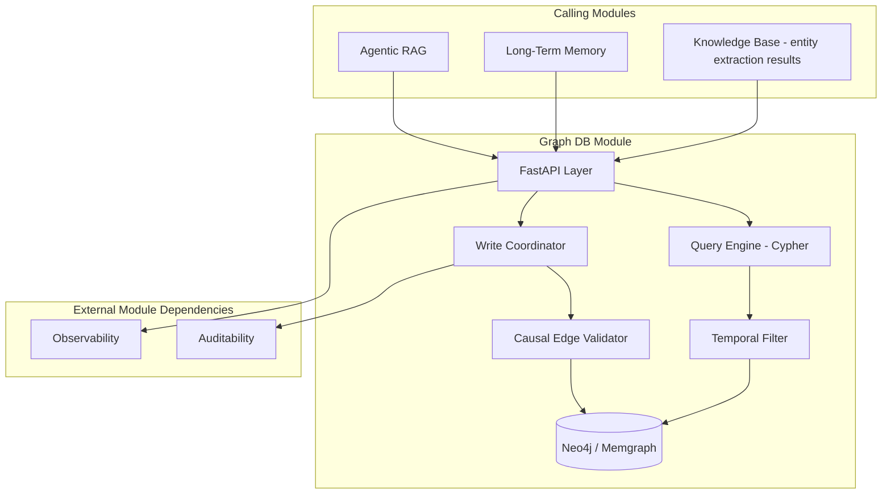
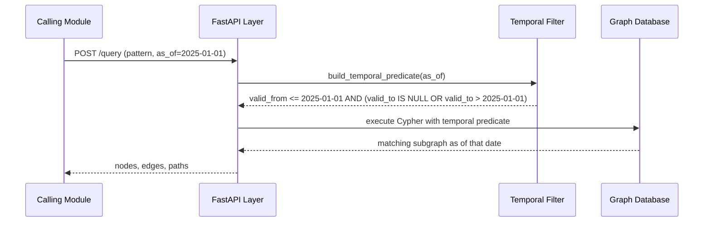
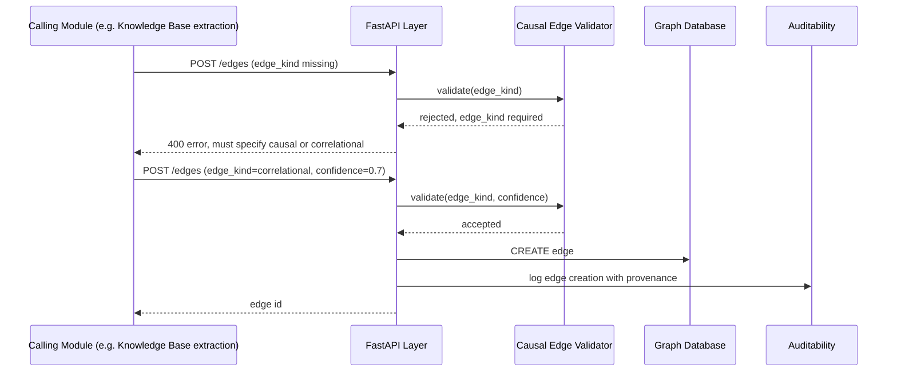

# Module 11: Graph DB — Complete Module Specification

## Overview and Commercial Value

| Description | Inputs | Outputs | Value | Key Metrics |
|---|---|---|---|---|
| Temporal, causally-typed entity/relationship storage | Node/edge writes, graph query | Query result (nodes, edges, paths) | Supports reasoning that pure vector search cannot ("what changed and why"), valuable for audit and long-term memory | Query latency, traversal depth, write throughput |

## Differentiator Features

Baseline (table stakes): entity/relationship storage, traversal queries.

What makes this module genuinely better:

- **Temporal graph support.** Relationships and facts are versioned over time (valid-from/valid-to on edges), letting agents reason about "what was true when," important for financial services audit and for Long-Term Memory's episodic reasoning, rather than a flat graph that only represents current state.
- **Causal edge typing.** Distinguishes correlation-only relationships from asserted causal ones, feeding more reliable agent reasoning than a graph where every edge is treated as equally meaningful, and giving Sentinel Agents and the Evaluation Framework a basis to challenge reasoning that conflates the two.

## Low-Level Design

### Level 1: Module Overview, Boundaries and Tech Stack

**Purpose.** Stores entities and their relationships for graph-based reasoning and memory, on behalf of Agentic RAG (structured relationship retrieval), Long-Term Memory (semantic/episodic graph) and Knowledge Base (entity extraction from documents). This module owns graph storage and query execution; it does not decide what to extract or when to query, that is the calling module's responsibility.

**Chosen stack**

| Concern | Choice | Why |
|---|---|---|
| Language/runtime | Python 3.12 | Platform consistency |
| Graph database | Neo4j Community/Enterprise, or Memgraph as a lighter-weight open source alternative depending on customer deployment scale | Both are mature, Cypher-compatible, self-hostable on any cloud (cloud-agnostic requirement); Memgraph offered as a lower-resource option for smaller deployments |
| Query language | Cypher | Industry-standard graph query language, widely understood, avoids a proprietary query DSL |
| Temporal modelling | Edge properties (`valid_from`, `valid_to`) plus query-time filtering, rather than a separate temporal graph engine | Keeps the model simple and portable across Neo4j/Memgraph rather than depending on a specialised temporal graph product |
| Entity extraction (feeding this module) | Owned by Knowledge Base and Long-Term Memory, not by this module; this module only stores and queries what it is given | Keeps this module a clean storage/query layer, avoiding scope creep into NLP |
| API layer | FastAPI wrapping the Cypher driver | Consistent platform API surface |
| Testing | `pytest`, `pytest-asyncio`, `testcontainers` for a real Neo4j/Memgraph instance | |

**Deployability and testability contract.** Runs and tests fully standalone; this module has no upstream module dependencies for its own core operation (write/query), only downstream consumers. Integration tests run against a real `testcontainers`-provisioned graph database instance.

### Level 2: Component Architecture and Diagrams



**Sub-components**

| Component | Responsibility | Built on |
|---|---|---|
| Write Coordinator | Validates and writes nodes/edges | Cypher driver, transactional writes |
| Causal Edge Validator | Enforces that edges are explicitly typed as causal or correlational at write time, rejects untyped edges | Schema validation at the API boundary |
| Query Engine | Executes traversal and pattern-match queries | Cypher, parameterised queries to avoid injection |
| Temporal Filter | Applies valid-from/valid-to filtering for point-in-time queries | Query-time predicate injection |

### Level 3: Detailed Design

**Data model (graph schema, not relational)**

| Element | Properties |
|---|---|
| Node (generic entity) | id, tenant_id, entity_type, name, attributes (map), created_at |
| Edge (relationship) | id, from_node_id, to_node_id, relationship_type, edge_kind (`causal` \| `correlational` \| `structural`), valid_from, valid_to (nullable, null = still current), confidence (nullable, for inferred edges), source_ref (provenance, e.g. Knowledge Base chunk ID) |

**API surface**

| Endpoint | Method | Request | Response | Notes |
|---|---|---|---|---|
| `/v1/graph-db/nodes` | POST | entity_type, name, attributes | node id | |
| `/v1/graph-db/edges` | POST | from_node_id, to_node_id, relationship_type, edge_kind, valid_from, source_ref | edge id | `edge_kind` is required, no default, forcing an explicit causal/correlational decision at write time |
| `/v1/graph-db/query` | POST | Cypher query (parameterised) or a structured query DSL for common patterns, as_of (optional timestamp for temporal filtering) | nodes, edges, paths | Structured DSL recommended for calling modules to avoid raw Cypher injection risk; raw Cypher available for advanced/internal use behind stricter access control |
| `/v1/graph-db/nodes/{id}/neighbours` | GET | depth, edge_kind filter, as_of | subgraph | Common traversal shortcut |

**Sequence: temporal point-in-time query**



**Sequence: causal-typed edge write**



### Level 4: Telemetry, Logging, Tracing, Alerting, Configuration and Testing

**Tracing.** `graph_db.query` span, attributes `graph.query_type` (traversal/pattern/temporal), `graph.result_node_count`, `graph.traversal_depth`. `graph_db.write` span for node/edge creation, attributes `graph.edge_kind`.

**Logging.** `structlog` JSON: `trace_id`, `tenant_id`, `operation`, `entity_type` or `relationship_type`, `event`. Full query text logged at INFO; entity content (names, attributes) subject to the same tenant data-classification rules as elsewhere.

**Metrics (Prometheus)**

| Metric | Type | Labels |
|---|---|---|
| `graph_db_queries_total` | Counter | `tenant_id`, `query_type` |
| `graph_db_query_duration_seconds` | Histogram | `tenant_id`, `traversal_depth_bucket` |
| `graph_db_writes_total` | Counter | `tenant_id`, `element_type` (node/edge), `edge_kind` |
| `graph_db_node_count` | Gauge | `tenant_id` |
| `graph_db_edge_count` | Gauge | `tenant_id`, `edge_kind` |

**Alerting**

| Alert | Condition | Severity |
|---|---|---|
| GraphDBQueryLatencyHigh | p95 of `graph_db_query_duration_seconds` > 0.1 for 2-3 hop traversals | Warning |
| GraphDBWriteFailureRateHigh | Write failure rate > 5% over 15 minutes | Critical |
| GraphDBUntypedEdgeRejectionSpike | Rejection rate for missing `edge_kind` rises sharply, may indicate an upstream integration bug | Informational |

**Configuration**

```yaml
graph_db:
  tenant_id: "<tenant>"
  query:
    default_max_traversal_depth: 3   # hot-reloadable, guards against runaway queries
    raw_cypher_enabled: false        # feature flag, default off, requires elevated access when on
  temporal:
    default_as_of: "now"
  telemetry:
    otlp_endpoint: "<customer-configured>"
```

**Deployment.** Graph database deployed as a stateful cluster (Neo4j Causal Cluster or Memgraph HA), sized per tenant workload; API layer stateless and independently scalable. `/healthz` checks graph database cluster health.

**Testing**

| Level | Tooling |
|---|---|
| Unit | `pytest`, `pytest-asyncio` |
| Contract | `schemathesis` against OpenAPI spec |
| Integration (isolated) | `testcontainers` for real Neo4j/Memgraph |
| Temporal correctness | Fixture graphs with known valid-from/valid-to ranges, verifying point-in-time query correctness |
| Causal typing enforcement | Test suite verifying no edge can be written without an explicit `edge_kind` |
| Load | `locust`, validated against the sub-100ms 2-3 hop traversal target |

**Non-functional targets**

| Attribute | Target |
|---|---|
| Query latency (2-3 hop traversal) | Under 100ms |
| Availability | 99.9% |
| Write throughput | Sized per tenant workload, tracked via `graph_db_writes_total` rate |
