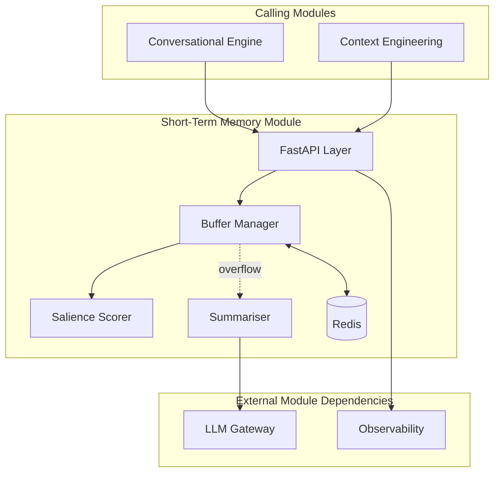
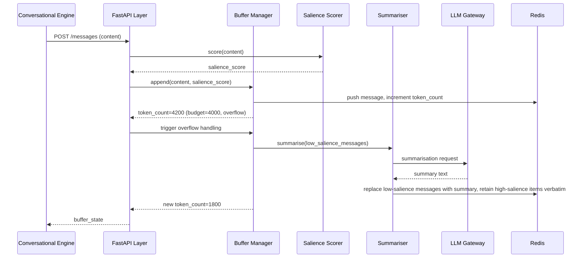
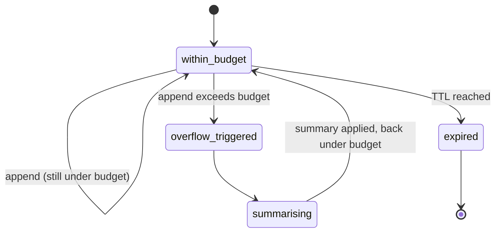

# Module 12: Short-Term Memory — Complete Module Specification

## Overview and Commercial Value

| Description | Inputs | Outputs | Value | Key Metrics |
|---|---|---|---|---|
| Token-budgeted session buffer with salience-weighted retention | Message, session ID, token budget | Buffer state, summary | Keeps conversations coherent without ballooning cost | Overflow rate, summarisation frequency |

## Differentiator Features

Baseline (table stakes): token-budgeted buffer, auto-summarisation on overflow.

What makes this module genuinely better:

- **Salience-weighted retention.** Not all recent messages are equal; the buffer keeps high-salience items (commitments, numbers, decisions) even as it summarises lower-value chat, rather than pure FIFO/token-count eviction that can drop a critical fact just because it happens to be a few turns old.

## Low-Level Design

### Level 1: Module Overview, Boundaries and Tech Stack

**Purpose.** Owns the working memory for a single active session: the recent message buffer that the Conversational Engine and Context Engineering draw on when assembling a prompt. Distinct from Long-Term Memory, which persists across sessions; this module's data is scoped to one session's lifetime and is intentionally lightweight.

**Chosen stack**

| Concern | Choice | Why |
|---|---|---|
| Language/runtime | Python 3.12 | Platform consistency |
| Storage | Redis | Sub-millisecond read/write, natural TTL for session-scoped expiry, no need for durable storage since this is working memory, not the system of record (Long-Term Memory owns durability) |
| Salience scoring | Lightweight rule-based scorer (numbers, named commitments, explicit "remember this" signals, entity density) with an optional LLM-based scorer for higher-value tenants | Keeps the common case fast and cheap; heavier scoring available where the tenant's use case justifies the cost |
| Summarisation | LLM Gateway call, triggered only on overflow | Reuses the platform's model access rather than a separate summarisation service |
| Testing | `pytest`, `pytest-asyncio`, `testcontainers` for Redis | |

**Deployability and testability contract.** Runs and tests fully with LLM Gateway stubbed for the summarisation path. Real Redis via `testcontainers` in integration tests.

### Level 2: Component Architecture and Diagrams



**Sub-components**

| Component | Responsibility | Built on |
|---|---|---|
| Buffer Manager | Appends messages, tracks token count, evicts/summarises on overflow | Redis list/hash structures per session |
| Salience Scorer | Scores each message for retention priority | Rule-based, optional LLM-based tier |
| Summariser | Compresses lower-salience content when the buffer exceeds budget | LLM Gateway call |

### Level 3: Detailed Design

**Data model (Redis structures, not relational)**

| Key pattern | Structure | Contents |
|---|---|---|
| `stm:session:{session_id}:messages` | List | Ordered messages, each with `content`, `token_count`, `salience_score`, `timestamp` |
| `stm:session:{session_id}:summary` | String | Current rolling summary, if any summarisation has occurred |
| `stm:session:{session_id}:token_count` | Integer | Running total, used for fast overflow checks without recomputing |

**API surface**

| Endpoint | Method | Request | Response | Notes |
|---|---|---|---|---|
| `/v1/short-term-memory/sessions/{id}/messages` | POST | content, role | buffer_state (current token count, overflow triggered boolean) | Appends a message |
| `/v1/short-term-memory/sessions/{id}` | GET | (none) | current buffer contents plus summary | Used by Context Engineering to build prompt context |
| `/v1/short-term-memory/sessions/{id}` | DELETE | (none) | status | Explicit session-end cleanup (also happens via TTL) |

**Sequence: message append triggering overflow and summarisation**



**State diagram: buffer lifecycle within a session**



### Level 4: Telemetry, Logging, Tracing, Alerting, Configuration and Testing

**Tracing.** `stm.append` span, attributes `stm.token_count`, `stm.overflow_triggered`, `stm.salience_score`.

**Logging.** `structlog` JSON: `trace_id`, `tenant_id`, `session_id`, `token_count`, `overflow_triggered`, `event`. Message content never logged.

**Metrics (Prometheus)**

| Metric | Type | Labels |
|---|---|---|
| `stm_appends_total` | Counter | `tenant_id` |
| `stm_overflow_events_total` | Counter | `tenant_id` |
| `stm_summarisation_duration_seconds` | Histogram | `tenant_id` |
| `stm_buffer_token_count` | Histogram | `tenant_id` (distribution at read time) |

**Alerting**

| Alert | Condition | Severity |
|---|---|---|
| STMOverflowRateHigh | Overflow rate per session exceeds tenant-expected baseline significantly | Informational, may indicate token budget is too small for typical conversations |
| STMSummarisationLatencyHigh | p95 of `stm_summarisation_duration_seconds` > 1s | Warning |

**Configuration**

```yaml
short_term_memory:
  tenant_id: "<tenant>"
  buffer:
    default_token_budget: 4000       # hot-reloadable
    session_ttl_seconds: 1800
  salience:
    scoring_method: "rule_based"     # rule_based | llm_based
    retention_priority_threshold: 0.7 # items above this score retained verbatim through summarisation
  telemetry:
    otlp_endpoint: "<customer-configured>"
```

**Deployment.** Stateless API layer, Redis as the only stateful dependency, deployed as a managed or self-hosted Redis cluster depending on customer preference (cloud-agnostic via standard Redis protocol).

**Testing**

| Level | Tooling |
|---|---|
| Unit | `pytest`, `pytest-asyncio` |
| Contract | `schemathesis` against OpenAPI spec |
| Integration (isolated) | `testcontainers` for real Redis, LLM Gateway stubbed |
| Salience retention correctness | Fixture conversations with known high-salience facts, verifying they survive summarisation |
| Load | `locust`, validated against sub-10ms append/read target |

**Non-functional targets**

| Attribute | Target |
|---|---|
| Append/read latency | Under 10ms |
| Availability | 99.9% |
| Summarisation latency | Bounded by LLM Gateway call, target under 1s |
