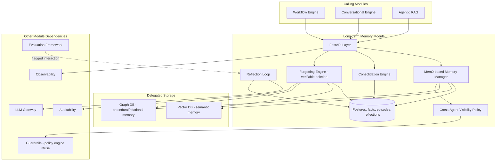
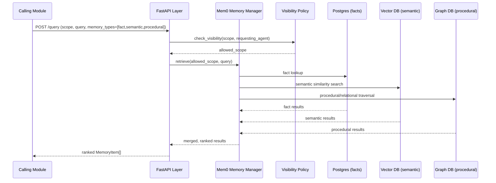
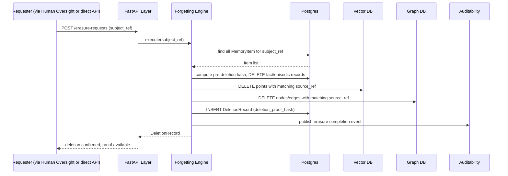
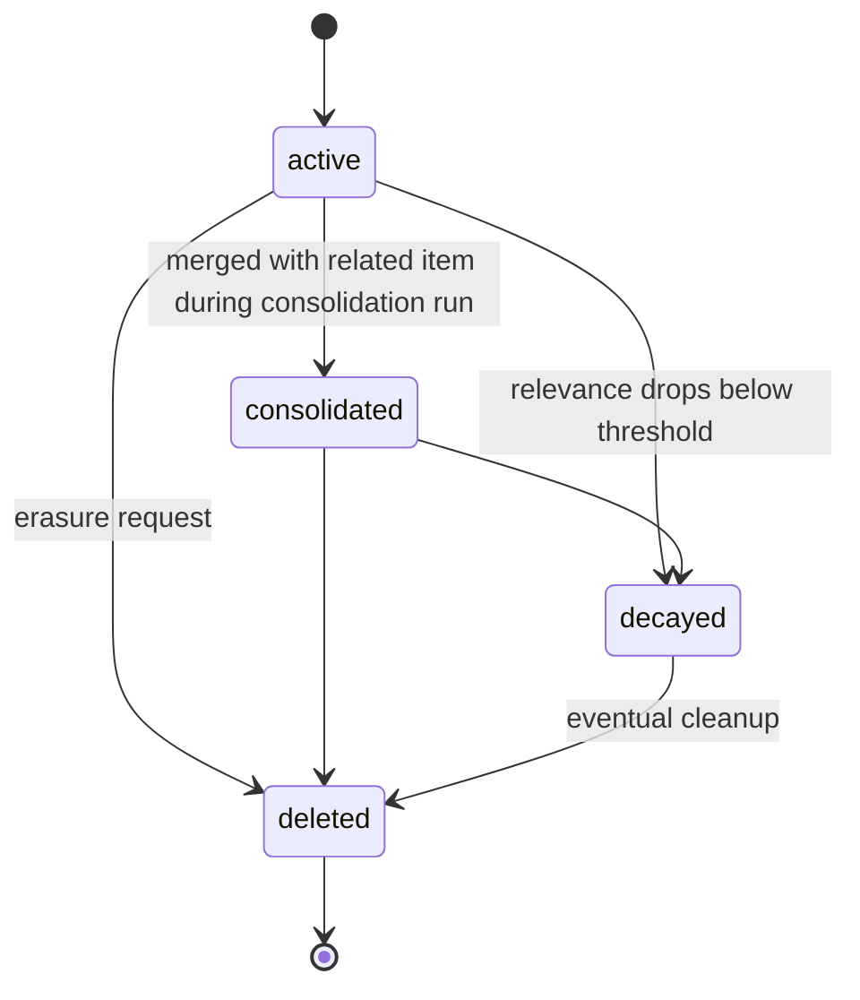

# Module 13: Long-Term Memory — Complete Module Specification

## Overview and Commercial Value

| Description | Inputs | Outputs | Value | Key Metrics |
|---|---|---|---|---|
| Hybrid store (facts, episodic, semantic, procedural) with consolidation and forgetting policies | Memory item to store, memory type, user/agent scope, query for retrieval | Stored confirmation, retrieved memories ranked by relevance | Agents that genuinely improve and personalise over time, and provably forget on request, a compliance and UX win at once | Recall accuracy on benchmark queries, memory growth rate, consolidation frequency, forgetting policy hit rate |

## Differentiator Features

Baseline (table stakes): hybrid store across memory types, consolidation, forgetting.

What makes this module genuinely better:

- **Agent self-reflection memory loop.** Agents log reflections on failed or corrected interactions (a verbal reinforcement learning pattern), improving future behaviour without retraining the underlying model, a technique now showing measurable gains in production coding and trading agents. This is a genuine "gets better over time" story most competing platforms cannot credibly make.
- **Explicit forgetting as a compliance feature, not just housekeeping.** Right-to-erasure requests trigger verifiable, auditable memory deletion across all memory types (episodic, semantic, procedural), mapped directly to GDPR and the Regulatory and Compliance module, turning what is usually a manual data-protection headache into an on-demand, provable action.
- **Cross-agent shared memory with governed visibility.** A team of agents can build shared institutional knowledge without every agent seeing everything, controlled by the same policy engine as Guardrails, rather than either full isolation (no shared learning) or full sharing (no access control).

## Low-Level Design

### Level 1: Module Overview, Boundaries and Tech Stack

**Purpose.** The durable, cross-session memory store for facts, episodes, semantic knowledge and procedural learning. Distinct from Short-Term Memory (session-scoped, ephemeral); this module persists what an agent or user relationship should remember across sessions, and owns the consolidation, forgetting and self-reflection loops that let agents genuinely improve over time.

**Chosen stack**

| Concern | Choice | Why |
|---|---|---|
| Language/runtime | Python 3.12 | Platform consistency |
| Memory framework | Mem0 (open source) as the base memory management layer, extended with platform-specific consolidation and governed cross-agent visibility | Mem0 already implements the core hybrid memory pattern (fact extraction, memory update/merge logic, retrieval) as a maintained open source project; building on it avoids reimplementing memory management primitives from scratch |
| Fact/episodic storage | PostgreSQL 16 via SQLAlchemy 2.0 async | Structured facts and episode metadata, transactional deletion for right-to-erasure |
| Semantic storage | Vector DB module (delegated, not owned locally) | Reuses the platform's vector storage rather than a second embedding store |
| Procedural/relational storage | Graph DB module (delegated, not owned locally) | Reuses the platform's graph storage for relationship-shaped procedural knowledge |
| Reflection loop | ADK 2.0 `Agent` reflection pattern, triggered on corrected or failed interactions flagged by Evaluation Framework | Reuses ADK's agent primitives rather than a bespoke reflection mechanism |
| Deletion verification | Cryptographic deletion proof (hash of pre-deletion state, signed deletion confirmation record) | Makes forgetting auditable and provable, not just "trust us it's gone" |
| Testing | `pytest`, `pytest-asyncio`, `testcontainers` for Postgres, Vector DB and Graph DB stubbed | |

**Deployability and testability contract.** Runs and tests fully with Vector DB, Graph DB, LLM Gateway and Evaluation Framework stubbed. This module owns fact/episode data directly in Postgres but delegates semantic and procedural storage to other modules, so its own tests focus on consolidation, forgetting and cross-agent visibility logic against stubbed storage backends.

### Level 2: Component Architecture and Diagrams



**Sub-components**

| Component | Responsibility | Built on |
|---|---|---|
| Mem0-based Memory Manager | Core memory CRUD, fact extraction and merge logic | Mem0 open source library |
| Consolidation Engine | Periodically merges/deduplicates related memories, applies decay to low-relevance items | Scheduled job |
| Forgetting Engine | Executes verifiable deletion across all storage backends on erasure request | Cross-module delete coordination plus cryptographic deletion proof |
| Reflection Loop | Generates and stores reflections on failed/corrected interactions | ADK reflection pattern, triggered by Evaluation Framework signals |
| Cross-Agent Visibility Policy | Determines which agents can read which memories | Reuses Guardrails' policy engine rather than a separate ACL system |

### Level 3: Detailed Design

**Data model**

| Entity | Key fields |
|---|---|
| MemoryItem | id, tenant_id, scope (user_ref or agent_ref), memory_type (fact/episodic/semantic/procedural), content, vector_ref (nullable, points to Vector DB), graph_ref (nullable, points to Graph DB), visibility_policy_ref, created_at, last_accessed_at, relevance_score |
| ConsolidationRun | id, tenant_id, items_merged_count, items_decayed_count, run_at |
| ReflectionEntry | id, agent_ref, triggering_interaction_ref, reflection_content, applied (boolean), created_at |
| DeletionRecord | id, tenant_id, subject_ref, memory_items_deleted (array of IDs), deletion_proof_hash, requested_by, completed_at |

**API surface**

| Endpoint | Method | Request | Response | Notes |
|---|---|---|---|---|
| `/v1/long-term-memory/items` | POST | scope, memory_type, content, visibility_policy_ref | MemoryItem id | Stores a new memory |
| `/v1/long-term-memory/query` | POST | scope, query, memory_types filter, top_k | ranked MemoryItem[] | Retrieval, fans out to Vector DB/Graph DB as needed |
| `/v1/long-term-memory/reflections` | GET | agent_ref | ReflectionEntry[] | |
| `/v1/long-term-memory/erasure-requests` | POST | subject_ref, reason | DeletionRecord (id, status) | Triggers cross-store verifiable deletion |
| `/v1/long-term-memory/erasure-requests/{id}` | GET | (none) | DeletionRecord with deletion_proof_hash | Proof of completion |

**Sequence: memory retrieval spanning fact, semantic and procedural stores**



**Sequence: verifiable right-to-erasure**



**State diagram: memory item lifecycle**



### Level 4: Telemetry, Logging, Tracing, Alerting, Configuration and Testing

**Tracing.** `ltm.retrieve` span with attributes `ltm.memory_types_queried`, `ltm.result_count`, `ltm.scope`. `ltm.erasure` span for deletion operations, attributes `ltm.items_deleted_count`, `ltm.deletion_proof_hash`.

**Logging.** `structlog` JSON: `trace_id`, `tenant_id`, `scope`, `operation`, `event`. Memory content never logged at INFO; erasure operations always logged at INFO with counts (not content) since they are compliance-relevant events.

**Metrics (Prometheus)**

| Metric | Type | Labels |
|---|---|---|
| `ltm_items_stored_total` | Counter | `tenant_id`, `memory_type` |
| `ltm_retrieval_duration_seconds` | Histogram | `tenant_id`, `memory_types_queried` |
| `ltm_consolidation_runs_total` | Counter | `tenant_id` |
| `ltm_reflection_entries_total` | Counter | `agent_ref` |
| `ltm_erasure_requests_total` | Counter | `tenant_id`, `outcome` |
| `ltm_erasure_completion_duration_seconds` | Histogram | `tenant_id` |

**Alerting**

| Alert | Condition | Severity |
|---|---|---|
| LTMErasureRequestFailing | Any erasure request fails to complete within its SLA window | Critical, compliance-relevant |
| LTMRetrievalLatencyHigh | p95 of `ltm_retrieval_duration_seconds` > 0.15 | Warning |
| LTMConsolidationBacklog | Consolidation runs falling behind schedule, memory growth rate outpacing consolidation | Warning |
| LTMReflectionLoopStalled | No new ReflectionEntry created despite Evaluation Framework flagging failed interactions | Warning, may indicate a broken integration |

**Configuration**

```yaml
long_term_memory:
  tenant_id: "<tenant>"
  consolidation:
    schedule: "daily"
    decay_threshold: 0.2             # hot-reloadable
  reflection:
    enabled: true                    # feature flag
    trigger_source: "evaluation_framework"
  cross_agent_sharing:
    enabled: false                   # feature flag, default off, opt-in per tenant
    visibility_policy_ref: "<policy_id>"
  erasure:
    sla_hours: 72                    # time within which an erasure request must complete
  telemetry:
    otlp_endpoint: "<customer-configured>"
```

**Deployment.** Stateless API and orchestration layer; state lives in Postgres (owned) plus Vector DB and Graph DB (delegated). `/healthz` checks Postgres, Vector DB and Graph DB reachability.

**Testing**

| Level | Tooling |
|---|---|
| Unit | `pytest`, `pytest-asyncio` |
| Contract | `schemathesis` against OpenAPI spec |
| Integration (isolated) | Vector DB, Graph DB, LLM Gateway, Evaluation Framework stubbed; `testcontainers` for Postgres |
| Erasure verification | Dedicated test suite confirming zero residual data across Postgres, Vector DB and Graph DB after an erasure request, and correct deletion_proof_hash generation |
| Reflection quality | Fixture failed-interaction scenarios verifying reflections are generated and measurably improve subsequent behaviour in a controlled eval |
| Load | `locust`, validated against retrieval latency target |

**Non-functional targets**

| Attribute | Target |
|---|---|
| Write latency | Under 100ms |
| Retrieval latency | Under 150ms |
| Erasure completion | Within configured SLA (default 72 hours), verifiable via deletion proof |
| Availability | 99.9% |
