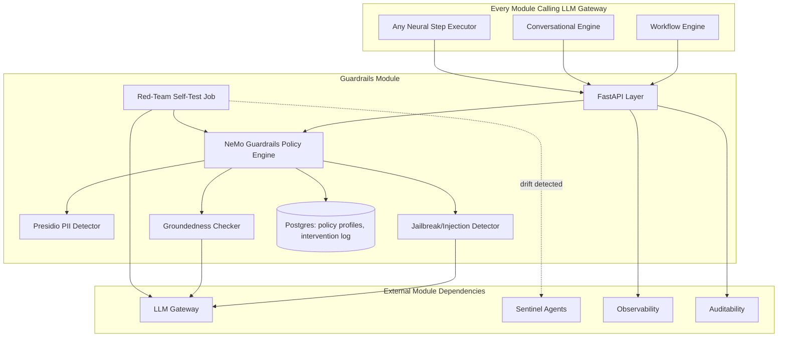
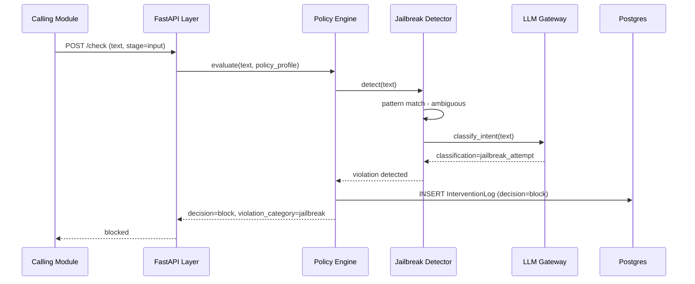
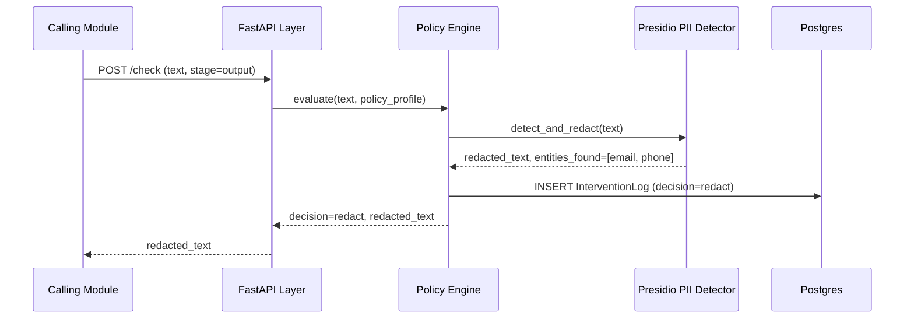
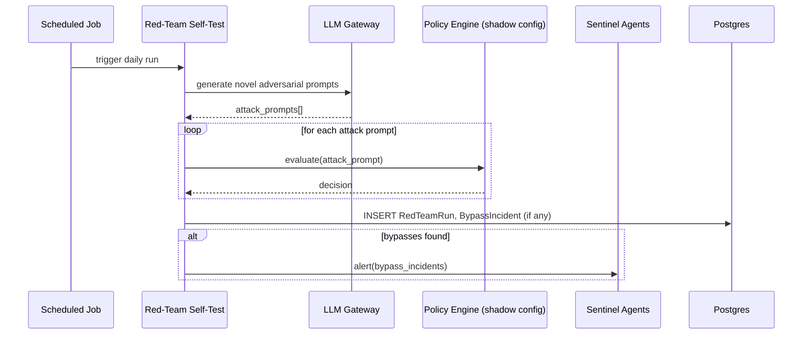
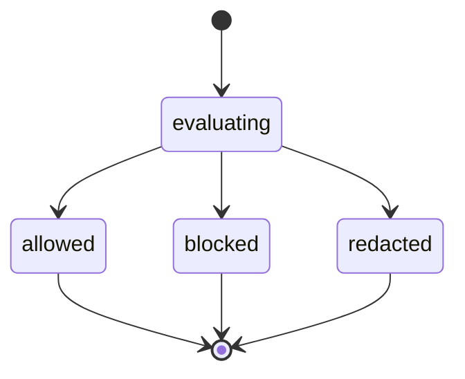

# Module 14: Guardrails — Complete Module Specification

## Overview and Commercial Value

| Description | Inputs | Outputs | Value | Key Metrics |
|---|---|---|---|---|
| Dual-stage input/output validation against policy: PII, jailbreak, content safety, groundedness | Input or output text, policy profile | Allow/block/redact decision, violation category, redacted text | The baseline trust requirement for any regulated customer, sellable as "we test ourselves continuously" | Intervention rate, false-positive rate, false-negative rate on adversarial test set, latency overhead |

## Differentiator Features

Baseline (table stakes): PII detection, jailbreak/injection defence, content safety, groundedness checking.

What makes this module genuinely better:

- **OWASP Top 10 for Agentic Applications alignment specifically.** This is distinct from and newer than the LLM Top 10 most competitors still build to; it covers agent-specific risks like excessive agency, tool misuse and goal manipulation, which is exactly the risk surface this platform's autonomous agents actually create.
- **Adversarial self-testing built in.** The platform runs its own red-team agent continuously against production guardrails to catch drift, rather than relying only on periodic manual pen testing, so degradation is caught before a real attacker finds it.

## Low-Level Design

### Level 1: Module Overview, Boundaries and Tech Stack

**Purpose.** The dual-stage policy enforcement point for every input reaching an LLM and every output leaving one. Every module that calls LLM Gateway routes the request and response through this module first (input check before the call, output check after), except where a step is explicitly configured to skip it (rare, and itself a Sentinel Agents monitoring signal).

**Chosen stack**

| Concern | Choice | Why |
|---|---|---|
| Language/runtime | Python 3.12 | Platform consistency |
| Guardrail framework | NVIDIA NeMo Guardrails (open source) as the policy execution engine, extended with custom detectors | NeMo Guardrails already provides a mature rails/flow-based policy definition language and integrates PII/jailbreak/topic detectors; building on it avoids reimplementing policy orchestration from scratch |
| PII detection | Microsoft Presidio (open source) | Purpose-built, actively maintained, covers 50+ entity types out of the box, integrates cleanly as a NeMo Guardrails detector |
| Jailbreak/prompt injection detection | Combination of Presidio-adjacent pattern detectors, a fine-tuned classifier, and an LLM Gateway call for ambiguous cases | Layered defence rather than a single detection method, since no single technique catches everything |
| Groundedness checking | Shared implementation with Agentic RAG's Groundedness Critic, exposed here for output-stage checks not tied to a retrieval flow | Avoids duplicating groundedness logic in two places |
| Red-team self-testing | Scheduled job using an LLM Gateway-driven adversarial agent generating novel jailbreak attempts against a shadow copy of production guardrail config | Continuous validation rather than point-in-time manual testing |
| API layer | FastAPI | Consistency |
| Testing | `pytest`, adversarial test corpus (OWASP LLM/Agentic Top 10 aligned test cases), `testcontainers` where a local model is needed for detection | |

**Deployability and testability contract.** Runs and tests fully standalone using its own bundled detectors and a stubbed LLM Gateway for the ambiguous-case fallback path. The adversarial test corpus ships with the module so guardrail regression tests never depend on an external dataset being available.

### Level 2: Component Architecture and Diagrams



**Sub-components**

| Component | Responsibility | Built on |
|---|---|---|
| NeMo Guardrails Policy Engine | Orchestrates which checks run, in what order, per policy profile | NeMo Guardrails rails/flows |
| Presidio PII Detector | Detects and redacts PII entities | Microsoft Presidio |
| Jailbreak/Injection Detector | Detects manipulation attempts (direct and indirect via retrieved content) | Pattern detectors, fine-tuned classifier, LLM Gateway fallback |
| Groundedness Checker | Assesses whether an output is supported by provided context | Shared logic with Agentic RAG's critic |
| Red-Team Self-Test Job | Continuously generates and runs novel adversarial attempts against a shadow config | Scheduled job, LLM Gateway-driven attack generation |

### Level 3: Detailed Design

**Data model**

| Entity | Key fields |
|---|---|
| PolicyProfile | id, tenant_id, name, enabled_checks (array), pii_entity_types, denied_topics, groundedness_threshold, status |
| InterventionLog | id, tenant_id, policy_profile_id, stage (input/output), check_type, decision (allow/block/redact), violation_category, latency_ms, created_at |
| RedTeamRun | id, tenant_id, attempts_generated, successful_bypasses, run_at |
| BypassIncident | id, red_team_run_id, attack_pattern, target_check, severity, resolved (boolean) |

**API surface**

| Endpoint | Method | Request | Response | Notes |
|---|---|---|---|---|
| `/v1/guardrails/check` | POST | text, stage (input/output), policy_profile_id | decision, violation_category (nullable), redacted_text (nullable) | Main enforcement endpoint, called by every LLM Gateway consumer |
| `/v1/guardrails/policy-profiles` | POST | tenant_id, enabled_checks, entity_types, denied_topics, groundedness_threshold | PolicyProfile | |
| `/v1/guardrails/red-team-runs` | GET | tenant_id, date_range | RedTeamRun[] with BypassIncident[] | |
| `/v1/guardrails/red-team-runs/trigger` | POST | (none) | run_id | Manual trigger, in addition to the scheduled cadence |

**Sequence: input check blocking a jailbreak attempt**



**Sequence: output check with PII redaction**



**Sequence: scheduled red-team self-test detecting drift**



**State diagram: check decision flow**



### Level 4: Telemetry, Logging, Tracing, Alerting, Configuration and Testing

**Tracing.** `guardrails.check` span, attributes `guardrails.stage`, `guardrails.decision`, `guardrails.violation_category`, `guardrails.checks_run` (list). Given this sits on the hot path of nearly every LLM call, span overhead itself is tracked as a first-class metric.

**Logging.** `structlog` JSON: `trace_id`, `tenant_id`, `stage`, `decision`, `violation_category`, `event`. Original and redacted text never logged at INFO; DEBUG only, feature-flagged, since this module by definition handles the most sensitive content in the platform.

**Metrics (Prometheus)**

| Metric | Type | Labels |
|---|---|---|
| `guardrails_checks_total` | Counter | `tenant_id`, `stage`, `decision` |
| `guardrails_check_duration_seconds` | Histogram | `tenant_id`, `stage` |
| `guardrails_intervention_rate` | Gauge | `tenant_id` (block+redact ratio) |
| `guardrails_redteam_bypass_total` | Counter | `tenant_id`, `attack_pattern` |

**Alerting**

| Alert | Condition | Severity |
|---|---|---|
| GuardrailsCheckLatencyHigh | p95 of `guardrails_check_duration_seconds` > 0.05 | Warning |
| GuardrailsRedTeamBypassDetected | Any `guardrails_redteam_bypass_total` increment | Critical, routed immediately, not batched |
| GuardrailsInterventionRateAnomaly | Intervention rate shifts more than 50% relative to 7-day baseline | Warning, could indicate either an attack pattern or a misconfiguration |

**Configuration**

```yaml
guardrails:
  tenant_id: "<tenant>"
  checks:
    pii_detection_enabled: true
    jailbreak_detection_enabled: true
    groundedness_check_enabled: true
    denied_topics: []                # tenant-specific, additive to platform defaults
  pii:
    entity_types: ["EMAIL", "PHONE_NUMBER", "PERSON", "CREDIT_CARD"]  # subset of Presidio's supported types
    action: "redact"                 # redact | block
  groundedness:
    threshold: 0.85                  # hot-reloadable
  red_team:
    schedule: "daily"
    enabled: true                    # feature flag, strongly recommended not to disable
  telemetry:
    otlp_endpoint: "<customer-configured>"
```

**Deployment.** Stateless container, horizontal autoscale on check throughput given its position on the hot path for nearly every LLM call platform-wide; deploy with a higher replica floor and stricter SLO than most modules, similar to LLM Gateway.

**Testing**

| Level | Tooling |
|---|---|
| Unit | `pytest`, `pytest-asyncio` |
| Contract | `schemathesis` against OpenAPI spec |
| Integration (isolated) | LLM Gateway stubbed for the ambiguous-case fallback |
| Adversarial regression | OWASP LLM Top 10 and OWASP Agentic Top 10 aligned test corpus, run on every guardrail config change as a CI gate |
| Red-team validation | Dedicated test verifying the scheduled job itself functions correctly and alerts Sentinel Agents on a simulated bypass |
| Load | `locust`, validated against the sub-50ms per-check target |

**Non-functional targets**

| Attribute | Target |
|---|---|
| Check latency | Under 50ms per check |
| Availability | 99.95% (hot-path module) |
| False-negative rate on adversarial test set | Tracked and reported, target continuously decreasing, no absolute zero claimed |
