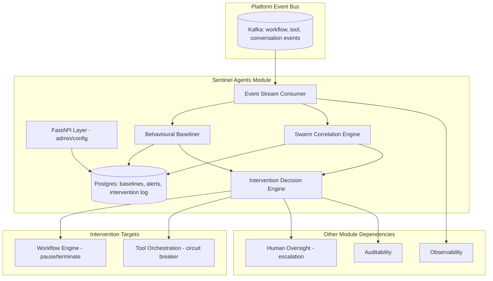
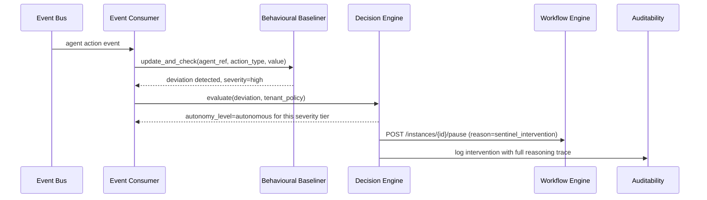
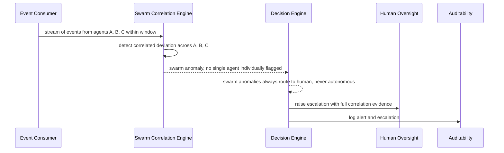
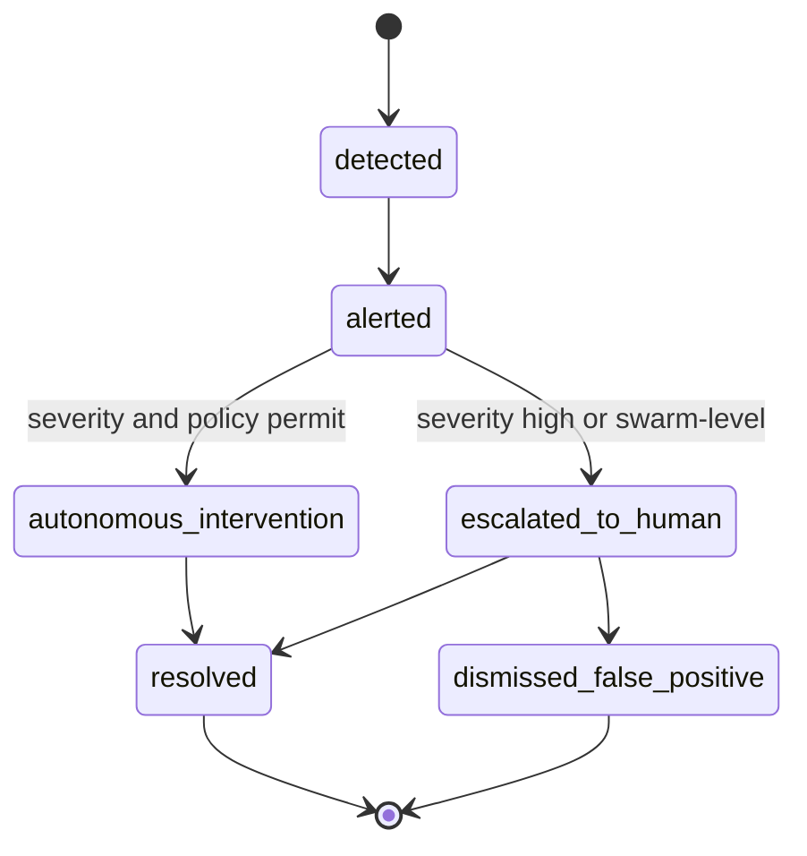

# Module 15: Sentinel Agents — Complete Module Specification

## Overview and Commercial Value

| Description | Inputs | Outputs | Value | Key Metrics |
|---|---|---|---|---|
| Runtime agents monitoring other agents, with per-agent behavioural baselining and swarm-level anomaly detection | Agent action stream, policy rules | Alert, autonomous intervention, audit event | Genuinely underserved area; catches problems no single-agent monitor would see | Detection rate, false-alarm rate, mean time to detect |

## Differentiator Features

Baseline (table stakes): runtime monitoring, anomaly detection, autonomous intervention.

What makes this module genuinely better:

- **Behavioural baselining per agent.** A Sentinel learns what "normal" looks like for each specific agent and flags deviation, rather than applying one static ruleset to all agents, so a customer-service agent and a trading agent are held to appropriately different behavioural norms rather than a lowest-common-denominator rule set.
- **Swarm-level anomaly detection.** Catches emergent problems that only appear from the interaction of multiple agents, not visible when watching any single agent in isolation. This is a genuinely underserved area industry-wide right now and is exactly the failure mode that only becomes possible once a platform runs many agents together, which this platform does by design.

## Low-Level Design

### Level 1: Module Overview, Boundaries and Tech Stack

**Purpose.** Watches the platform's own agents at runtime, independent of Guardrails (which checks individual inputs/outputs) and Evaluation Framework (which scores quality). Sentinel Agents are concerned with behaviour over time and across agents: is this agent acting outside its normal envelope, is this agent exceeding its intended scope of action, and are multiple agents together producing an emergent problem no single one would trigger alone.

**Chosen stack**

| Concern | Choice | Why |
|---|---|---|
| Language/runtime | Python 3.12 | Platform consistency |
| Agent runtime for the Sentinels themselves | Google ADK 2.0 `Agent`, since Sentinels are themselves agents observing other agents, not a separate monitoring paradigm | Consistency, and lets Sentinels use the same tool/reasoning primitives as any other platform agent when investigating an anomaly |
| Behavioural baselining | Statistical process control (rolling mean/variance per agent per action type) as the default, with an optional anomaly-detection model (e.g. isolation forest) for higher-volume tenants | Keeps the default explainable and cheap; heavier ML available where volume and value justify it |
| Swarm-level detection | Correlation analysis across agent action streams within a time window, looking for co-occurring deviations that individually would not trigger an alert | Custom correlation logic over the same event stream Observability consumes, not a separate data pipeline |
| Event ingestion | Consumes the same event bus (Kafka/Redpanda) that Observability and Auditability consume from, via `aiokafka` | Avoids a second event pipeline; Sentinels are a consumer, not a producer, of the platform's existing lifecycle events |
| Intervention mechanism | Calls back into Workflow Engine's `/instances/{id}/pause` or `/terminate` endpoints, and Tool Orchestration's circuit breaker, rather than having its own separate kill-switch mechanism | Reuses existing control points instead of building parallel intervention machinery |
| Testing | `pytest`, `pytest-asyncio`, fixture event streams with known anomaly and swarm-anomaly patterns | |

**Deployability and testability contract.** Runs and tests fully with a replayed/fixture event stream in place of the real Kafka feed, and with Workflow Engine/Tool Orchestration intervention endpoints stubbed.

### Level 2: Component Architecture and Diagrams



**Sub-components**

| Component | Responsibility | Built on |
|---|---|---|
| Event Stream Consumer | Ingests platform lifecycle events in real time | `aiokafka` consumer |
| Behavioural Baseliner | Maintains per-agent normal-behaviour statistics, flags deviation | Rolling statistics, optional isolation forest |
| Swarm Correlation Engine | Detects cross-agent emergent anomalies | Time-windowed correlation analysis |
| Intervention Decision Engine | Decides whether to alert, escalate to human, or autonomously intervene, based on severity and tenant policy | Rule-based decision tree, configurable autonomy level per severity tier |

### Level 3: Detailed Design

**Data model**

| Entity | Key fields |
|---|---|
| AgentBaseline | agent_ref, action_type, mean, variance, sample_count, last_updated_at |
| Alert | id, tenant_id, alert_type (single_agent/swarm), agent_refs (array), severity, description, detected_at |
| InterventionRecord | id, alert_id, intervention_type (alert_only/pause/terminate/circuit_break), target_ref, executed_at, outcome |
| SwarmCorrelationWindow | id, tenant_id, window_start, window_end, agent_refs_involved, correlation_score, pattern_description |

**API surface**

| Endpoint | Method | Request | Response | Notes |
|---|---|---|---|---|
| `/v1/sentinel-agents/alerts` | GET | tenant_id, date_range, severity filter | Alert[] | |
| `/v1/sentinel-agents/alerts/{id}` | GET | (none) | full Alert with contributing baseline/correlation data | |
| `/v1/sentinel-agents/baselines/{agent_ref}` | GET | (none) | current AgentBaseline per action_type | Transparency into what "normal" means for a given agent |
| `/v1/sentinel-agents/config` | POST | tenant_id, autonomy_level_per_severity, intervention_policy | status | Configures how much autonomy Sentinels have to act unilaterally |

**Sequence: single-agent deviation triggering autonomous pause**



**Sequence: swarm-level anomaly requiring human escalation**



**State diagram: alert lifecycle**



### Level 4: Telemetry, Logging, Tracing, Alerting, Configuration and Testing

**Tracing.** `sentinel.evaluate` span per event batch, attributes `sentinel.agent_ref`, `sentinel.deviation_detected`, `sentinel.severity`. `sentinel.intervene` span when an intervention fires, attributes `sentinel.intervention_type`, `sentinel.target_ref`.

**Logging.** `structlog` JSON: `trace_id`, `tenant_id`, `agent_ref`, `alert_type`, `severity`, `event`. Full reasoning behind a flagged deviation logged at INFO given its audit relevance, since this is exactly the kind of decision a compliance reviewer will want to see explained.

**Metrics (Prometheus)**

| Metric | Type | Labels |
|---|---|---|
| `sentinel_alerts_total` | Counter | `tenant_id`, `alert_type`, `severity` |
| `sentinel_interventions_total` | Counter | `tenant_id`, `intervention_type` |
| `sentinel_detection_latency_seconds` | Histogram | `tenant_id`, `alert_type` |
| `sentinel_false_positive_rate` | Gauge | `tenant_id` (computed from dismissed alerts over total alerts) |

**Alerting (meta: alerts about the alerting system itself)**

| Alert | Condition | Severity |
|---|---|---|
| SentinelDetectionLatencyHigh | p95 of `sentinel_detection_latency_seconds` exceeds the 500ms design target | Warning |
| SentinelFalsePositiveRateHigh | `sentinel_false_positive_rate` exceeds tenant-configured tolerance over 7 days | Warning, tune baselining sensitivity |
| SentinelEventConsumerLag | Kafka consumer lag exceeds threshold, meaning detection is running on stale data | Critical |

**Configuration**

```yaml
sentinel_agents:
  tenant_id: "<tenant>"
  baselining:
    method: "statistical"            # statistical | isolation_forest
    sensitivity: "medium"            # low | medium | high, hot-reloadable
  swarm_detection:
    enabled: true
    correlation_window_seconds: 300
  intervention:
    autonomy_level:
      low_severity: "alert_only"
      medium_severity: "alert_only"
      high_severity: "autonomous_intervention"  # tenant can restrict to alert_only if preferred
    swarm_anomalies_always_escalate: true        # cannot be overridden to autonomous, by design
  telemetry:
    otlp_endpoint: "<customer-configured>"
```

**Deployment.** Stateless consumer group, horizontally scalable by Kafka partition count. `/healthz` checks Kafka consumer lag and Postgres connectivity.

**Testing**

| Level | Tooling |
|---|---|
| Unit | `pytest`, `pytest-asyncio` |
| Contract | `schemathesis` against OpenAPI spec, consumer-driven contract test against the platform event schema |
| Integration (isolated) | Fixture event streams with injected known single-agent and swarm anomaly patterns, Workflow Engine/Tool Orchestration intervention endpoints stubbed |
| Detection accuracy regression | Labelled fixture event streams (normal, single-agent-anomalous, swarm-anomalous) run in CI on any baselining or correlation logic change |
| Load | `locust`-driven event stream replay, validated against detection latency target under realistic event volume |

**Non-functional targets**

| Attribute | Target |
|---|---|
| Detection latency | Under 500ms from event to alert |
| Availability | 99.9% |
| Swarm anomalies | Always escalate to human, never autonomous intervention, by design, regardless of tenant configuration |
