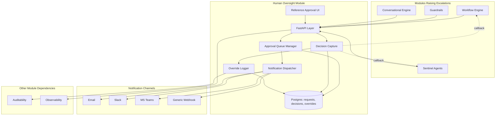
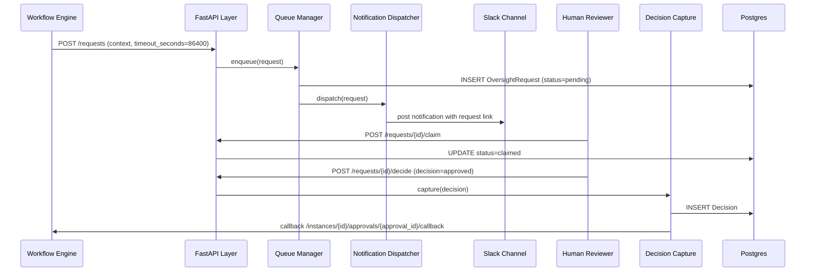
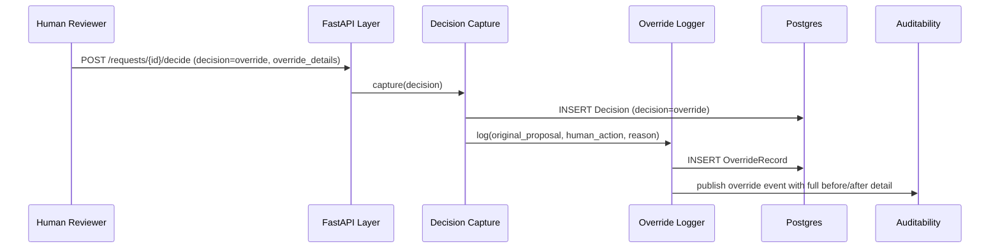
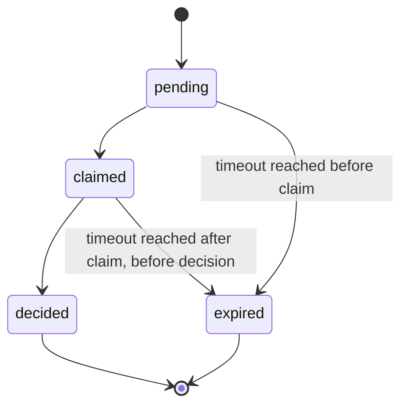

# Module 16: Human Oversight — Complete Module Specification

## Overview and Commercial Value

| Description | Inputs | Outputs | Value | Key Metrics |
|---|---|---|---|---|
| Designed-in approval queues, override logging, escalation routing per EU AI Act Article 14 | Escalation trigger, decision context | Approval/rejection, override record | Turns a legal requirement into a built-in feature rather than a customer afterthought | Approval turnaround time, override rate |

## Differentiator Features

Baseline (table stakes): approval queues, override logging, escalation routing.

There is no separate "baseline vs differentiator" split for this module the way there is for most others: the differentiator here is structural, not a bolt-on feature. Most competing platforms treat human oversight as something a customer bolts onto their own workflow tooling after the fact. This module makes it a first-class platform primitive that Workflow Engine, Sentinel Agents and Guardrails all call into directly, which is what actually satisfies EU AI Act Article 14's "designed and developed" requirement for human oversight, rather than a policy document describing a manual process layered on top.

## Low-Level Design

### Level 1: Module Overview, Boundaries and Tech Stack

**Purpose.** The single system of record for every point where a human is asked to review, approve, reject or override an agent decision, regardless of which module raised the request (Workflow Engine's confidence-gated steps, Sentinel Agents' escalations, Guardrails' ambiguous cases routed to a person). Owns queueing, notification, decision capture and override logging; does not itself decide what should require human review, that is each calling module's responsibility via configuration.

**Chosen stack**

| Concern | Choice | Why |
|---|---|---|
| Language/runtime | Python 3.12 | Platform consistency |
| Queue/task management | Custom lightweight queue built on Postgres with `SELECT FOR UPDATE SKIP LOCKED` for worker-safe claiming, rather than a heavyweight workflow engine, since this module's job is narrower than Workflow Engine's | Avoids depending on a second orchestration engine for what is fundamentally a queue-plus-notification problem |
| Notification delivery | Pluggable notification adapters: email (SMTP), Slack, Microsoft Teams, generic webhook | Meets customers where their existing operational tooling already is, rather than forcing a new UI as the only entry point |
| Approval UI | A minimal reference web UI included, but the API is the primary contract; customers with existing case-management tools (ServiceNow, Jira) integrate via the API/webhook rather than being forced onto the reference UI | Keeps the module genuinely composable rather than assuming customers will abandon their existing operational tooling |
| API layer | FastAPI | Consistency |
| Testing | `pytest`, `pytest-asyncio`, `testcontainers` for Postgres | |

**Deployability and testability contract.** Runs and tests fully standalone; calling modules (Workflow Engine, Sentinel Agents, Guardrails) are stubbed as request originators in this module's own test suite, and this module's callback endpoints are what those modules stub in their own tests (see, for example, Module 1 section 4.4).

### Level 2: Component Architecture and Diagrams



**Sub-components**

| Component | Responsibility | Built on |
|---|---|---|
| Approval Queue Manager | Accepts escalation requests, manages queue state, claiming, timeout | Postgres, `SELECT FOR UPDATE SKIP LOCKED` |
| Notification Dispatcher | Routes new requests to the configured channel(s) per tenant | Pluggable adapter pattern |
| Decision Capture | Records the human's decision, triggers the callback to the requesting module | Postgres transaction, then async callback |
| Override Logger | Records when a human overrides an agent's proposed action, distinct from a simple approve/reject, since an override carries additional audit weight | Postgres, immutable append |
| Reference Approval UI | Minimal web UI for reviewers who do not have an existing case-management integration | Simple server-rendered or lightweight SPA, not the primary integration path |

### Level 3: Detailed Design

**Data model**

| Entity | Key fields |
|---|---|
| OversightRequest | id, tenant_id, requesting_module, requesting_ref (e.g. step_execution_id), context (JSONB), priority, status (pending/claimed/decided/expired), created_at, expires_at |
| Decision | id, request_id, decision (approved/rejected/override), decided_by, decision_reason, decided_at |
| OverrideRecord | id, decision_id, original_agent_proposal (JSONB), human_override_action (JSONB), override_reason, created_at |
| NotificationLog | id, request_id, channel, delivered_at, delivery_status |

**API surface**

| Endpoint | Method | Request | Response | Notes |
|---|---|---|---|---|
| `/v1/human-oversight/requests` | POST | tenant_id, requesting_module, requesting_ref, context, priority, timeout_seconds | OversightRequest id | Called by Workflow Engine, Sentinel Agents, Guardrails, etc |
| `/v1/human-oversight/requests/{id}/claim` | POST | claimed_by | status | A reviewer claims a request to work on it |
| `/v1/human-oversight/requests/{id}/decide` | POST | decision, decided_by, decision_reason, override_details (optional) | Decision | Triggers callback to the originating module |
| `/v1/human-oversight/requests` | GET | tenant_id, status filter | OversightRequest[] | Queue view for the reference UI or an external integration |
| `/v1/human-oversight/requests/{id}` | GET | (none) | full request with decision/override if resolved | |

**Sequence: escalation raised, notified, decided, callback delivered**



**Sequence: override with reasoning captured**



**State diagram: request lifecycle**



### Level 4: Telemetry, Logging, Tracing, Alerting, Configuration and Testing

**Tracing.** `oversight.request.lifecycle` span spanning from creation to decision, attributes `oversight.requesting_module`, `oversight.priority`, `oversight.decision`, `oversight.wait_duration_seconds`.

**Logging.** `structlog` JSON: `trace_id`, `tenant_id`, `requesting_module`, `status`, `event`. Override records logged at INFO in full (original proposal, human action, reason) given their audit importance; this is one of the few places in the platform where full decision content is logged by design, not redacted, since it is precisely the record a regulator would want to see.

**Metrics (Prometheus)**

| Metric | Type | Labels |
|---|---|---|
| `oversight_requests_total` | Counter | `tenant_id`, `requesting_module`, `outcome` (approved/rejected/override/expired) |
| `oversight_wait_duration_seconds` | Histogram | `tenant_id`, `priority` |
| `oversight_override_rate` | Gauge | `tenant_id`, `requesting_module` |
| `oversight_notification_delivery_failures_total` | Counter | `channel` |

**Alerting**

| Alert | Condition | Severity |
|---|---|---|
| OversightBacklogGrowing | Pending queue depth grows sustained over 1 hour | Warning |
| OversightExpiryRateHigh | Expiry rate (requests timing out unclaimed or undecided) > 10% | Warning, likely means reviewer capacity or notification delivery issue |
| OversightNotificationDeliveryFailing | Notification delivery failure rate > 5% for a channel | Critical, since a failed notification means a request may sit unseen |
| OversightOverrideRateSpike | Override rate for a requesting_module rises sharply relative to baseline | Informational, worth investigating whether the underlying agent behaviour has degraded |

**Configuration**

```yaml
human_oversight:
  tenant_id: "<tenant>"
  notification:
    channels: ["slack"]              # email | slack | teams | webhook, tenant can enable multiple
    escalation_on_timeout: true      # re-notify or escalate to a secondary channel/reviewer group
  queue:
    default_timeout_seconds: 86400   # hot-reloadable, overridable per request
    priority_levels: ["low", "medium", "high", "critical"]
  telemetry:
    otlp_endpoint: "<customer-configured>"
```

**Deployment.** Stateless API layer, Postgres as the only stateful dependency. `/healthz` checks Postgres and configured notification channel reachability.

**Testing**

| Level | Tooling |
|---|---|
| Unit | `pytest`, `pytest-asyncio` |
| Contract | `schemathesis` against OpenAPI spec; consumer-driven contract tests for the callback interface each requesting module depends on |
| Integration (isolated) | `testcontainers` for Postgres, notification channels mocked |
| Timeout/expiry correctness | Fixture requests with short timeouts verifying correct expiry transition and escalation behaviour |
| Load | `locust`, validated against queue throughput under realistic escalation volume |

**Non-functional targets**

| Attribute | Target |
|---|---|
| Request creation latency | Under 50ms |
| Notification dispatch latency | Under 5 seconds |
| Availability | 99.9% |
