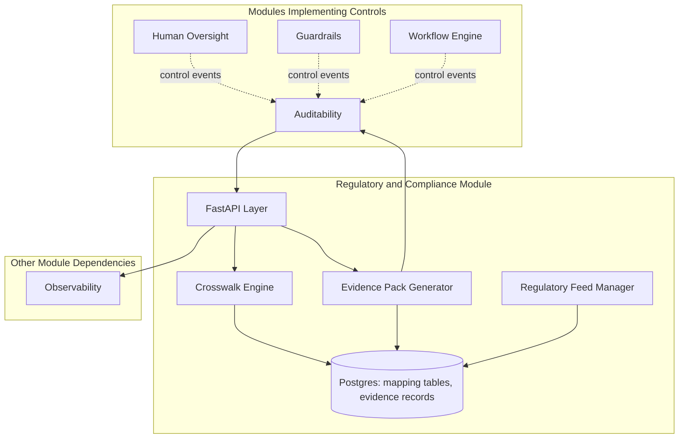
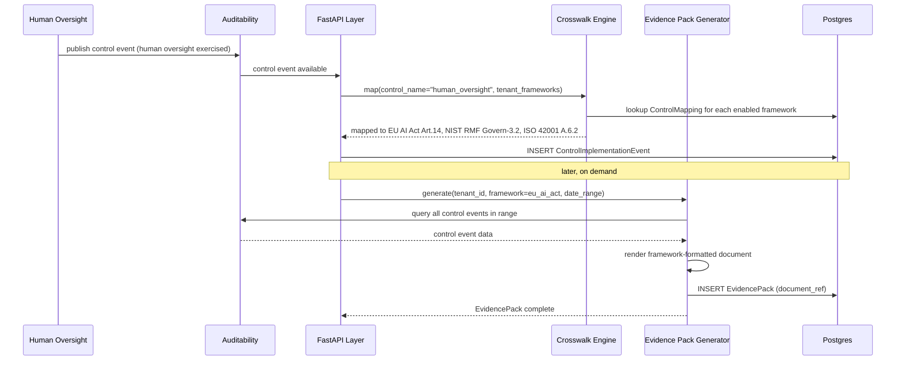
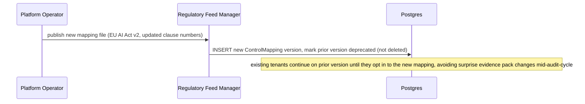
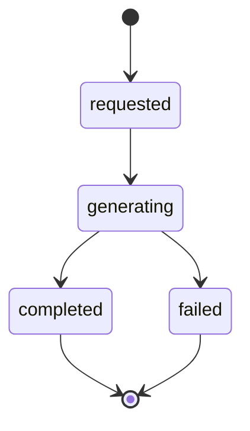

# Module 17: Regulatory and Compliance — Complete Module Specification

## Overview and Commercial Value

| Description | Inputs | Outputs | Value | Key Metrics |
|---|---|---|---|---|
| Crosswalk engine mapping controls once to EU AI Act, NIST AI RMF, ISO 42001, DORA, with living regulatory feed | Control implementation event, active framework profiles | Framework-specific evidence records | Turns compliance from cost centre into procurement-winning feature | Framework coverage %, evidence completeness |

## Differentiator Features

Baseline (table stakes): control mapping to at least one regulatory framework, evidence storage.

What makes this module genuinely better:

- **Living regulatory feed.** Framework mapping profiles update as regulations change (the EU AI Act's own timelines have already shifted once) without needing a platform rebuild, since the mapping is config-driven, not hardcoded logic. This is the difference between a compliance feature that ages badly and one that stays current.
- **Pre-built evidence packs per framework, generated automatically from Auditability data.** Turns what is usually months of manual compliance work into an on-demand export, a genuine wedge into procurement conversations where a buyer's compliance team is often the actual blocker on a deal.

## Low-Level Design

### Level 1: Module Overview, Boundaries and Tech Stack

**Purpose.** Maps a single, once-implemented control (e.g. "human oversight on high-risk decisions") to the specific clauses/articles it satisfies across every regulatory framework a tenant has enabled, and generates framework-formatted evidence packs from data the platform already produces elsewhere (mainly Auditability). This module does not implement controls itself; it maps and evidences controls implemented by other modules.

**Chosen stack**

| Concern | Choice | Why |
|---|---|---|
| Language/runtime | Python 3.12 | Platform consistency |
| Mapping representation | Config-driven crosswalk tables (YAML/JSON per framework version), not hardcoded logic | This is what makes the "living regulatory feed" claim real: a new EU AI Act delegated act becomes a new mapping file, not a code change |
| Evidence generation | Template-based document generation (Jinja2 for structured text sections) pulling data from Auditability's query API, output as PDF (via the platform's own PDF generation approach) or structured JSON for machine-readable submission | Reuses existing platform document generation patterns rather than a bespoke reporting engine |
| Framework version tracking | Postgres, versioned crosswalk tables, with a changelog per framework | Enables the "what changed and when" story auditors expect |
| API layer | FastAPI | Consistency |
| Testing | `pytest`, fixture control-to-clause mappings, snapshot tests for generated evidence pack structure | |

**Deployability and testability contract.** Runs and tests fully with Auditability stubbed to return canned evidence data. Crosswalk mapping logic is tested purely against fixture mapping tables, with no dependency on any other module for its own correctness.

### Level 2: Component Architecture and Diagrams



**Sub-components**

| Component | Responsibility | Built on |
|---|---|---|
| Crosswalk Engine | Maps a control implementation to relevant clauses across enabled frameworks | Config-driven mapping tables |
| Evidence Pack Generator | Produces framework-formatted evidence documents from Auditability data | Jinja2 templates, PDF/JSON output |
| Regulatory Feed Manager | Manages versioned framework mapping tables, applies updates as regulations change | Postgres, versioned config |

### Level 3: Detailed Design

**Data model**

| Entity | Key fields |
|---|---|
| FrameworkProfile | id, tenant_id, framework_name (eu_ai_act/nist_ai_rmf/iso_42001/dora), version, enabled |
| ControlMapping | id, control_name, framework_name, framework_version, clause_references (array), mapping_rationale |
| ControlImplementationEvent | id, tenant_id, control_name, source_module, evidence_ref (points to Auditability record), occurred_at |
| EvidencePack | id, tenant_id, framework_name, generated_at, coverage_percentage, document_ref |

**API surface**

| Endpoint | Method | Request | Response | Notes |
|---|---|---|---|---|
| `/v1/regulatory-compliance/framework-profiles` | POST | tenant_id, framework_name, version | FrameworkProfile | Enables a framework for a tenant |
| `/v1/regulatory-compliance/mappings` | GET | control_name or framework_name filter | ControlMapping[] | |
| `/v1/regulatory-compliance/evidence-packs` | POST | tenant_id, framework_name, date_range | EvidencePack (id, status=generating) | Async generation, poll for completion |
| `/v1/regulatory-compliance/evidence-packs/{id}` | GET | (none) | EvidencePack with document_ref when complete | |
| `/v1/regulatory-compliance/coverage` | GET | tenant_id, framework_name | coverage_percentage, gaps (list of unmapped required controls) | |

**Sequence: control event mapped and evidence pack generated on demand**



**Sequence: regulatory feed update (new framework version)**



**State diagram: evidence pack generation**



### Level 4: Telemetry, Logging, Tracing, Alerting, Configuration and Testing

**Tracing.** `regcomp.map_control` span, attributes `regcomp.control_name`, `regcomp.frameworks_mapped`. `regcomp.generate_evidence` span, attributes `regcomp.framework_name`, `regcomp.coverage_percentage`, `regcomp.duration_seconds`.

**Logging.** `structlog` JSON: `trace_id`, `tenant_id`, `framework_name`, `control_name`, `event`. Evidence pack content itself not logged (it is a generated document, retrievable via `document_ref`); only generation metadata is logged.

**Metrics (Prometheus)**

| Metric | Type | Labels |
|---|---|---|
| `regcomp_control_events_total` | Counter | `tenant_id`, `control_name` |
| `regcomp_evidence_packs_generated_total` | Counter | `tenant_id`, `framework_name`, `outcome` |
| `regcomp_evidence_generation_duration_seconds` | Histogram | `framework_name` |
| `regcomp_framework_coverage_percentage` | Gauge | `tenant_id`, `framework_name` |

**Alerting**

| Alert | Condition | Severity |
|---|---|---|
| RegCompCoverageGap | `regcomp_framework_coverage_percentage` drops below tenant-configured minimum | Warning, likely means a required control has no implementation event on record |
| RegCompEvidenceGenerationFailing | Evidence pack generation failure rate > 5% | Warning |
| RegCompStaleFrameworkVersion | A tenant remains on a deprecated framework version more than 90 days after a newer version is published | Informational, prompts a review conversation |

**Configuration**

```yaml
regulatory_compliance:
  tenant_id: "<tenant>"
  frameworks:
    enabled: ["eu_ai_act", "nist_ai_rmf"]   # per-tenant selection
  evidence:
    output_format: "pdf"              # pdf | json
    auto_generation_schedule: null    # optional, e.g. "monthly", null means on-demand only
  telemetry:
    otlp_endpoint: "<customer-configured>"
```

**Deployment.** Stateless API layer; evidence generation runs as a background job for larger date ranges given document generation can be I/O and template-render heavy. `/healthz` checks Postgres and Auditability reachability.

**Testing**

| Level | Tooling |
|---|---|
| Unit | `pytest`, fixture control-to-clause mappings |
| Contract | `schemathesis` against OpenAPI spec |
| Integration (isolated) | Auditability stubbed with canned control event data |
| Mapping correctness | Snapshot tests verifying a given control event maps to the exact expected clause references per framework, regression-tested on any mapping table update |
| Evidence pack structure | Snapshot tests verifying generated document structure matches the expected framework template |

**Non-functional targets**

| Attribute | Target |
|---|---|
| Control mapping latency | Under 1 second per event (asynchronous, not on the hot path of the originating action) |
| Evidence pack generation | Under 5 minutes for a typical monthly date range, tracked per framework given documents vary in size |
| Availability | 99.9% |
