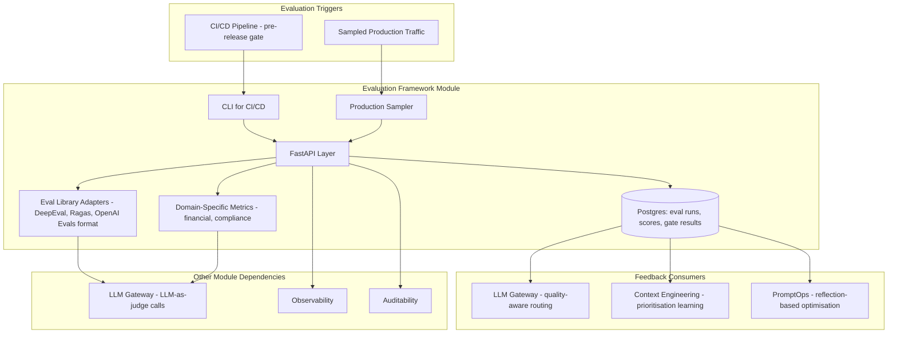
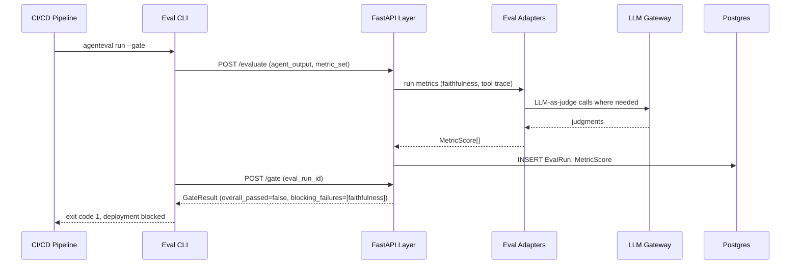
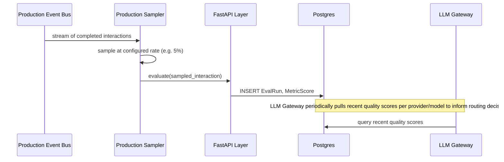
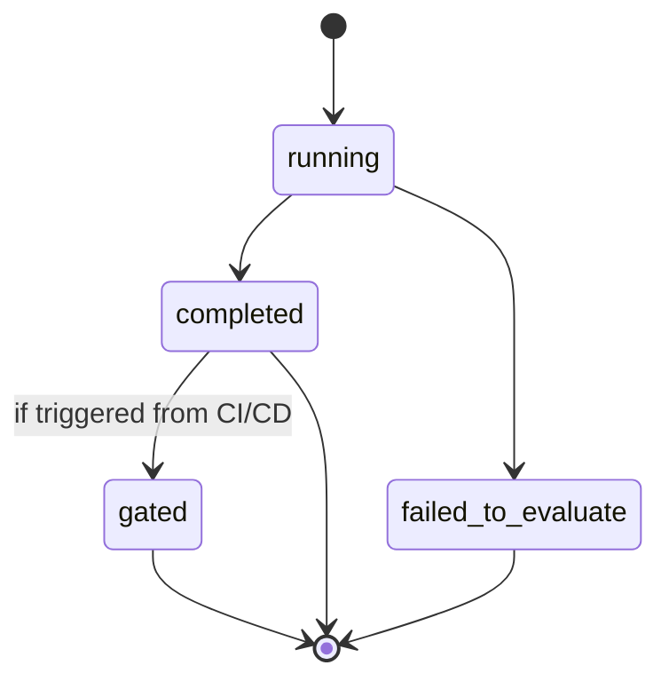

# Module 18: Evaluation Framework — Complete Module Specification

## Overview and Commercial Value

| Description | Inputs | Outputs | Value | Key Metrics |
|---|---|---|---|---|
| Faithfulness, coherence, tool-trace scoring, continuous production evaluation | Agent output, reference data, metric set | Scores, pass/fail gate | Objective quality evidence for both engineering and compliance conversations | Score distributions, gate pass rate |

## Differentiator Features

Baseline (table stakes): faithfulness/hallucination scoring, multi-turn coherence, tool-trace correctness, CI/CD gating.

What makes this module genuinely better:

- **Continuous production evaluation, not just pre-release testing.** Samples live traffic and feeds results back into both LLM Gateway routing and Context Engineering prioritisation, closing the loop rather than treating evaluation as a one-off gate that tells you nothing about how the system is actually performing once it is live.
- **Domain-specific metric packs sellable as their own add-on.** Financial guidance compliance, complaints handling accuracy and similar packs, built on the same foundation as your own AgentEval work, giving regulated customers metrics that speak their specific domain's risk language rather than generic quality scores.

## Low-Level Design

### Level 1: Module Overview, Boundaries and Tech Stack

**Purpose.** Scores agent outputs against faithfulness, coherence, tool-trace correctness and domain-specific metrics, both as a CI/CD gate before deployment and as continuous sampling against live production traffic. Feeds scores back to LLM Gateway (for quality-aware routing) and Context Engineering (for prioritisation learning), and to PromptOps (for reflection-based optimisation).

**Chosen stack**

| Concern | Choice | Why |
|---|---|---|
| Language/runtime | Python 3.12 | Platform consistency |
| Eval library integration layer | Wraps multiple open source eval libraries behind one unified interface: DeepEval, Ragas, and OpenAI Evals-compatible test format, following the same adapter pattern already proven in your own AgentEval project | Avoids picking a single eval library and being stuck with its blind spots; different libraries are strong at different metric types |
| Custom financial/domain metrics | Ported directly from AgentEval's existing custom metrics (regulatory compliance, risk disclosure, numerical accuracy, claim decomposition) | Reuses validated, already-built work rather than reimplementing |
| Sampling infrastructure | Kafka consumer sampling a configurable percentage of live traffic events, rather than evaluating every single interaction (cost control) | Keeps continuous evaluation affordable at scale while still catching drift |
| API layer | FastAPI, plus a CLI (reusing AgentEval's existing CLI pattern) for CI/CD pipeline integration | Matches how engineering teams actually gate deployments, via CLI/CI step, not just API calls |
| Testing | `pytest`, fixed benchmark datasets per metric, `testcontainers` where a local model is needed | |

**Deployability and testability contract.** Runs and tests fully with LLM Gateway stubbed (for any metric requiring an LLM-as-judge call) and with a fixture sampled-event stream in place of live Kafka traffic for the continuous evaluation path.

### Level 2: Component Architecture and Diagrams



**Sub-components**

| Component | Responsibility | Built on |
|---|---|---|
| Eval Library Adapters | Unified interface over multiple eval libraries | DeepEval, Ragas, OpenAI Evals-compatible adapters |
| Domain-Specific Metrics | Financial compliance, risk disclosure, claim decomposition scoring | Ported from AgentEval |
| Production Sampler | Selects a configurable percentage of live traffic for continuous evaluation | Kafka consumer with sampling logic |
| Gate Engine | Applies pass/fail thresholds for CI/CD gating | Configurable per metric, per environment |

### Level 3: Detailed Design

**Data model**

| Entity | Key fields |
|---|---|
| EvalRun | id, tenant_id, trigger_source (ci_cd/production_sample), agent_ref, metrics_evaluated (array), started_at, completed_at |
| MetricScore | id, eval_run_id, metric_name, score, threshold, passed (boolean) |
| GateResult | id, eval_run_id, overall_passed (boolean), blocking_failures (array of metric_names) |
| DomainMetricPack | id, tenant_id, pack_name (e.g. financial_guidance_compliance), enabled, custom_thresholds (JSONB) |

**API surface**

| Endpoint | Method | Request | Response | Notes |
|---|---|---|---|---|
| `/v1/evaluation-framework/evaluate` | POST | agent_output, reference_data (optional), metric_set, trigger_source | EvalRun with MetricScore[] | Main evaluation endpoint |
| `/v1/evaluation-framework/gate` | POST | eval_run_id, environment | GateResult | CI/CD gate check |
| `/v1/evaluation-framework/domain-packs` | POST | tenant_id, pack_name | DomainMetricPack | Enables an add-on metric pack |
| `/v1/evaluation-framework/scores` | GET | tenant_id, agent_ref, date_range | MetricScore[] | For dashboards/analysis |

CLI: `agenteval run --config <path> --gate` mirrors the API's evaluate-then-gate flow for CI/CD pipeline use, consistent with the existing AgentEval CLI.

**Sequence: CI/CD gate before deployment**



**Sequence: continuous production sampling feeding routing**



**State diagram: eval run lifecycle**



### Level 4: Telemetry, Logging, Tracing, Alerting, Configuration and Testing

**Tracing.** `eval.run` span, attributes `eval.trigger_source`, `eval.metrics_evaluated`, `eval.overall_score`. `eval.gate` span, attributes `eval.gate_passed`, `eval.blocking_failures`.

**Logging.** `structlog` JSON: `trace_id`, `tenant_id`, `agent_ref`, `trigger_source`, `metrics_evaluated`, `event`.

**Metrics (Prometheus)**

| Metric | Type | Labels |
|---|---|---|
| `eval_runs_total` | Counter | `tenant_id`, `trigger_source` |
| `eval_metric_score` | Histogram | `tenant_id`, `metric_name` |
| `eval_gate_pass_rate` | Gauge | `tenant_id`, `environment` |
| `eval_sampling_rate` | Gauge | `tenant_id` (actual observed sampling rate vs configured) |

**Alerting**

| Alert | Condition | Severity |
|---|---|---|
| EvalGatePassRateDropping | Gate pass rate drops sharply relative to 7-day baseline | Warning, may indicate a regression before it reaches production |
| EvalProductionScoreDegrading | Continuous sampling shows a metric trending down over a sustained window | Warning, feeds directly into whether PromptOps optimisation should trigger |
| EvalSamplingRateOffTarget | Actual sampling rate deviates significantly from configured rate | Warning, may indicate a consumer lag issue |

**Configuration**

```yaml
evaluation_framework:
  tenant_id: "<tenant>"
  metrics:
    enabled_libraries: ["deepeval", "ragas"]
    domain_packs: []                  # e.g. ["financial_guidance_compliance"]
  gating:
    thresholds:
      faithfulness: 0.85               # hot-reloadable
      tool_trace_correctness: 0.9
  production_sampling:
    enabled: true
    sample_rate: 0.05                  # hot-reloadable
  telemetry:
    otlp_endpoint: "<customer-configured>"
```

**Deployment.** Stateless API/CLI layer, sampler runs as a horizontally scalable consumer group. `/healthz` checks Postgres, Kafka consumer lag and LLM Gateway reachability.

**Testing**

| Level | Tooling |
|---|---|
| Unit | `pytest`, fixed benchmark datasets per metric |
| Contract | `schemathesis` against OpenAPI spec, CLI tested against expected exit codes for pass/fail scenarios |
| Integration (isolated) | LLM Gateway stubbed with deterministic judge responses |
| Metric accuracy regression | Benchmark datasets with known-correct scores, regression-tested on any adapter or metric logic change |
| Load | `locust` for the sampling path at realistic production traffic volume |

**Non-functional targets**

| Attribute | Target |
|---|---|
| Single evaluation latency | Under 5 seconds per interaction (online checks) |
| Availability | 99.9% |
| Sampling accuracy | Observed rate within 10% of configured target rate |
