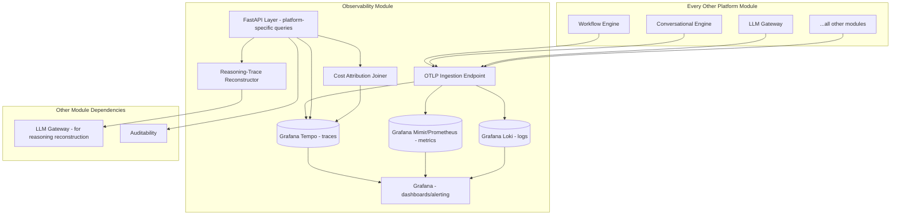
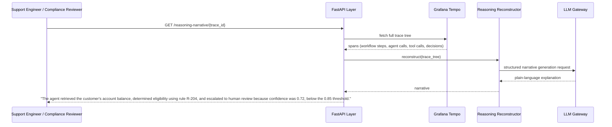
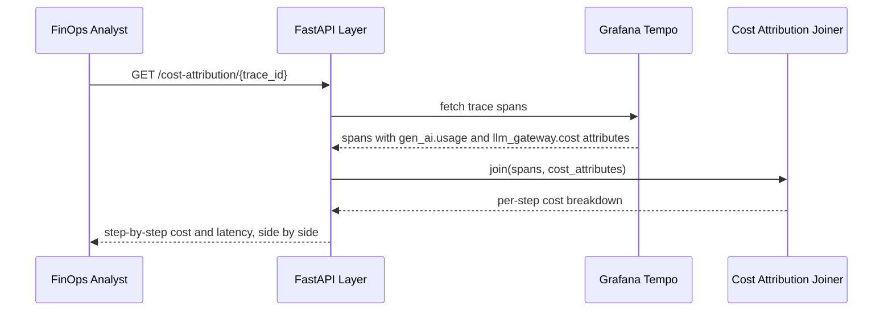

# Module 19: Observability — Complete Module Specification

## Overview and Commercial Value

| Description | Inputs | Outputs | Value | Key Metrics |
|---|---|---|---|---|
| OpenTelemetry GenAI-compliant tracing with reasoning-trace visualisation and cost-attributed tracing | Span/trace/metric data | Queryable traces, dashboards, alerts | Debugging time for agent failures drops from hours to minutes | Trace completeness, ingestion latency |

## Differentiator Features

Baseline (table stakes): OpenTelemetry GenAI-compliant tracing, metrics, dashboards.

What makes this module genuinely better:

- **Reasoning-trace visualisation, not just span timing.** Shows why an agent made a decision in a human-readable narrative reconstructed from its trace, which is where most current observability tools stop short: they show you what happened and how long it took, not why the agent chose that path.
- **Cost-attributed tracing.** Spend per trace/step shown alongside performance, so FinOps and Observability data are the same dataset viewed two ways rather than two separate systems a team has to reconcile manually.

## Low-Level Design

### Level 1: Module Overview, Boundaries and Tech Stack

**Purpose.** The platform-wide sink for every trace, span, metric and log emitted by every other module. Owns ingestion, storage, querying, dashboarding and alerting infrastructure. Every module's telemetry sections (as specified throughout this document) assume this module is the destination.

**Chosen stack**

| Concern | Choice | Why |
|---|---|---|
| Language/runtime | Python 3.12 for the platform-specific reasoning-trace and cost-attribution layers; the underlying storage/query stack is not Python-specific | Platform consistency for the custom layer, while using best-of-breed infrastructure underneath |
| Trace storage/query | Grafana Tempo (open source), OTLP-native | Cloud-agnostic, self-hostable anywhere, native OpenTelemetry protocol support, avoids a proprietary tracing backend |
| Metrics storage/query | Prometheus plus Grafana Mimir for long-term/multi-tenant storage at scale | Prometheus for the standard case, Mimir when a customer's retention or multi-tenant scale needs exceed single-instance Prometheus |
| Dashboards and alerting UI | Grafana | Single pane of glass across traces, metrics and logs, all open source, works with any of the above backends |
| Logs | Grafana Loki | Consistent with the Grafana/Tempo/Mimir stack, keeps log correlation with traces straightforward via shared labels |
| Reasoning-trace narrative reconstruction | LLM Gateway call that takes a raw trace tree and produces a plain-language explanation of the decision path | This is the genuinely custom layer; everything else in this module is assembling proven open source infrastructure |
| Cost attribution | Joins LLM Gateway's per-request cost data (already emitted as trace attributes per Module 3) with trace spans at query time, rather than a separate cost pipeline | Keeps cost and performance as one dataset, per the differentiator claim |
| Testing | `pytest` for the custom layers, `testcontainers` for Tempo/Prometheus/Loki in integration tests | |

**Deployability and testability contract.** The Grafana/Tempo/Prometheus/Loki stack itself is deployed as standard infrastructure, tested via `testcontainers` where feasible. The platform-specific reasoning-trace and cost-attribution layers are tested with fixture trace data, independent of a live OTel pipeline.

### Level 2: Component Architecture and Diagrams



**Sub-components**

| Component | Responsibility | Built on |
|---|---|---|
| OTLP Ingestion Endpoint | Receives all trace/metric/log data via standard OTLP protocol | OpenTelemetry Collector |
| Grafana Tempo | Trace storage and query | Open source Tempo |
| Grafana Mimir/Prometheus | Metrics storage and query | Open source, choice depends on customer scale |
| Grafana Loki | Log storage and query | Open source Loki |
| Grafana | Dashboards and native alerting | Open source Grafana |
| Reasoning-Trace Reconstructor | Turns a raw trace tree into a plain-language decision narrative | LLM Gateway call over structured trace data |
| Cost Attribution Joiner | Combines cost data (already in trace attributes) with performance data at query time | Query-time join, no separate pipeline |

### Level 3: Detailed Design

**Data model.** Trace, metric and log schemas follow OpenTelemetry's standard formats and the GenAI semantic conventions referenced throughout every other module's telemetry section; this module does not define a custom schema beyond the platform-specific extension attributes already named per-module (e.g. `workflow.step_id`, `gen_ai.usage.input_tokens`).

**Platform-specific API surface** (beyond standard Grafana/Tempo/Loki/Prometheus query APIs, which remain directly accessible)

| Endpoint | Method | Request | Response | Notes |
|---|---|---|---|---|
| `/v1/observability/reasoning-narrative/{trace_id}` | GET | (none) | plain-language narrative reconstructed from the trace | The differentiator feature's primary endpoint |
| `/v1/observability/cost-attribution/{trace_id}` | GET | (none) | per-span cost breakdown joined with performance data | |
| `/v1/observability/trace-completeness` | GET | tenant_id, date_range | completeness percentage (spans present vs expected per known workflow shapes) | Used to detect instrumentation gaps |

**Sequence: reasoning-trace narrative generation on demand**



**Sequence: cost-attributed trace query**



### Level 4: Telemetry, Logging, Tracing, Alerting, Configuration and Testing

Since this module is itself the telemetry destination, its own "telemetry section" covers monitoring the observability pipeline's own health, a genuinely meta but necessary concern.

**Tracing (of the pipeline itself).** `observability.ingestion` span per OTLP batch received, attributes `observability.span_count`, `observability.source_module`.

**Logging.** `structlog` JSON for the platform-specific layers only (Reasoning Reconstructor, Cost Attribution Joiner); the underlying Tempo/Loki/Prometheus/Grafana components use their own standard logging, surfaced through the same Grafana instance for consistency.

**Metrics (Prometheus, meta-metrics about the observability pipeline itself)**

| Metric | Type | Labels |
|---|---|---|
| `observability_ingestion_rate` | Counter | `source_module` |
| `observability_ingestion_latency_seconds` | Histogram | (time from span emission to queryable) |
| `observability_trace_completeness_ratio` | Gauge | `tenant_id` |
| `observability_reasoning_narrative_requests_total` | Counter | `tenant_id` |
| `observability_storage_cost_per_million_spans` | Gauge | (informational, feeds FinOps) |

**Alerting**

| Alert | Condition | Severity |
|---|---|---|
| ObservabilityIngestionLagHigh | p95 ingestion latency > 100ms | Warning |
| ObservabilityTraceCompletenessLow | Completeness ratio drops below 95% for a tenant | Warning, indicates an instrumentation gap somewhere upstream |
| ObservabilityStorageGrowthAnomalous | Storage growth rate deviates sharply from historical baseline | Informational, cost-awareness signal |

**Configuration**

```yaml
observability:
  tenant_id: "<tenant>"
  retention:
    traces_days: 30                  # hot-reloadable, customer/compliance-driven
    metrics_days: 90
    logs_days: 30
  reasoning_narrative:
    enabled: true                    # feature flag
  cost_attribution:
    enabled: true
  otlp_endpoint: "http://otel-collector:4317"
```

**Deployment.** Tempo, Mimir/Prometheus, Loki and Grafana deployed as standard Kubernetes workloads, each independently scalable per their own well-documented operational patterns; this is genuinely off-the-shelf infrastructure, not custom-built. The platform-specific API layer (reasoning narrative, cost attribution) is a thin, independently deployable service on top.

**Testing**

| Level | Tooling |
|---|---|
| Unit | `pytest` for the platform-specific layers |
| Contract | `schemathesis` against the platform-specific API endpoints; OTLP ingestion tested against the OpenTelemetry Collector's own conformance suite |
| Integration (isolated) | `testcontainers` for Tempo, Prometheus and Loki, LLM Gateway stubbed for reasoning narrative generation |
| Narrative quality | Fixture trace trees with known expected narratives, reviewed for accuracy on any prompt or model change in the Reasoning Reconstructor |
| Load | Standard Tempo/Prometheus/Loki load testing per their own documented benchmarks, plus `locust` against the platform-specific API layer |

**Non-functional targets**

| Attribute | Target |
|---|---|
| Ingestion latency | Under 100ms |
| Dashboard query response | Under 1 second for standard dashboards |
| Availability | 99.9% |
