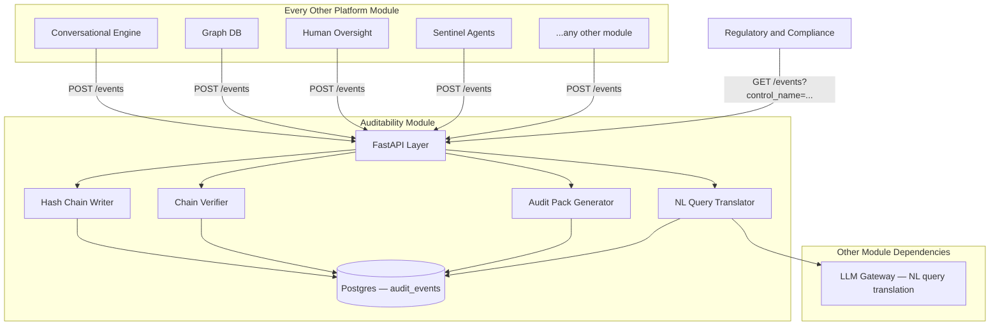
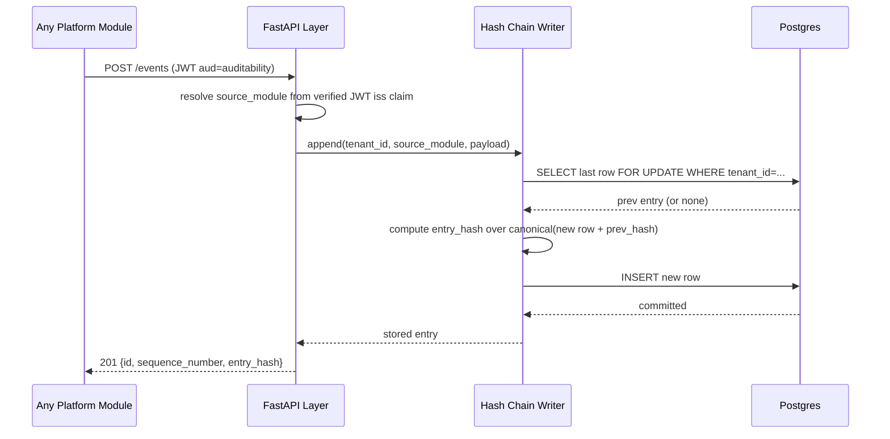
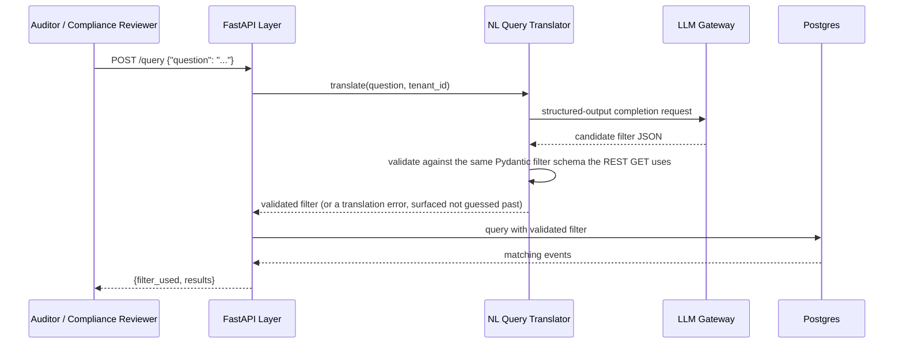

# Module 20: Auditability — Complete Module Specification

## Overview and Commercial Value

| Description | Inputs | Outputs | Value | Key Metrics |
|---|---|---|---|---|
| Immutable chained logs with cryptographic tamper-evidence and natural-language audit query | System/agent events, decision context | Log entry, audit pack, provenance chain | The evidence layer every other governance module depends on; a genuine sales differentiator for regulated buyers | Integrity verification rate, pack generation time |

## Differentiator Features

Baseline (table stakes): an append-only event log every other module can write to.

What makes this module genuinely better:

- **Cryptographic tamper-evidence, not just "append-only" by convention.** Every event is chained to the previous one via a SHA-256 hash over its own content plus the prior entry's hash — the same construction as a blockchain's block-hash chain, minus the distributed-consensus machinery this platform doesn't need. A single altered, deleted, or reordered row breaks the chain from that point forward, and `verify_chain` proves it deterministically rather than asking anyone to trust the database wasn't touched.
- **Natural-language audit query.** A compliance reviewer or auditor asks a plain-language question ("show me every override on regulatory-compliance decisions for tenant acme in March"); an LLM Gateway call translates it into the same structured filter the REST API accepts, so the reviewer never needs to know this module's query parameter names.
- **Caller identity from the JWT, never from the payload.** `source_module` — the single most audit-critical field on every entry — is read from the verified inbound bearer token's `iss` claim, not from any field the caller's JSON body could set. A module cannot misattribute (accidentally or otherwise) an event to a different source; every other event field is accepted as opaque JSON, since this platform's callers already send materially different shapes (see "Design notes vs. the LLD" in the module README) and normalizing them is not this module's job.

## Low-Level Design

### Level 1: Module Overview, Boundaries and Tech Stack

**Purpose.** The platform-wide, append-only sink for governance-relevant events emitted by every other module: conversational handoffs, human-oversight decisions and overrides, sentinel alerts, graph writes, and anything else a module chooses to record. Owns event ingestion, tamper-evident storage, filtered/paginated querying, natural-language query translation, and audit-pack export. Does **not** own framework-to-control mapping or compliance evidence generation — that is Module 17 (Regulatory and Compliance)'s job; Module 17 is a *consumer* of this module's event stream (`HTTPAuditabilityClient.query_control_events`, already coded against this module's `GET /v1/auditability/events` endpoint by five modules built before this one), not the other way around. This module's own "audit pack" is a raw, chronologically ordered, integrity-proven export of events matching a filter — framework-agnostic, distinct from Module 17's framework-specific evidence pack.

**Chosen stack**

| Concern | Choice | Why |
|---|---|---|
| Language/runtime | Python 3.12, FastAPI, SQLAlchemy 2.0 async | Platform consistency (LLD §mirrors every other module's stack) |
| Storage | Postgres, `JSONB` payload column | The chain is only as trustworthy as its storage's own durability guarantees; Postgres's WAL and this platform's existing pooling/backup story cover that, no bespoke storage engine needed |
| Hash chaining | stdlib `hashlib` (SHA-256) over a canonical JSON serialization of each entry plus the prior entry's hash | No external crypto dependency justified for a hash chain — this is exactly what the stdlib is for; a dedicated blockchain/ledger library would add operational weight (its own consensus/storage model) this single-writer-per-tenant log doesn't need |
| NL query translation | LLM Gateway call, structured-output request translating a free-text question into this module's own filter schema | Reuses the platform's existing LLM Gateway rather than a bespoke NL-to-SQL layer; the *translation* target is this module's safe, already-parameterized filter — never raw SQL — so a prompt-injected or hallucinated translation can misfilter but never execute arbitrary SQL |
| Audit pack rendering | `fpdf2`, the same real-PDF-generation library Module 17's evidence packs already use | Consistency with the one other module that already generates a comparable artifact |
| Testing | `pytest` unit tier against an in-memory fake; real-Postgres integration tier (dual-path fixture, this platform's now-standard pattern) proving hash-chain integrity survives a real multi-row, concurrent-write scenario | Matches the platform-wide testing convention established across modules 1–19 |

**Deployability and testability contract.** Runs standalone against SQLite for unit tests (via the in-memory fake repository) and against real Postgres for the integration tier; every other module's dependency-stub already returns a `200` for `POST /v1/auditability/events` (see each module's `stubs/dependency-stub/`), so this module deploying for real is a base-URL change for its five existing callers, not a code change.

### Level 2: Component Architecture and Diagrams



**Sub-components**

| Component | Responsibility | Built on |
|---|---|---|
| FastAPI Layer | Ingest, query, verify, pack, NL-query endpoints; resolves `source_module` from the verified inbound JWT | `ServiceAuthMiddleware` (this platform's standard) |
| Hash Chain Writer | Appends an entry with the correct `sequence_number`/`prev_hash`/`entry_hash`, one writer-critical-section per tenant | `SELECT ... FOR UPDATE` on the tenant's last row, avoiding the durable-worker-style `SKIP LOCKED` pattern since here correctness requires serializing writes per tenant, not distributing them |
| Chain Verifier | Walks a tenant's chain in sequence order, recomputes each `entry_hash`, reports the first break (if any) | Pure function over fetched rows, no external dependency |
| Audit Pack Generator | Renders a filtered, chronologically ordered export plus its own verification result as a PDF/JSON artifact | `fpdf2`, same pattern as Module 17's `core/evidence_generator.py` |
| NL Query Translator | Turns a free-text question into this module's own structured filter (tenant_id, event_type, source_module, occurred_after/before, control_name) | LLM Gateway structured-output call; the translated filter is validated against the same Pydantic schema the REST endpoint uses before it ever reaches the repository — a hallucinated field name is rejected, not silently ignored |

### Level 3: Detailed Design

**Data model**

| Field | Type | Notes |
|---|---|---|
| `id` | UUID | Primary key |
| `tenant_id` | string | Required; every write and read is tenant-scoped |
| `source_module` | string | Read from the verified inbound JWT's `iss` claim — never client-supplied |
| `event_type` | string | Best-effort normalized from the payload's `event_type` or `event` key (this platform's existing callers use both, inconsistently — see the module README); falls back to `"unknown"` rather than rejecting the write, since losing an audit event because of a naming mismatch is worse than filing it loosely typed |
| `payload` | JSONB | The full, unmodified submitted body — opaque beyond what `event_type` extracts |
| `occurred_at` | `timestamptz` | Server-assigned, immutable |
| `sequence_number` | integer | Monotonic per `tenant_id`, starting at 1 |
| `prev_hash` | string, nullable | Null for a tenant's first entry |
| `entry_hash` | string | `sha256(canonical_json({sequence_number, tenant_id, source_module, event_type, occurred_at, payload, prev_hash}))` |

**API surface**

| Endpoint | Method | Request | Response | Notes |
|---|---|---|---|---|
| `/v1/auditability/events` | POST | arbitrary JSON body, `tenant_id` required | `201`, the stored entry (id, sequence_number, entry_hash) | The five existing callers already code against this path/verb |
| `/v1/auditability/events` | GET | `tenant_id` (required), `event_type`, `source_module`, `control_name` (filters `payload->>'control_name'`), `occurred_after`, `occurred_before`, `limit`/`offset` | `ListResponse[AuditEvent]` (`items`/`total`/`limit`/`offset`) | `control_name` exists specifically because Module 17 already calls this exact shape |
| `/v1/auditability/events/verify-chain` | GET | `tenant_id` | `{"valid": bool, "verified_count": int, "break_at_sequence": int \| null}` | |
| `/v1/auditability/audit-packs` | POST | `tenant_id`, optional filter (same fields as the GET above) | `202`, pack id | Async-generated like Module 17's evidence packs, same durable-worker pattern (Postgres `SKIP LOCKED` queue) — the correctness property (a pack request surviving a pod restart) is identical to the problem Module 17's Branch 3 already solved, so this module reuses that exact worker design rather than inventing a second one |
| `/v1/auditability/audit-packs/{id}` | GET | (none) | pack status/metadata; `GET .../document` streams the rendered PDF once `completed` | |
| `/v1/auditability/query` | POST | `{"question": "<free text>", "tenant_id": "..."}` | `{"filter_used": {...}, "results": ListResponse[AuditEvent]}` | Always echoes the structured filter it derived, so a reviewer can see exactly what was searched, not just trust the answer |

**Sequence: event ingestion and chaining**



**Sequence: natural-language query**



### Level 4: Telemetry, Logging, Tracing, Alerting, Configuration and Testing

**Tracing.** `auditability.event_ingest` span per write, attributes `auditability.tenant_id`, `auditability.source_module`, `auditability.event_type`. `auditability.chain_verify` span per verification run, attribute `auditability.verified_count`.

**Logging.** `structlog` JSON. A chain-verification failure logs at `error` level with the tenant and break sequence number — this is the one failure mode in this module that always deserves an operator's attention.

**Metrics (Prometheus)**

| Metric | Type | Labels |
|---|---|---|
| `auditability_events_ingested_total` | Counter | `tenant_id`, `source_module`, `event_type` |
| `auditability_chain_verification_total` | Counter | `tenant_id`, `result` (valid/broken) |
| `auditability_audit_pack_generation_seconds` | Histogram | |
| `auditability_nl_query_translation_seconds` | Histogram | |
| `auditability_nl_query_translation_failures_total` | Counter | reason (invalid_filter/llm_error) |

**Alerting**

| Alert | Condition | Severity |
|---|---|---|
| AuditabilityChainBroken | Any `verify-chain` call returns `valid: false` | Critical — this is the platform's tamper-evidence signal firing for real |
| AuditabilityIngestionErrorRateHigh | 5xx rate on `POST /events` > 1% over 5m | Warning |

**Configuration**

```yaml
auditability:
  tenant_id: "<tenant>"
  service_name: "auditability"
  nl_query:
    enabled: true                    # feature flag; falls back to 400 with a clear message if disabled
  audit_pack:
    worker_poll_interval_seconds: 5
    worker_max_attempts: 3
  db_pool_size: 10                   # tuned to this module's own Helm maxReplicas, platform convention
  db_max_overflow: 5
  jwt_shared_secret: "dev-insecure-shared-secret-change-me"  # env TECTONIC_JWT_SHARED_SECRET
```

**Testing**

| Level | Tooling |
|---|---|
| Unit | `pytest` against the in-memory fake repository, including hash-chain computation and verification as pure-function tests |
| Integration (isolated) | Real Postgres (dual-path fixture): concurrent-write serialization per tenant, a genuine multi-entry chain built and verified end-to-end, a deliberately corrupted row proving `verify-chain` detects it |
| Contract | `schemathesis` against the REST surface |
| Load | `locust` against `POST /events`, since every other module's steady-state write volume lands here |

**Non-functional targets**

| Attribute | Target |
|---|---|
| Ingestion latency (p95) | Under 50ms |
| Chain verification (10k entries) | Under 2 seconds |
| Availability | 99.9% |
