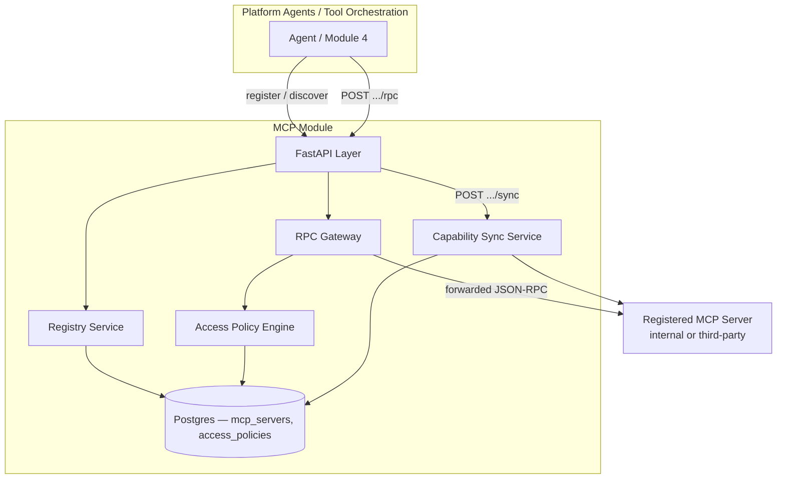
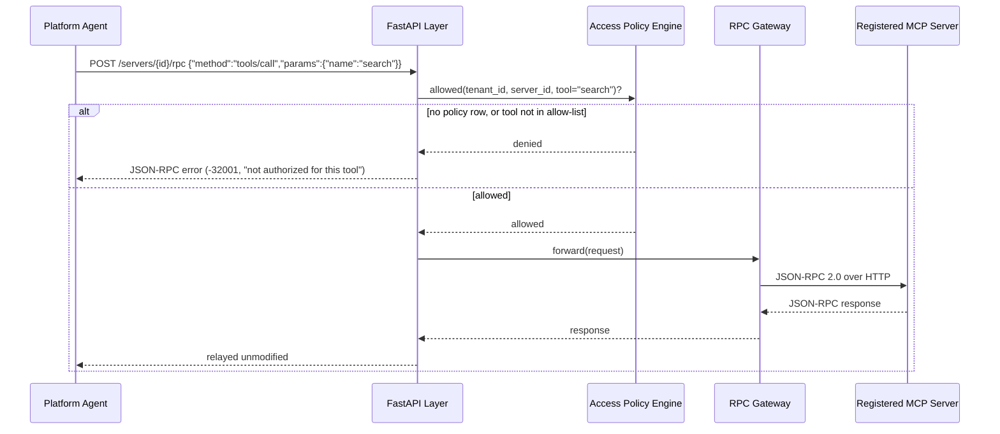

# Module 21: MCP — Complete Module Specification

## Overview and Commercial Value

| Description | Inputs | Outputs | Value | Key Metrics |
|---|---|---|---|---|
| Standardised agent-to-tool/data interface over JSON-RPC, with internal server marketplace | MCP client request | MCP server response | Avoids bespoke integration per tool, and lets customers govern their own internal tool catalogue | Uptime, request success rate |

## Differentiator Features

Baseline (table stakes): a JSON-RPC-2.0 proxy in front of MCP servers.

What makes this module genuinely better:

- **Deny-by-default, per-tool access policy — not just per-server.** A
  tenant with no policy row for a server has zero access to it, full
  stop. Where a policy does exist, it can scope down to *which specific
  tools* on that server a tenant may call (`tools/call` with a
  disallowed tool name is rejected before the request ever reaches the
  backing server) — most MCP gateways stop at "can this caller reach
  this server at all."
- **One governed entry point, not N bespoke integrations.** Every
  platform agent talks to one stable address (this module) instead of
  needing each individual MCP server's real network location and auth
  scheme — exactly the LLD's "avoids bespoke integration per tool"
  value, made concrete: registering a new server here is what makes it
  usable platform-wide, with no caller-side code change.
- **A real marketplace catalogue, not just a proxy.** `GET
  /v1/mcp/servers` returns every server's cached tool list (name,
  description, input schema) refreshed from the server's own real
  `tools/list` response — a tenant can browse what's available and what
  it's allowed to call before ever issuing a `tools/call`.

## Low-Level Design

### Level 1: Module Overview, Boundaries and Tech Stack

**Purpose.** The platform's single, governed entry point for MCP
(Model Context Protocol) traffic: a registry of MCP servers (the
"internal server marketplace"), a per-tenant/per-tool access policy over
that registry, and a JSON-RPC 2.0 proxy that enforces the policy before
forwarding a request to the real backing server. Distinct from Module 4
(Tool Orchestration)'s own `HTTPMCPClientAdapter`: that adapter is Tool
Orchestration's *direct*, ungoverned outbound call to whatever MCP
server a specific tool definition names, one caller talking to one
server it already knows about. This module is the opposite direction —
the place a server gets *registered* so any caller platform-wide can
discover and be governed calling it — and Tool Orchestration itself is a
natural (optional) caller of this module once a tool is MCP-registered
here rather than pointed at directly.

**Chosen stack**

| Concern | Choice | Why |
|---|---|---|
| Language/runtime | Python 3.12, FastAPI, SQLAlchemy 2.0 async | Platform consistency |
| MCP protocol | Generic JSON-RPC-2.0-over-HTTP, same choice Module 4 already made | JSON-RPC is MCP's wire-level shape regardless of transport variant (stdio/SSE/streamable-HTTP); swapping in the real `mcp` SDK means implementing the same backend-call interface against it, without touching the registry or policy engine that drive it |
| Storage | Postgres | Registry, access policies, cached capability listings |
| Testing | `pytest` unit tier against an in-memory fake; real-Postgres integration tier | Platform-standard pattern |

**Deployability and testability contract.** Runs standalone against
SQLite for unit tests; the dependency-stub implements a minimal MCP
server (`initialize`, `tools/list`, `tools/call`) so this module's own
proxy path is exercised end-to-end without a real third-party MCP
server.

### Level 2: Component Architecture and Diagrams



**Sub-components**

| Component | Responsibility | Built on |
|---|---|---|
| Registry Service | CRUD for registered MCP servers (the marketplace) | Own Postgres table |
| Access Policy Engine | Deny-by-default check: is `tenant_id` allowed to call `server_id`, and (for `tools/call`) is the named tool in its allow-list | Own Postgres table, one row per `(server_id, tenant_id)` |
| RPC Gateway | Parses the inbound JSON-RPC envelope, enforces policy, forwards to the backend, relays the response unmodified | `clients/mcp_backend_client.py`'s resilient JSON-RPC-over-HTTP adapter |
| Capability Sync Service | Calls a registered server's own `tools/list`, caches the result for the marketplace catalogue | Same backend client |

### Level 3: Detailed Design

**Data model**

| Entity | Fields |
|---|---|
| `McpServerRecord` | `id`, `tenant_id` (owning/publishing tenant), `name`, `description`, `base_url`, `status` (active/disabled), `created_at` |
| `McpToolRecord` | `id`, `server_id`, `name`, `description`, `input_schema` (JSONB), `synced_at` — replaced wholesale on each sync, not merged |
| `AccessPolicyRecord` | `id`, `server_id`, `tenant_id`, `allowed_tools` (JSONB list of tool names, `null` = every tool on this server) |

**API surface**

| Endpoint | Method | Notes |
|---|---|---|
| `/v1/mcp/servers` | POST | Register a server (the publish step of the marketplace) |
| `/v1/mcp/servers` | GET | Paginated discovery listing, includes each server's cached tool count |
| `/v1/mcp/servers/{id}` | GET | Full detail incl. cached tool list |
| `/v1/mcp/servers/{id}/sync` | POST | Re-fetches `tools/list` from the real backend, replaces the cache |
| `/v1/mcp/servers/{id}/access-policy` | PUT | Upserts the calling tenant's allow-list for this server (`allowed_tools: null` for full access, `[]` for server-reachable-but-no-tools-callable, a named list otherwise) |
| `/v1/mcp/servers/{id}/rpc` | POST | The governed proxy: body is a JSON-RPC 2.0 request; `tenant_id` resolved from the header the same way every paginated endpoint elsewhere on this platform resolves it |

**Sequence: a governed `tools/call`**



A method other than `tools/call` (e.g. `initialize`, `tools/list`,
`resources/list`) only needs server-level access (a policy row must
exist for the tenant) — the tool-level allow-list is checked
specifically for `tools/call`, since that's the one method that actually
executes something.

### Level 4: Telemetry, Logging, Tracing, Alerting, Configuration and Testing

**Tracing.** `mcp.rpc_proxy` span per forwarded call, attributes
`mcp.server_id`, `mcp.method`, `mcp.tenant_id`, `mcp.tool_name` (when
applicable).

**Logging.** `structlog` JSON; every access-policy denial logs at
`warning` with `tenant_id`/`server_id`/`method` — a governance signal
worth being able to audit (and, per this platform's convention, worth
emitting to Module 20/Auditability — see the module README).

**Metrics (Prometheus)**

| Metric | Type | Labels |
|---|---|---|
| `mcp_rpc_requests_total` | Counter | `server_id`, `method`, `outcome` (forwarded/denied/error) |
| `mcp_rpc_latency_seconds` | Histogram | `server_id` |
| `mcp_capability_sync_total` | Counter | `server_id`, `outcome` |

**Alerting**

| Alert | Condition | Severity |
|---|---|---|
| MCPRPCErrorRateHigh | 5xx/error rate on `.../rpc` > 5% over 10m for a server | Warning |
| MCPCapabilitySyncFailing | `mcp_capability_sync_total{outcome="error"}` rate > 0 sustained 30m | Warning |

**Configuration**

```yaml
mcp:
  tenant_id: "<tenant>"
  service_name: "mcp"
  db_pool_size: 5
  db_max_overflow: 2
  jwt_shared_secret: "dev-insecure-shared-secret-change-me"  # env TECTONIC_JWT_SHARED_SECRET
```

**Testing**

| Level | Tooling |
|---|---|
| Unit | `pytest` against the in-memory fake, incl. the policy engine's allow/deny matrix as pure-function-shaped tests |
| Integration (isolated) | Real Postgres (dual-path fixture) |
| Contract | `schemathesis` against the REST surface |

**Non-functional targets**

| Attribute | Target |
|---|---|
| RPC proxy overhead (p95, over the backend's own latency) | Under 20ms |
| Availability | 99.9% |
