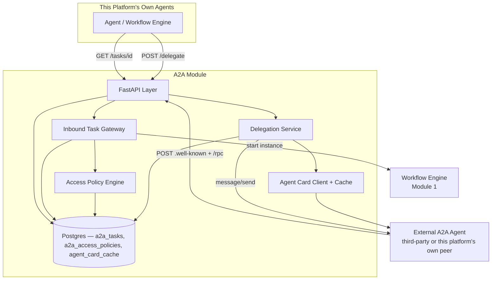
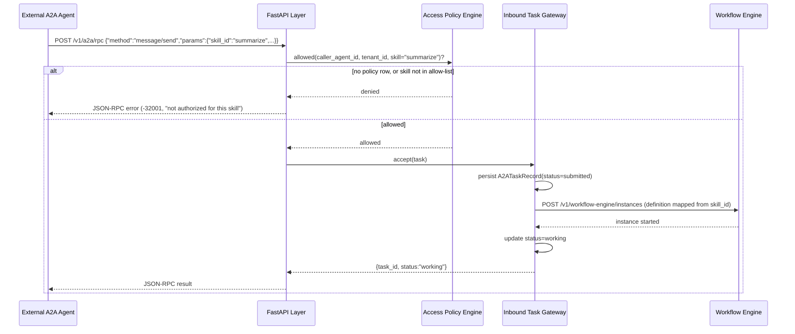

# Module 22: A2A — Complete Module Specification

## Overview and Commercial Value

| Description | Inputs | Outputs | Value | Key Metrics |
|---|---|---|---|---|
| Standardised agent-to-agent delegation and capability negotiation, cross-vendor federation | A2A task request, target agent card | Task result, delegation status | Genuine future-proofing story: agents interoperate with third-party ecosystems, not locked to this platform alone | Delegation success rate, cross-vendor compatibility |

## Differentiator Features

Baseline (table stakes): a JSON-RPC-2.0 client/server pair implementing
the A2A wire protocol (`message/send`, `tasks/get`, `tasks/cancel`)
against a target agent's published Agent Card.

What makes this module genuinely better:

- **Bidirectional, not a one-way SDK wrapper.** This module both
  delegates *out* to third-party A2A-compliant agents on behalf of this
  platform's own agents, and accepts delegated tasks *in* from external
  callers by publishing this platform's own Agent Card at
  `/.well-known/agent.json` — most first builds of this pattern only do
  the outbound half.
- **A real task lifecycle, not fire-and-forget.** Every delegated task
  (either direction) is a persisted `A2ATaskRecord` a caller can poll —
  `submitted → working → (input-required) → completed|failed|canceled`,
  the same state machine the A2A spec itself defines — rather than a
  single synchronous call that loses the task the moment the HTTP
  response returns.
- **Deny-by-default inbound access policy, the same shape as MCP's.**
  An external caller with no `A2AAccessPolicyRecord` row for this
  tenant is rejected before a task is ever created, and where a policy
  does exist it can scope down to *which specific skills* that caller
  may invoke — Module 21's own "per-tool, not just per-server" pattern,
  applied here to "per-skill, not just per-caller."
- **Skill-matched handshake before sending, not a blind POST.** Outbound
  delegation fetches (and caches) the target's own Agent Card first and
  checks the requested `skill_id` is actually one it advertises —
  failing fast locally with a clear error rather than discovering the
  mismatch as an opaque error from the far side.

## Low-Level Design

### Level 1: Module Overview, Boundaries and Tech Stack

**Purpose.** The platform's standardised agent-to-agent delegation
boundary: lets this platform's own agents hand off a task to another
autonomous agent — this platform's own or a genuinely external,
cross-vendor one — and lets external agents hand a task to this
platform in return, both over the A2A protocol. Distinct from Module 21
(MCP), which governs agent-to-*tool* calls (a deterministic function
with a fixed input/output schema), and from Module 1 (Workflow Engine),
which is this platform's own *internal* execution engine for a workflow
it already owns end to end. A2A sits at the boundary where the thing
being called is itself an autonomous agent that may not share this
platform's execution model, ownership, or trust domain at all — the
"genuine future-proofing" the module table calls out: agents
interoperate with third-party ecosystems, not locked into this
platform's own orchestration alone.

On the inbound side, this module is a gatekeeper and adapter, not a
second execution engine: an accepted external task is dispatched into
Workflow Engine (Module 1) — a specific `definition_id` mapped from the
requested `skill_id` — the same way any other trigger starts a workflow
instance; A2A's own job stops at accept/reject/track, matching this
platform's "wrap a real peer, don't duplicate it" convention.

**Chosen stack**

| Concern | Choice | Why |
|---|---|---|
| Language/runtime | Python 3.12, FastAPI, SQLAlchemy 2.0 async | Platform consistency |
| A2A protocol | JSON-RPC-2.0-over-HTTP (`message/send`, `tasks/get`, `tasks/cancel`), Agent Card served at `/.well-known/agent.json` | The A2A spec's own wire shape; same JSON-RPC choice Module 21 already made for MCP, for the same "swap in a real SDK later without touching the task lifecycle or policy engine that drive it" reason |
| Storage | Postgres | Task records (either direction), inbound access policies, outbound agent-card cache |
| Testing | `pytest` unit tier against an in-memory fake; real-Postgres integration tier | Platform-standard pattern |

**Deployability and testability contract.** Runs standalone against
SQLite for unit tests; the dependency-stub plays two roles so the full
round trip is exercised without either a real third-party agent or a
real Workflow Engine deployed alongside it: (1) an external A2A peer —
serves its own Agent Card at `/.well-known/agent.json` and a canned
`message/send` response, exercising the outbound path; (2) a stand-in
for Workflow Engine's `POST /v1/workflow-engine/instances`, exercising
the inbound-dispatch path.

### Level 2: Component Architecture and Diagrams



**Sub-components**

| Component | Responsibility | Built on |
|---|---|---|
| Delegation Service | Outbound: fetch/validate the target's Agent Card, send the task, persist a local `A2ATaskRecord`, expose it for polling | `clients/a2a_peer_client.py` |
| Agent Card Client + Cache | Fetches a target's `/.well-known/agent.json`, caches with TTL, checks a requested `skill_id` against the card's advertised skills | Same peer client |
| Inbound Task Gateway | Parses an inbound `message/send`, enforces the Access Policy Engine, creates a local `A2ATaskRecord`, dispatches into Workflow Engine, relays lifecycle updates | `clients/workflow_engine_client.py` |
| Access Policy Engine | Deny-by-default: is this external caller allowed to reach this tenant at all, and (for a specific skill) is that skill in its allow-list | Own Postgres table, one row per `(caller_agent_id, tenant_id)` — same shape as MCP's own engine |
| Local Card Builder | Assembles this platform's own published Agent Card from config (name, description, skills list) for `/.well-known/agent.json` | Pure function over `config.py` |

### Level 3: Detailed Design

**Data model**

| Entity | Fields |
|---|---|
| `A2ATaskRecord` | `id`, `tenant_id`, `direction` (`outbound`/`inbound`), `peer_agent_url` (outbound target, or inbound caller's declared URL), `skill_id`, `status` (`submitted`/`working`/`input_required`/`completed`/`failed`/`canceled`), `input_message` (JSONB), `output_artifacts` (JSONB list), `error` (nullable), `created_at`, `updated_at` |
| `A2AAccessPolicyRecord` | `id`, `caller_agent_id`, `tenant_id`, `allowed_skills` (JSONB list of skill IDs, `null` = every skill this platform publishes) |
| `AgentCardCacheEntry` | `id`, `agent_url`, `card` (JSONB, the fetched card verbatim), `fetched_at`, `expires_at` — a TTL cache for outbound lookups only; the full trust-scored discovery registry is Module 23 (Agent Cards)'s job, not this module's |

**API surface**

| Endpoint | Method | Notes |
|---|---|---|
| `/v1/a2a/delegate` | POST | This platform's own convenience wrapper: `{target_agent_url, skill_id, input_message}` → performs the card-fetch handshake, sends the task, returns `{task_id, status}`. Platform-internal, JWT-gated. |
| `/v1/a2a/tasks/{id}` | GET | Poll a task's current status/result, either direction. Platform-internal, JWT-gated. |
| `/v1/a2a/tasks/{id}/cancel` | POST | Cancel an in-flight task (best-effort on outbound; direct on inbound). Platform-internal, JWT-gated. |
| `/.well-known/agent.json` | GET | This platform's own published Agent Card. Unauthenticated by design — discovery has to work before a caller has any credential, the same reasoning `/healthz`/`/metrics` are excluded from the shared-secret check. |
| `/v1/a2a/rpc` | POST | The actual A2A wire surface external callers use: `message/send` (create an inbound task), `tasks/get`, `tasks/cancel`. Authenticated by the caller's own per-caller token (see Design notes in the module README) and gated by the Access Policy Engine — **not** this platform's internal shared-secret JWT, since an external agent was never issued that secret. |

**Sequence: an inbound `message/send`**



A completed (or failed) workflow instance updates the same
`A2ATaskRecord` row to `completed`/`failed` with its output artifacts —
the external caller polls `tasks/get` (or this platform's own
`/v1/a2a/tasks/{id}`) for the terminal result the same way outbound
delegation is polled.

### Level 4: Telemetry, Logging, Tracing, Alerting, Configuration and Testing

**Tracing.** `a2a.delegate` span per outbound delegation
(`a2a.peer_url`, `a2a.skill_id`, `a2a.tenant_id`); `a2a.task_accept`
span per inbound `message/send` (`a2a.caller_agent_id`, `a2a.skill_id`,
`a2a.tenant_id`).

**Logging.** `structlog` JSON; every access-policy denial logs at
`warning` with `caller_agent_id`/`tenant_id`/`skill_id` — a governance
signal worth auditing, emitted to Module 20 (Auditability) per this
platform's convention.

**Metrics (Prometheus)**

| Metric | Type | Labels |
|---|---|---|
| `a2a_tasks_total` | Counter | `direction`, `skill_id`, `outcome` (completed/failed/canceled/denied) |
| `a2a_delegation_latency_seconds` | Histogram | `direction` |
| `a2a_card_fetch_total` | Counter | `outcome` (hit/miss/error) |

**Alerting**

| Alert | Condition | Severity |
|---|---|---|
| A2ADelegationErrorRateHigh | outbound `outcome="failed"` rate > 5% over 10m | Warning |
| A2AInboundDeniedRateHigh | inbound `outcome="denied"` rate > 20% over 15m | Warning |
| A2ATaskStuckInWorking | a task in `working` for longer than its configured timeout with no update | Warning |

**Configuration**

```yaml
a2a:
  tenant_id: "<tenant>"
  service_name: "a2a"
  db_pool_size: 5
  db_max_overflow: 2
  agent_card_cache_ttl_seconds: 3600
  workflow_engine_base_url: "http://workflow-engine:8080"
  jwt_shared_secret: "dev-insecure-shared-secret-change-me"  # env TECTONIC_JWT_SHARED_SECRET
```

**Testing**

| Level | Tooling |
|---|---|
| Unit | `pytest` against the in-memory fake, incl. the policy engine's allow/deny matrix and the card-fetch skill-match check as pure-function-shaped tests |
| Integration (isolated) | Real Postgres (dual-path fixture) |
| Contract | `schemathesis` against the REST surface |

**Non-functional targets**

| Attribute | Target |
|---|---|
| Outbound delegation handshake overhead (p95, card fetch + send, over the peer's own latency) | Under 100ms (cached card) / under 1s (cold fetch) |
| Availability | 99.9% |
