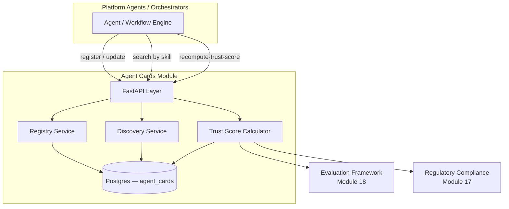

# Module 23: Agent Cards — Complete Module Specification

## Overview and Commercial Value

| Description | Inputs | Outputs | Value | Key Metrics |
|---|---|---|---|---|
| Machine-readable, trust-scored capability manifests for discovery | Agent registration, capability definition | Published card, discovery response | Lets orchestrators choose the best agent for a task, not just the first one found | Card freshness, discovery success rate |

## Differentiator Features

Baseline (table stakes): a CRUD registry of Agent Cards (per the A2A
spec's own card shape) with a search/list endpoint.

What makes this module genuinely better:

- **Trust score computed from real platform peers, not invented.** A
  card's `trust_score` is a weighted combination of a genuine quality
  signal (Evaluation Framework's own `GET /scores?agent_ref=...` —
  Module 18's real metric-score history for that agent) and a genuine
  compliance signal (Regulatory Compliance's own `GET /coverage` —
  Module 17's real control-coverage percentage for that tenant) — the
  same "real peer, not a guessed shape" pattern this platform already
  established for Observability's Cost Attribution Joiner and
  Auditability's NL-query LLM Gateway call, applied here to trust
  scoring instead of being left as a hand-waved heuristic.
- **Graceful degradation when a signal is unavailable, not a fabricated
  number.** If an agent has no evaluation history yet, or its tenant has
  no compliance coverage computed yet, that component is simply excluded
  and the remaining weight is renormalized across whatever signals
  *are* available — and if neither is available, the card's
  `trust_score` stays `null` with a reason, rather than defaulting to a
  fake neutral number that would silently look like a real score.
- **Freshness is a first-class, queryable property, not just a
  timestamp nobody reads.** `GET /agent-cards/{id}` and every discovery
  result compute `is_stale` from `last_verified_at` against a configured
  TTL — an orchestrator picking "the best agent for a task" can see
  *and filter on* whether a high-trust-score card is actually current.
- **Discovery ranks by trust score, not registration order.** `GET
  /agent-cards` (the discovery endpoint) sorts by `trust_score` descending
  by default — "lets orchestrators choose the best agent for a task, not
  just the first one found" is the literal sort order, not just prose in
  the LLD table.

## Low-Level Design

### Level 1: Module Overview, Boundaries and Tech Stack

**Purpose.** The platform's trust-scored discovery registry for Agent
Cards: any agent (this platform's own, or an external one worth
caching) gets a published, machine-readable capability manifest here,
and any orchestrator platform-wide can search that registry by skill and
get results ranked by a genuine, cross-module trust signal. Distinct
from Module 22 (A2A), whose own `core/local_card.py` and
`DelegationService`'s per-call card cache are scoped to A2A's own
protocol mechanics (publishing *this platform's* one card at
`/.well-known/agent.json`, and caching *one target's* card for the
duration of a delegation handshake) — this module is the platform-wide,
governed, trust-scored catalogue that a discovery *search* runs against,
the same registry/direct-call split this platform already drew between
MCP (Module 21, registry) and Tool Orchestration (Module 4, direct
call), and again between this module and A2A.

**Chosen stack**

| Concern | Choice | Why |
|---|---|---|
| Language/runtime | Python 3.12, FastAPI, SQLAlchemy 2.0 async | Platform consistency |
| Card shape | JSON schema aligned with the A2A spec's own Agent Card (`name`/`description`/`url`/`skills`), the same shape Module 22 already consumes | One card shape platform-wide; a card fetched by A2A's own `DelegationService` and a card registered here describe the same thing |
| Trust scoring | Weighted combination of real Evaluation Framework + Regulatory Compliance signals, computed on demand and cached on the card row | No separate scoring model to maintain — reads the same scores/coverage those modules already compute for their own reasons |
| Storage | Postgres | Card registry, cached trust-score breakdown |
| Testing | `pytest` unit tier against an in-memory fake; real-Postgres integration tier | Platform-standard pattern |

**Deployability and testability contract.** Runs standalone against
SQLite for unit tests; the dependency-stub plays both of this module's
real platform-peer dependencies (Evaluation Framework's `/scores`,
Regulatory Compliance's `/coverage`) with canned responses, so
`TrustScoreCalculator`'s full weighted-combination path is exercised
end to end without either real peer deployed alongside it.

### Level 2: Component Architecture and Diagrams



**Sub-components**

| Component | Responsibility | Built on |
|---|---|---|
| Registry Service | CRUD for Agent Cards — register, fetch, update, bump `last_verified_at` | Own Postgres table |
| Trust Score Calculator | Weighted combination of Evaluation Framework's performance signal and Regulatory Compliance's compliance signal, with graceful degradation when either is unavailable | `clients/evaluation_framework_client.py`, `clients/regulatory_compliance_client.py` |
| Discovery Service | Search cards by tenant/skill, paginated, sorted by `trust_score` descending, computes `is_stale` per result | Own Postgres table |

### Level 3: Detailed Design

**Data model**

| Entity | Fields |
|---|---|
| `AgentCardRecord` | `id`, `tenant_id`, `agent_ref` (the identity Evaluation Framework's own scores are keyed on), `name`, `description`, `url`, `skills` (JSONB list of `{id, name, description}`), `trust_score` (float, nullable — `null` until first computed or if no signal was ever available), `trust_score_computed_at` (nullable), `last_verified_at`, `created_at`, `updated_at` |

**API surface**

| Endpoint | Method | Notes |
|---|---|---|
| `/v1/agent-cards` | POST | Register a card (the publish step); `tenant_id` resolved from `X-Tenant-Id`, this platform's standard convention |
| `/v1/agent-cards` | GET | Discovery: paginated, optional `skill_id` filter, sorted by `trust_score` descending (nulls last) |
| `/v1/agent-cards/{id}` | GET | Full detail, incl. `is_stale` computed from `last_verified_at` |
| `/v1/agent-cards/{id}` | PUT | Update card fields, bumps `last_verified_at` |
| `/v1/agent-cards/{id}/recompute-trust-score` | POST | Calls both real peers, persists the new `trust_score`/`trust_score_computed_at` |

**Trust score computation**

```mermaid
sequenceDiagram
    participant API as FastAPI Layer
    participant TRUST as Trust Score Calculator
    participant EVALFW as Evaluation Framework
    participant REGCOMP as Regulatory Compliance
    participant REPO as Repository

    API->>TRUST: recompute(card)
    TRUST->>EVALFW: GET /scores?tenant_id&agent_ref=card.agent_ref
    EVALFW-->>TRUST: metric scores (or none)
    TRUST->>REGCOMP: GET /coverage?tenant_id&framework_name
    REGCOMP-->>TRUST: coverage_percentage (or none)
    Note over TRUST: performance_score = mean(min(score/threshold, 1.0)) over available scores<br/>compliance_score = coverage_percentage / 100<br/>trust_score = weighted average of whichever components have data,<br/>renormalized over their weights; null if neither does
    TRUST->>REPO: persist trust_score, trust_score_computed_at
    TRUST-->>API: TrustScoreBreakdown
```

Weights (`performance_weight`/`compliance_weight`, default 0.6/0.4) are
config, not hardcoded — a deployment that only cares about one signal
can zero out the other's weight without a code change.

### Level 4: Telemetry, Logging, Tracing, Alerting, Configuration and Testing

**Tracing.** `agent_cards.recompute_trust_score` span per computation,
attributes `agent_cards.agent_ref`, `agent_cards.tenant_id`,
`agent_cards.trust_score` (when computed).

**Logging.** `structlog` JSON; a recompute that ends with `trust_score =
null` (insufficient data from both peers) logs at `info` — not a
warning, since a genuinely new agent with no history yet is an expected
state, not a fault.

**Metrics (Prometheus)**

| Metric | Type | Labels |
|---|---|---|
| `agent_cards_registered_total` | Counter | `tenant_id` |
| `agent_cards_trust_score_computations_total` | Counter | `outcome` (computed/insufficient_data/error) |
| `agent_cards_discovery_requests_total` | Counter | `tenant_id` |

**Alerting**

| Alert | Condition | Severity |
|---|---|---|
| AgentCardsTrustScoreComputationErrorRateHigh | `outcome="error"` rate > 5% over 15m | Warning |
| AgentCardsDiscoveryLatencyHigh | p95 `GET /agent-cards` latency > 500ms over 15m | Warning |

**Configuration**

```yaml
agent_cards:
  tenant_id: "<tenant>"
  service_name: "agent-cards"
  performance_weight: 0.6
  compliance_weight: 0.4
  compliance_framework_name: "eu_ai_act"
  card_staleness_ttl_seconds: 86400
  evaluation_framework_base_url: "http://evaluation-framework:8097"
  regulatory_compliance_base_url: "http://regulatory-compliance:8096"
  jwt_shared_secret: "dev-insecure-shared-secret-change-me"  # env TECTONIC_JWT_SHARED_SECRET
```

**Testing**

| Level | Tooling |
|---|---|
| Unit | `pytest` against the in-memory fake, incl. the trust-score weighted-average/graceful-degradation matrix as pure-function-shaped tests |
| Integration (isolated) | Real Postgres (dual-path fixture) |
| Contract | `schemathesis` against the REST surface |

**Non-functional targets**

| Attribute | Target |
|---|---|
| Discovery query latency (p95) | Under 200ms |
| Availability | 99.9% |
