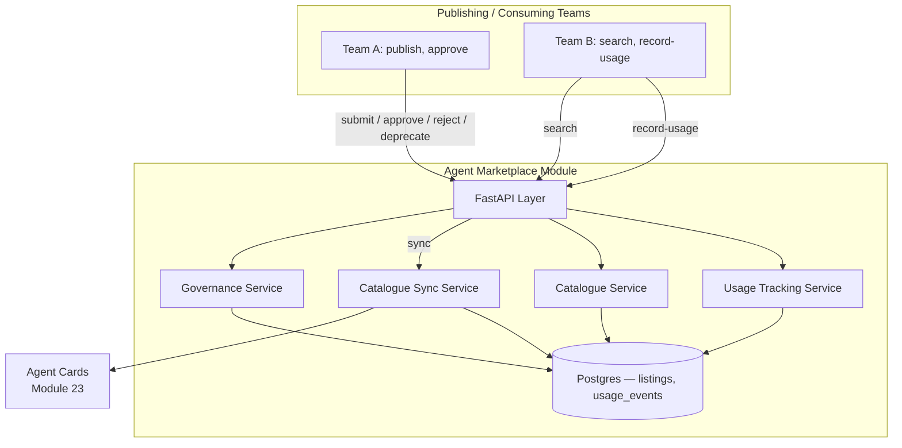
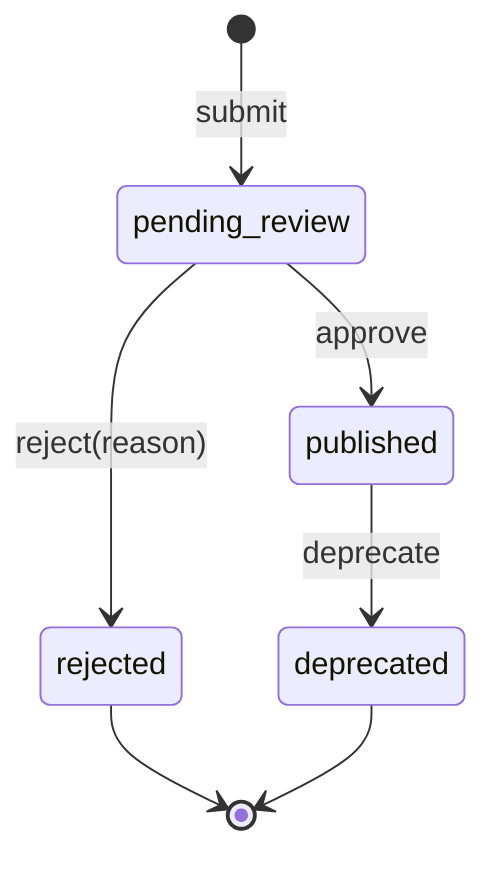

# Module 24: Agent Marketplace / Registry — Complete Module Specification

## Overview and Commercial Value

| Description | Inputs | Outputs | Value | Key Metrics |
|---|---|---|---|---|
| Internal catalogue of built agents with governance, reuse and (future) external monetisation | Agent metadata, usage policy | Searchable catalogue, reuse metrics | Prevents duplicate agent-building across teams, and opens a future revenue channel if opened externally | Reuse rate, catalogue growth, external listing revenue (if enabled) |

## Differentiator Features

Baseline (table stakes): a CRUD catalogue of listings referencing an
Agent Card, with a search endpoint.

What makes this module genuinely better:

- **A real governance gate, not just a list.** A listing starts
  `pending_review`; only an explicit `approve` transitions it to
  `published` and visible in the default catalogue search — a team
  can't just self-publish and call it governed. `reject` (with a
  reason) and `deprecate` (remove a once-published listing without
  erasing its history) are the only other legal transitions;
  `GovernanceService` rejects anything else with a clear
  `InvalidTransitionError` rather than silently allowing an
  out-of-order state change.
- **Reuse is a measured signal, not a marketing word.** Every actual
  use of a catalogued agent by a *different* team is recorded
  (`POST /listings/{id}/record-usage`), and the catalogue's default
  sort is `reuse_count` descending — an agent teams have genuinely
  reused outranks a freshly published one, directly serving "prevents
  duplicate agent-building" as the literal search order, not just
  prose.
- **Denormalized from Agent Cards (Module 23), not duplicated
  ownership.** A listing snapshots its card's name/skills/trust_score
  at submission (and on explicit `sync`, wholesale-replaced — the same
  "always a wholesale replace, never a merge" convention MCP's own
  Capability Sync Service already established) — the capability
  manifest itself is still owned entirely by Agent Cards; this module
  never writes to that data, only reads and snapshots it.
- **External monetisation is a documented placeholder, not a half-built
  feature.** `external_listing_enabled` is a real field or a future
  revenue flow to build on, but no billing/payment logic exists here —
  that's Module 33 (Billing and Metering)'s job once it exists,
  exactly the same "(future)" the module table itself flags, called
  out rather than half-implemented.

## Low-Level Design

### Level 1: Module Overview, Boundaries and Tech Stack

**Purpose.** The platform's internal catalogue of built agents: a team
publishes a listing referencing an existing Agent Card (Module 23), it
goes through an explicit governance approval before appearing in
search, and every genuine reuse by a different team is tracked —
turning "did anyone already build this" from a Slack question into a
searchable, ranked answer. Distinct from Agent Cards itself: that
module owns the capability manifest and its trust score; this module
owns *whether an agent is catalogued for reuse at all*, and by whom
it's actually been reused — a governance and adoption layer built on
top of Agent Cards, per the module table's own "Catalogue service on
top of Agent Cards" implementation approach, not a second copy of the
same registry.

**Chosen stack**

| Concern | Choice | Why |
|---|---|---|
| Language/runtime | Python 3.12, FastAPI, SQLAlchemy 2.0 async | Platform consistency |
| Card data | Snapshotted from Agent Cards via its real `GET /agent-cards/{id}`, wholesale-replaced on sync | Same "real peer, not invented" and "wholesale replace" conventions this platform already established (MCP's Capability Sync Service, Agent Cards' own Trust Score Calculator) |
| Storage | Postgres | Listings, usage events |
| Testing | `pytest` unit tier against an in-memory fake; real-Postgres integration tier | Platform-standard pattern |

**Deployability and testability contract.** Runs standalone against
SQLite for unit tests; the dependency-stub plays Agent Cards' own `GET
/agent-cards/{id}` with a canned card, so `CatalogueSyncService`'s
snapshot path is exercised end to end without Agent Cards itself
deployed alongside it.

### Level 2: Component Architecture and Diagrams



**Sub-components**

| Component | Responsibility | Built on |
|---|---|---|
| Governance Service | The listing state machine: submit (→ `pending_review`), approve (→ `published`), reject (→ `rejected`, with a reason), deprecate (`published` → `deprecated`); rejects any other transition | Own Postgres table |
| Catalogue Sync Service | Fetches the referenced Agent Card's current name/skills/trust_score and wholesale-replaces the listing's snapshot | `clients/agent_cards_client.py` |
| Catalogue Service | Search published listings, paginated, sorted by `reuse_count` descending (ties broken by the snapshotted `trust_score`) | Own Postgres table |
| Usage Tracking Service | Records a genuine reuse event (`listing_id`, consuming `tenant_id`), increments the listing's `reuse_count`, computes reuse metrics (total count, distinct consuming tenants) | Own Postgres table |

### Level 3: Detailed Design

**Data model**

| Entity | Fields |
|---|---|
| `ListingRecord` | `id`, `tenant_id` (publishing tenant), `agent_card_id` (Agent Cards' own id), `name`, `description`, `skills_snapshot` (JSONB, from the card), `trust_score_snapshot` (float, nullable), `status` (`pending_review`/`published`/`rejected`/`deprecated`), `submitted_by`, `reviewed_by` (nullable), `reviewed_at` (nullable), `rejection_reason` (nullable), `reuse_count` (int, default 0), `external_listing_enabled` (bool, default false — see Module 33 note above), `created_at`, `updated_at` |
| `UsageEventRecord` | `id`, `listing_id`, `consumer_tenant_id`, `used_at` |

**API surface**

| Endpoint | Method | Notes |
|---|---|---|
| `/v1/agent-marketplace/listings` | POST | Submit a listing referencing an `agent_card_id`; fetches and snapshots the card, status starts `pending_review` |
| `/v1/agent-marketplace/listings/{id}/approve` | POST | `pending_review` → `published`; any other starting status is a 409 (`InvalidTransitionError`) |
| `/v1/agent-marketplace/listings/{id}/reject` | POST | `pending_review` → `rejected`, with a required reason |
| `/v1/agent-marketplace/listings/{id}/deprecate` | POST | `published` → `deprecated` |
| `/v1/agent-marketplace/listings/{id}/sync` | POST | Wholesale-refreshes the card snapshot from Agent Cards |
| `/v1/agent-marketplace/listings` | GET | Paginated catalogue search: `published` only by default, sorted `reuse_count` descending; an explicit `status` filter is available for a listing's own submitting tenant or a governance view |
| `/v1/agent-marketplace/listings/{id}` | GET | Full detail |
| `/v1/agent-marketplace/listings/{id}/record-usage` | POST | `{consumer_tenant_id}` → appends a `UsageEventRecord`, increments `reuse_count` |
| `/v1/agent-marketplace/listings/{id}/reuse-metrics` | GET | `{reuse_count, distinct_consumer_tenants}` |

**The governance state machine**



Any transition not drawn above (approving an already-published listing,
rejecting a deprecated one, etc.) raises `InvalidTransitionError`,
surfaced as a `409 Conflict` — the same "reject clearly rather than
silently allow" posture this platform already takes with A2A's own
task-status transitions.

**Governance scoping note.** `approve`/`reject` are today open to any
authenticated platform-internal caller (JWT-gated, the same as every
other endpoint) — this module does not yet enforce a distinct
"reviewer" role. That's a real, documented simplification, not an
oversight: reviewer-role enforcement is Identity and Access (Module
27)'s job once it exists, and this module's own state machine doesn't
need to change shape to adopt it — only *who* is allowed to call
`approve`/`reject` does.

### Level 4: Telemetry, Logging, Tracing, Alerting, Configuration and Testing

**Tracing.** `agent_marketplace.governance_transition` span per
state-machine transition (`agent_marketplace.listing_id`,
`agent_marketplace.from_status`, `agent_marketplace.to_status`).

**Logging.** `structlog` JSON; every `reject` logs at `info` with the
`rejection_reason` — a governance decision worth being able to audit,
emitted to Module 20 (Auditability) per this platform's convention.

**Metrics (Prometheus)**

| Metric | Type | Labels |
|---|---|---|
| `agent_marketplace_listings_total` | Counter | `status` (catalogue growth, per the LLD's own key metric) |
| `agent_marketplace_usage_events_total` | Counter | `listing_id` |
| `agent_marketplace_sync_total` | Counter | `outcome` (synced/error) |

**Alerting**

| Alert | Condition | Severity |
|---|---|---|
| AgentMarketplaceSyncErrorRateHigh | `agent_marketplace_sync_total{outcome="error"}` rate > 5% over 15m | Warning |
| AgentMarketplacePendingReviewBacklogHigh | count of listings in `pending_review` for longer than 7 days > 10 | Warning |

**Configuration**

```yaml
agent_marketplace:
  tenant_id: "<tenant>"
  service_name: "agent-marketplace"
  agent_cards_base_url: "http://agent-cards:8102"
  jwt_shared_secret: "dev-insecure-shared-secret-change-me"  # env TECTONIC_JWT_SHARED_SECRET
```

**Testing**

| Level | Tooling |
|---|---|
| Unit | `pytest` against the in-memory fake, incl. the governance state machine's legal/illegal transition matrix as pure-function-shaped tests |
| Integration (isolated) | Real Postgres (dual-path fixture) |
| Contract | `schemathesis` against the REST surface |

**Non-functional targets**

| Attribute | Target |
|---|---|
| Catalogue search latency (p95) | Under 200ms |
| Availability | 99.9% |
