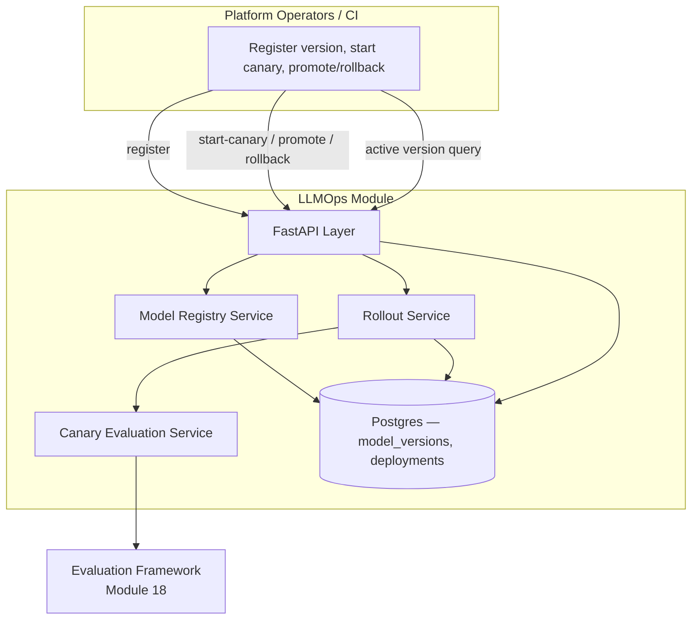
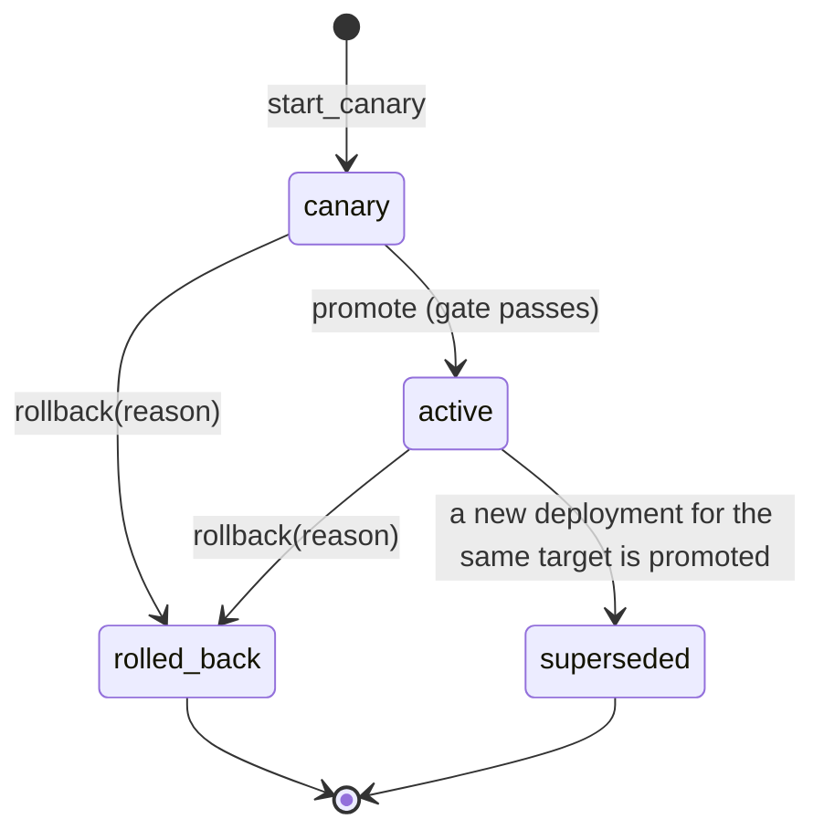

# Module 25: LLMOps — Complete Module Specification

## Overview and Commercial Value

| Description | Inputs | Outputs | Value | Key Metrics |
|---|---|---|---|---|
| Model registry, versioning, staged rollout, automatic canary evaluation | Model artefact/config, deployment target | Deployment status, active version | Safe model upgrades without manual sign-off bottlenecks | Rollout success rate, rollback frequency |

## Differentiator Features

Baseline (table stakes): a model version registry with a deployment
record per target.

What makes this module genuinely better:

- **Canary promotion is gated by real evidence, not a timer.**
  `CanaryEvaluationService` reads Evaluation Framework's own `GET
  /scores` for the canary's version, requires a minimum sample size
  before it will even consider a verdict (`insufficient_data`, not a
  false pass, below that), and only passes if the real pass rate meets
  a configurable threshold — a canary can sit at 10% traffic
  indefinitely without ever silently timing its way to `active` on
  volume alone.
- **A real state machine for rollout stages, not a status string
  nobody enforces.** `canary → active` only via an explicit `promote`
  that re-runs the gate check every time (never trusts a stale earlier
  pass); `canary`/`active → rolled_back` via `rollback` with a required
  reason; promoting a new version automatically supersedes whatever was
  previously `active` for the same target — the same explicit
  legal-transition-table shape (`InvalidTransitionError` on anything
  else) this platform's own Agent Marketplace (Module 24) already
  established for its governance workflow.
- **Rollback is a first-class, measured outcome, not an admin's manual
  workaround.** Every `rollback` records a reason and increments a
  labelled counter — "rollback frequency," the LLD's own key metric,
  comes directly from real operational history, not a support ticket
  count someone has to go dig up.
- **Honest about where its authority ends.** This module is the source
  of truth for which model version is `active` for a given model/target
  — it does not itself reconfigure LLM Gateway (Module 3)'s live
  routing. That integration (LLM Gateway polling or being pushed this
  module's active-version decision) is a real, valuable next step this
  LLD explicitly calls out as future work rather than quietly assuming
  or half-wiring — the same "documented placeholder, not a half-built
  feature" posture Agent Marketplace's own `external_listing_enabled`
  already takes.

## Low-Level Design

### Level 1: Module Overview, Boundaries and Tech Stack

**Purpose.** The platform's model registry and staged-rollout
controller: a new model version is registered, deployed to a target at
some canary traffic percentage, evaluated against real production
scores from Evaluation Framework (Module 18), and only promoted to
`active` — automatically superseding whatever was active before — once
that evidence clears a configurable bar. Distinct from LLM Gateway
(Module 3): that module is the actual request-routing/serving layer;
this module is the decision-and-record-keeping layer for *which*
version should be routed to, not the router itself.

**Chosen stack**

| Concern | Choice | Why |
|---|---|---|
| Language/runtime | Python 3.12, FastAPI, SQLAlchemy 2.0 async | Platform consistency |
| Canary gate | Reads Evaluation Framework's real `GET /scores`, keyed by the model version's own ref (reusing that endpoint's `agent_ref` scoping — a model-version-attributed evaluation run is scored the identical way an agent-attributed one is) | Same "real peer, not invented" convention this platform already established for Agent Cards' Trust Score Calculator |
| Storage | Postgres | Model versions, deployments |
| Testing | `pytest` unit tier against an in-memory fake; real-Postgres integration tier | Platform-standard pattern |

**Deployability and testability contract.** Runs standalone against
SQLite for unit tests; the dependency-stub plays Evaluation Framework's
own `GET /scores` with a canned, controllable pass rate, so
`CanaryEvaluationService`'s full gate path is exercised end to end
without Evaluation Framework itself deployed alongside it.

### Level 2: Component Architecture and Diagrams



**Sub-components**

| Component | Responsibility | Built on |
|---|---|---|
| Model Registry Service | Register a model version, list version history | Own Postgres table |
| Canary Evaluation Service | Reads real evaluation scores for a version, computes `{sample_size, pass_rate, passed, reason}` against configured thresholds | `clients/evaluation_framework_client.py` |
| Rollout Service | The deployment state machine: `start_canary`, `promote` (re-runs the gate, supersedes the prior active deployment), `rollback` (with a required reason) | Canary Evaluation Service, own Postgres table |

### Level 3: Detailed Design

**Data model**

| Entity | Fields |
|---|---|
| `ModelVersionRecord` | `id`, `tenant_id`, `model_name` (logical slot, e.g. `chat-default`), `version`, `artifact_ref` (provider/model id or config blob reference), `status` (`registered`/`canary`/`active`/`rolled_back`/`superseded`), `created_at` |
| `DeploymentRecord` | `id`, `tenant_id`, `model_version_id`, `model_name` (denormalized for the active-version query), `target` (e.g. `prod`, `tenant:acme`), `stage` (`canary`/`active`/`rolled_back`/`superseded`), `canary_percentage`, `started_at`, `promoted_at` (nullable), `rolled_back_at` (nullable), `rollback_reason` (nullable), `created_at`, `updated_at` |

**API surface**

| Endpoint | Method | Notes |
|---|---|---|
| `/v1/llmops/model-versions` | POST | Register a new version, status starts `registered` |
| `/v1/llmops/model-versions` | GET | Paginated version history for a `model_name` |
| `/v1/llmops/deployments` | POST | Start a canary: `{model_version_id, target, canary_percentage}` |
| `/v1/llmops/deployments/{id}` | GET | Full detail |
| `/v1/llmops/deployments/{id}/canary-gate` | GET | Read-only: the current gate verdict, without mutating state |
| `/v1/llmops/deployments/{id}/promote` | POST | Re-runs the gate; `canary → active` on pass, `409` on fail with the gate's own reason |
| `/v1/llmops/deployments/{id}/rollback` | POST | `{reason}`; `canary`/`active → rolled_back` |
| `/v1/llmops/models/{model_name}/active` | GET | `{target, tenant_id}` → the currently `active` `ModelVersionRecord` for that model/target, or `404` if none |

**The rollout state machine**



`promote` on a deployment whose gate has not passed raises
`CanaryGateFailedError` (`409`, carrying the gate's own `reason`) — it
never promotes "optimistically" and lets a caller find out later.

### Level 4: Telemetry, Logging, Tracing, Alerting, Configuration and Testing

**Tracing.** `llmops.canary_gate_evaluation` span per gate check
(`llmops.model_version_id`, `llmops.sample_size`, `llmops.pass_rate`,
`llmops.passed`).

**Logging.** `structlog` JSON; every `rollback` logs at `warning` with
the `rollback_reason` — a real production incident signal worth being
able to audit, emitted to Module 20 (Auditability) per this platform's
convention.

**Metrics (Prometheus)**

| Metric | Type | Labels |
|---|---|---|
| `llmops_deployments_total` | Counter | `stage` (rollout success rate: `active` vs. `rolled_back` transitions) |
| `llmops_rollbacks_total` | Counter | `model_name` (rollback frequency, the LLD's own key metric) |
| `llmops_canary_gate_evaluations_total` | Counter | `outcome` (passed/insufficient_data/failed) |

**Alerting**

| Alert | Condition | Severity |
|---|---|---|
| LLMOpsRollbackRateHigh | `llmops_rollbacks_total` rate > 1 per hour, sustained 3h | Warning |
| LLMOpsCanaryStuckInsufficientData | a deployment has stayed `canary` for longer than 24h with its last gate check `insufficient_data` | Warning |

**Configuration**

```yaml
llmops:
  tenant_id: "<tenant>"
  service_name: "llmops"
  min_canary_sample_size: 10
  min_canary_pass_rate: 0.95
  evaluation_framework_base_url: "http://evaluation-framework:8097"
  jwt_shared_secret: "dev-insecure-shared-secret-change-me"  # env TECTONIC_JWT_SHARED_SECRET
```

**Testing**

| Level | Tooling |
|---|---|
| Unit | `pytest` against the in-memory fake, incl. the canary gate's sample-size/pass-rate matrix and the rollout state machine's legal/illegal transitions as pure-function-shaped tests |
| Integration (isolated) | Real Postgres (dual-path fixture) |
| Contract | `schemathesis` against the REST surface |

**Non-functional targets**

| Attribute | Target |
|---|---|
| Active-version query latency (p95) | Under 100ms |
| Availability | 99.9% |
