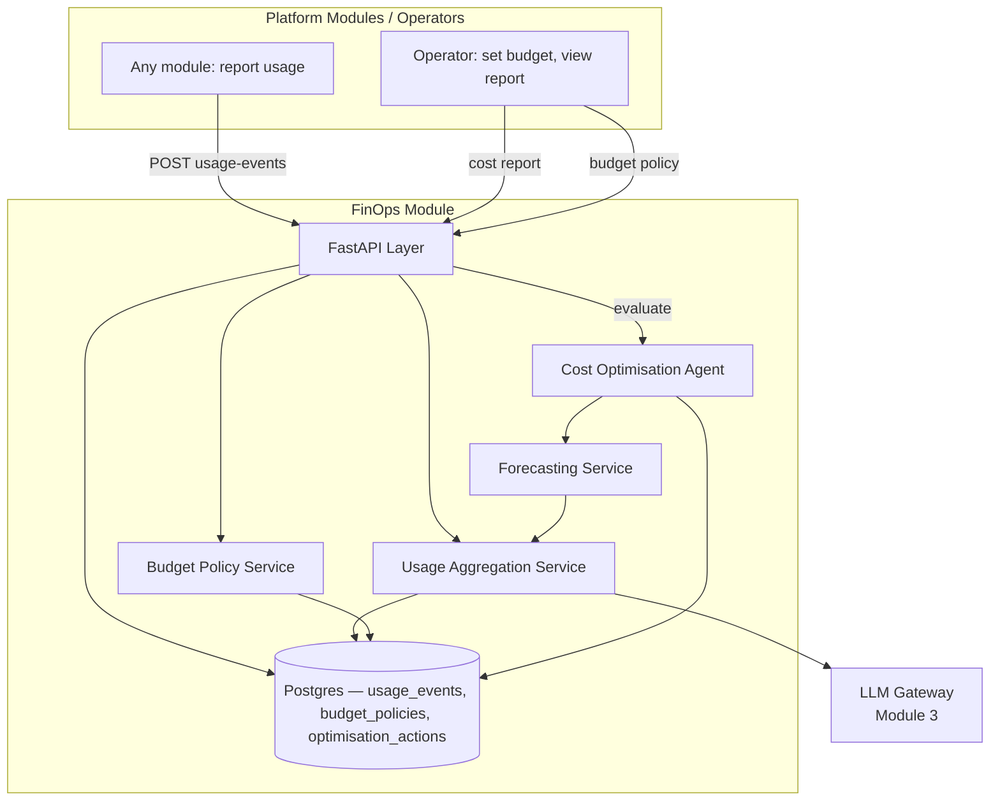

# Module 26: FinOps — Complete Module Specification

## Overview and Commercial Value

| Description | Inputs | Outputs | Value | Key Metrics |
|---|---|---|---|---|
| Budgets, chargeback, autonomous cost-optimisation agent, predictive forecasting | Usage events, budget policy | Cost reports, budget alerts | Directly answers the CFO question "what will this cost us," and actively reduces spend, not just reports it | Budget adherence, cost per tenant, forecast accuracy |

## Differentiator Features

Baseline (table stakes): a usage-event ledger with a per-tenant budget
limit and a threshold alert.

What makes this module genuinely better:

- **Reads LLM Gateway's own real spend, never re-derives a guess.**
  `UsageAggregationService` calls LLM Gateway (Module 3)'s own `GET
  /admin/virtual-keys` and `GET /admin/budgets/{id}` — the exact
  `current_spend` LLM Gateway's own `CostGovernanceEngine` already
  settles after every completion — rather than re-computing an LLM
  spend estimate from scratch. LLM Gateway itself never pushes usage
  events into this module; its spend is read live from its own
  authoritative source specifically to avoid double-counting the same
  dollar twice across two systems.
- **A genuinely bounded, auditable autonomous action — not "an AI
  decides your spend."** The cost-optimisation agent's one action is
  tightening a budget's alert sensitivity (`alert_threshold_pct`) when
  its own forecast says the period will end over limit — never
  blocking spend, never touching LLM Gateway's own hard budget
  enforcement. The step size and the floor it can never cross below are
  both config, and every action it takes is recorded with its reason —
  "autonomous... operating within bounded limits" made concrete as an
  action catalog of exactly one safe, reversible, always-logged move.
- **Forecasting admits when it doesn't have enough of the period yet to
  say anything.** A run-rate projection early in a period (say, day one
  of a monthly budget) is worthless — `ForecastingService` returns "no
  forecast yet" rather than a wild extrapolation, the same
  insufficient-data honesty this platform's own Agent Cards (Module 23)
  and LLMOps (Module 25) already established for their own real-signal
  gates.
- **Chargeback is genuinely cross-module, not LLM-cost-only.** Any
  module can report a non-LLM usage event (`POST /usage-events` —
  vector storage, compute, whatever a future module wants metered) and
  it lands in the same per-tenant cost report as LLM spend, one place a
  CFO question actually gets answered from.

## Low-Level Design

### Level 1: Module Overview, Boundaries and Tech Stack

**Purpose.** The platform's cost-visibility and budget-governance
layer: aggregates real LLM spend from LLM Gateway with any other
module's self-reported usage events into one per-tenant cost report,
enforces FinOps-level budget policies (distinct from LLM Gateway's own
request-time budget enforcement), forecasts where a period will land,
and takes one bounded, logged autonomous action when that forecast says
a budget is at risk. Distinct from Billing and Metering (a later,
not-yet-built module in the platform's own table): that module's job is
turning usage into invoices for revenue; this module's job is cost
*visibility and control* for the operator/CFO side — the same usage
data, two different audiences, not one module doing both.

**Chosen stack**

| Concern | Choice | Why |
|---|---|---|
| Language/runtime | Python 3.12, FastAPI, SQLAlchemy 2.0 async | Platform consistency |
| LLM spend source | LLM Gateway's own real `GET /admin/virtual-keys` + `GET /admin/budgets/{id}` | Same "real peer, not invented" convention this platform already established (Agent Cards' Trust Score Calculator, LLMOps' Canary Evaluation Service) |
| Storage | Postgres | Usage events, budget policies, autonomous-action audit trail |
| Testing | `pytest` unit tier against an in-memory fake; real-Postgres integration tier | Platform-standard pattern |

**Deployability and testability contract.** Runs standalone against
SQLite for unit tests; the dependency-stub plays LLM Gateway's own
`GET /admin/virtual-keys` and `GET /admin/budgets/{id}` with canned,
controllable spend figures, so `UsageAggregationService`'s full
cost-report path is exercised end to end without LLM Gateway itself
deployed alongside it.

### Level 2: Component Architecture and Diagrams



**Sub-components**

| Component | Responsibility | Built on |
|---|---|---|
| Usage Aggregation Service | Combines LLM Gateway's live spend with this module's own ingested usage events into one `CostReport` per tenant/period | `clients/llm_gateway_client.py` |
| Budget Policy Service | CRUD for this module's own (platform-wide) budget policies | Own Postgres table |
| Forecasting Service | Run-rate projection of period-end spend from the period's elapsed fraction; `None` (not a guess) when too little of the period has elapsed | Usage Aggregation Service |
| Cost Optimisation Agent | The one bounded autonomous action: tighten `alert_threshold_pct` when the forecast says a budget is at risk, never below a configured floor, always logged | Forecasting Service, own Postgres table |

### Level 3: Detailed Design

**Data model**

| Entity | Fields |
|---|---|
| `UsageEventRecord` | `id`, `tenant_id`, `source_module`, `resource_type` (e.g. `vector_query`, `storage_gb_month`), `quantity`, `unit_cost`, `cost`, `occurred_at` |
| `BudgetPolicyRecord` | `id`, `tenant_id`, `period` (`daily`/`monthly` — the same two values LLM Gateway's own `BudgetPeriod` uses), `limit_amount`, `alert_threshold_pct`, `created_at`, `updated_at` |
| `OptimisationActionRecord` | `id`, `tenant_id`, `budget_policy_id`, `action_type` (currently only `lowered_alert_threshold`), `previous_value`, `new_value`, `reason`, `taken_at` |

**API surface**

| Endpoint | Method | Notes |
|---|---|---|
| `/v1/finops/usage-events` | POST | Any module reports a non-LLM-Gateway usage event |
| `/v1/finops/cost-reports/{tenant_id}` | GET | `{period}` → `{llm_gateway_spend, other_usage_cost, total_cost, forecast, budget}` |
| `/v1/finops/budget-policies` | POST | Create a FinOps-level budget policy for a tenant |
| `/v1/finops/budget-policies/{id}` | GET | Full detail |
| `/v1/finops/budget-policies/{id}/evaluate` | POST | Runs the Cost Optimisation Agent once; returns the action taken, or `null` if forecast is within bounds |
| `/v1/finops/budget-policies/{id}/actions` | GET | Paginated audit trail of autonomous actions taken |

**Sequence: a bounded autonomous action**

```mermaid
sequenceDiagram
    participant OP as Operator / scheduler
    participant API as FastAPI Layer
    participant OPT as Cost Optimisation Agent
    participant FCAST as Forecasting Service
    participant AGG as Usage Aggregation Service
    participant LLMGW as LLM Gateway

    OP->>API: POST /budget-policies/{id}/evaluate
    API->>OPT: evaluate(policy)
    OPT->>FCAST: forecast(tenant_id, period)
    FCAST->>AGG: cost_report(tenant_id, period)
    AGG->>LLMGW: GET virtual-keys, GET budgets/{id}
    LLMGW-->>AGG: current_spend
    AGG-->>FCAST: CostReport
    FCAST-->>OPT: forecast_amount (or None -- insufficient elapsed period)
    alt forecast > limit_amount AND alert_threshold_pct > floor
        OPT->>OPT: new_threshold = max(floor, alert_threshold_pct - step)
        OPT->>API: OptimisationActionRecord persisted
    else within bounds, or already at floor, or no forecast yet
        OPT-->>API: no action taken
    end
```

### Level 4: Telemetry, Logging, Tracing, Alerting, Configuration and Testing

**Tracing.** `finops.evaluate_budget_policy` span per evaluation
(`finops.tenant_id`, `finops.forecast_amount`, `finops.action_taken`).

**Logging.** `structlog` JSON; every autonomous action logs at `warning`
with `previous_value`/`new_value`/`reason` — an operational decision
worth being able to audit, emitted to Module 20 (Auditability) per this
platform's convention.

**Metrics (Prometheus)**

| Metric | Type | Labels |
|---|---|---|
| `finops_cost_reports_total` | Counter | `tenant_id` |
| `finops_optimisation_actions_total` | Counter | `tenant_id`, `action_type` |
| `finops_budget_alerts_total` | Counter | `tenant_id` (budget adherence — an alert firing is a real adherence miss) |

**Alerting**

| Alert | Condition | Severity |
|---|---|---|
| FinOpsBudgetExceeded | `total_cost / limit_amount >= 1.0` for any tenant's active budget policy | Critical |
| FinOpsLLMGatewaySpendUnreachable | `UsageAggregationService` fails to reach LLM Gateway on 3 consecutive cost-report requests | Warning |

**Configuration**

```yaml
finops:
  tenant_id: "<tenant>"
  service_name: "finops"
  min_alert_threshold_pct: 0.5
  alert_threshold_step: 0.05
  llm_gateway_base_url: "http://llm-gateway:8082"
  jwt_shared_secret: "dev-insecure-shared-secret-change-me"  # env TECTONIC_JWT_SHARED_SECRET
```

**Testing**

| Level | Tooling |
|---|---|
| Unit | `pytest` against the in-memory fake, incl. the forecasting run-rate/insufficient-data matrix and the optimisation agent's bounded-step logic as pure-function-shaped tests |
| Integration (isolated) | Real Postgres (dual-path fixture) |
| Contract | `schemathesis` against the REST surface |

**Non-functional targets**

| Attribute | Target |
|---|---|
| Cost report latency (p95, incl. the LLM Gateway round trip) | Under 500ms |
| Availability | 99.9% |
