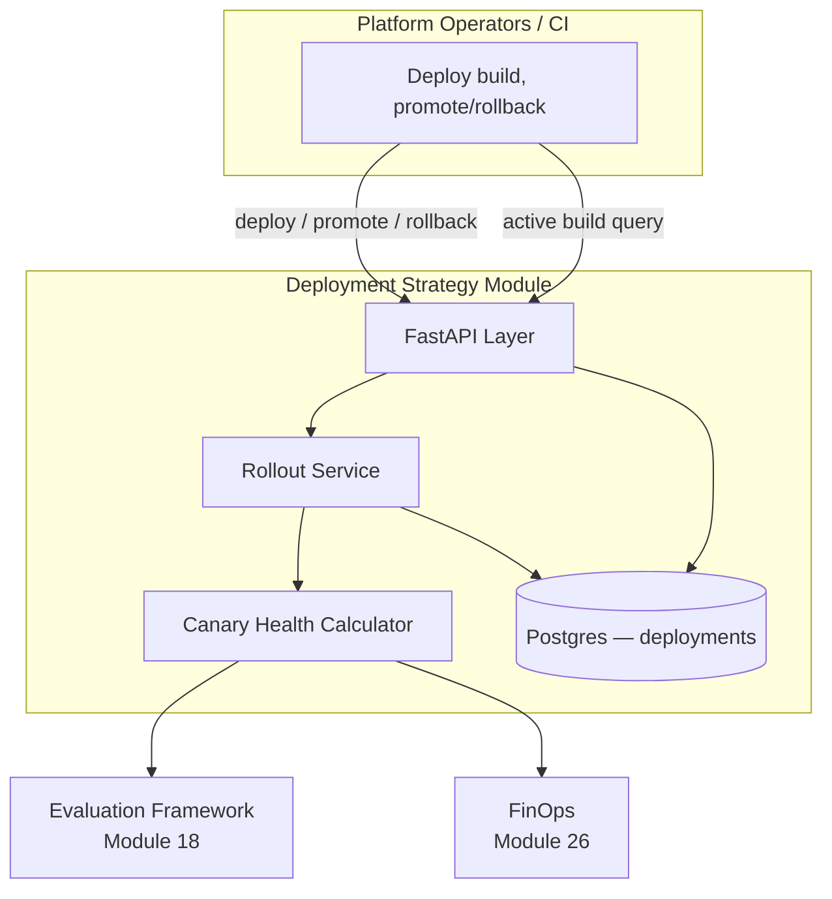
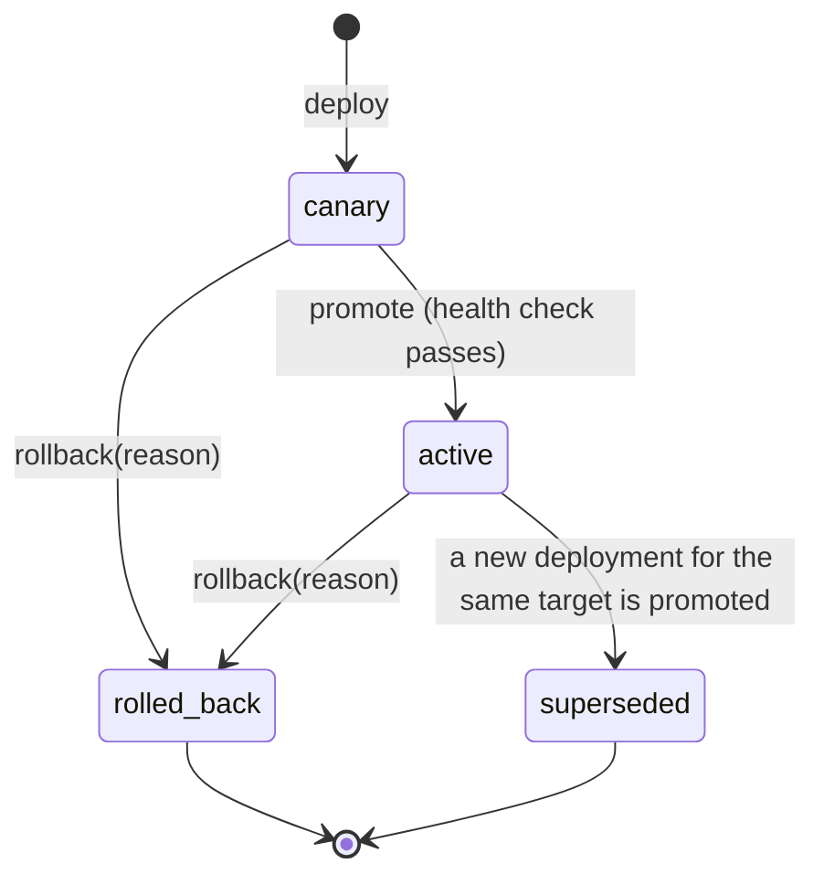

# Module 27: Deployment Strategy — Complete Module Specification

## Overview and Commercial Value

| Description | Inputs | Outputs | Value | Key Metrics |
|---|---|---|---|---|
| Cloud-agnostic packaging with agent-aware canary analysis | Build artefact, rollout policy | Deployment status, canary health | Deploys safely across any cloud without vendor rewrite, with agent-specific health signals not just infra ones | Deployment frequency, change failure rate, MTTR |

## Differentiator Features

Baseline (table stakes): a deployment record per service/target with a
canary traffic percentage and a promote/rollback lifecycle.

What makes this module genuinely better:

- **Canary health is agent-specific, not just infra metrics dressed up
  as a gate.** Most canary-analysis tools (Argo Rollouts, Flagger)
  watch HTTP error rate and latency — real, but blind to whether an
  *agentic* service is actually behaving well. `CanaryHealthCalculator`
  instead reads real signals about the deployed agent's own behavior:
  Evaluation Framework (Module 18)'s own `GET /scores` (a groundedness/
  quality pass rate, keyed by this deployment's own attribution ref)
  and FinOps (Module 26)'s own `GET /cost-reports/{tenant_id}` (a
  budget utilisation signal — a canary that's technically healthy but
  burning 3x the cost per request of the version it's replacing is not
  a safe promotion).
- **The same weighted, renormalize-over-available-signals math Agent
  Cards (Module 23) already established for trust scores, reused here
  for a promotion gate.** Each signal is fetched independently
  (`_safe_call`-wrapped, so a down peer degrades that one component
  rather than failing the whole computation); the composite health
  score renormalizes its weights over whichever signal(s) actually have
  data. Zero signals with data is `insufficient_data` — never a
  default, fabricated "healthy" verdict — and `promote` treats that
  exactly like `LLMOps`'s own gate treats it: not a pass.
- **A real state machine for rollout stages, the same shape Agent
  Marketplace (Module 24) and LLMOps (Module 25) already established.**
  `canary → active` only via an explicit `promote` that re-runs the
  health check every time (never trusts a stale earlier verdict);
  `canary`/`active → rolled_back` via `rollback` with a required
  reason; promoting a new deployment automatically supersedes whatever
  was previously `active` for the same `(tenant_id, service_name,
  target)` slot — anything outside that legal set is a `409`
  (`InvalidTransitionError`).
- **Honest about the one signal it doesn't have yet.** A genuinely
  agent-aware canary gate should also watch guardrail-violation rate,
  but Guardrails (Module 14) doesn't yet expose an aggregate,
  queryable violation-rate endpoint (only a per-request `/check` and
  red-team-run history) — this LLD calls that out explicitly as real
  future work for both modules, rather than fabricating a signal
  against an endpoint that doesn't exist, the same "documented
  placeholder, not a half-built feature" posture this platform's own
  Agent Marketplace and LLMOps already take.

## Low-Level Design

### Level 1: Module Overview, Boundaries and Tech Stack

**Purpose.** The platform's cloud-agnostic deployment controller: a
build artefact is deployed to a target at some canary traffic
percentage, its health is evaluated against real signals from
Evaluation Framework (Module 18) and FinOps (Module 26), and only
promoted to `active` — automatically superseding whatever was active
before — once that composite health score clears a configurable bar.
Distinct from LLMOps (Module 25): that module governs *which model
version* an LLM Gateway slot should route to; this module governs
*which build of a service* is live on a deployment target — the
service being deployed can itself be any platform module, including
one whose own canary is an LLMOps-governed model swap underneath it.
The two modules' state-machine shapes are intentionally identical
(`canary`/`active`/`rolled_back`/`superseded`) because they're solving
the same governance problem at two different layers of the stack.

**Chosen stack**

| Concern | Choice | Why |
|---|---|---|
| Language/runtime | Python 3.12, FastAPI, SQLAlchemy 2.0 async | Platform consistency |
| Packaging model | Kubernetes-native (Deployment + HPA + PDB, this module's own Helm chart is the reference shape every other module's chart already follows) | Cloud-agnostic: runs on any conformant Kubernetes, no vendor-specific rollout CRDs required |
| Canary health | Reads Evaluation Framework's real `GET /scores` and FinOps's real `GET /cost-reports/{tenant_id}`, combined with Agent Cards' own weighted-renormalization pattern | Same "real peer, not invented" convention this platform already established |
| Storage | Postgres | Deployments |
| Testing | `pytest` unit tier against an in-memory fake; real-Postgres integration tier | Platform-standard pattern |

**Deployability and testability contract.** Runs standalone against
SQLite for unit tests; the dependency-stub plays both Evaluation
Framework's `GET /scores` and FinOps's `GET /cost-reports/{tenant_id}`
with canned, controllable values, so `CanaryHealthCalculator`'s full
gate path — including its degrade-one-signal-at-a-time behavior — is
exercised end to end without either real peer deployed alongside it.

### Level 2: Component Architecture and Diagrams



**Sub-components**

| Component | Responsibility | Built on |
|---|---|---|
| Canary Health Calculator | Fetches groundedness pass-rate and cost-utilisation signals independently, each `_safe_call`-wrapped; computes a weighted composite health score renormalized over whichever signal(s) have data | `clients/evaluation_framework_client.py`, `clients/finops_client.py` |
| Rollout Service | The deployment state machine: `deploy` (start canary), `promote` (re-runs the health check, supersedes the prior active deployment), `rollback` (with a required reason) | Canary Health Calculator, own Postgres table |

### Level 3: Detailed Design

**Data model**

| Entity | Fields |
|---|---|
| `DeploymentRecord` | `id`, `tenant_id`, `service_name`, `build_ref` (image tag / artefact digest), `target` (e.g. `prod`, `tenant:acme`), `stage` (`canary`/`active`/`rolled_back`/`superseded`), `canary_percentage`, `started_at`, `promoted_at` (nullable), `rolled_back_at` (nullable), `rollback_reason` (nullable), `created_at`, `updated_at` |

`deployment_ref(record) -> f"deployment:{service_name}:{build_ref}"` is
the `agent_ref` convention this deployment's own evaluation runs must
be tagged with to be picked up by the Canary Health Calculator — the
same dedicated-attribution-convention shape LLMOps's own
`evaluation_ref` already established.

**Canary Health Calculator**

| Signal | Source | Component score | Weight (default) |
|---|---|---|---|
| Groundedness | Evaluation Framework `GET /scores` (`agent_ref=deployment_ref(...)`) | `pass_rate` once `sample_size >= min_groundedness_sample_size`, else excluded (insufficient data) | 0.6 |
| Cost | FinOps `GET /cost-reports/{tenant_id}?period=...&budget_policy_id=...` | `max(0.0, 1.0 - utilisation_ratio)` once a budget policy is configured for the tenant, else excluded (no budget configured is not a failure) | 0.4 |

Composite score = weighted average over whichever signal(s) have data,
weights renormalized to sum to 1 over just those. Zero signals with
data → `insufficient_data`, not a default pass. `passed = composite
score >= min_health_score` (only ever computed when at least one
signal had data).

**API surface**

| Endpoint | Method | Notes |
|---|---|---|
| `/v1/deployment-strategy/deployments` | POST | Start a canary: `{service_name, build_ref, target, canary_percentage}` |
| `/v1/deployment-strategy/deployments/{id}` | GET | Full detail |
| `/v1/deployment-strategy/deployments/{id}/canary-health` | GET | Read-only: the current composite health verdict, without mutating state |
| `/v1/deployment-strategy/deployments/{id}/promote` | POST | Re-runs the health check; `canary → active` on pass, `409` on fail/insufficient_data with the verdict's own reason |
| `/v1/deployment-strategy/deployments/{id}/rollback` | POST | `{reason}`; `canary`/`active → rolled_back` |
| `/v1/deployment-strategy/services/{service_name}/active` | GET | `{target, tenant_id}` → the currently `active` `DeploymentRecord` for that service/target, or `404` if none |

**The rollout state machine**



`promote` on a deployment whose health check has not passed (including
`insufficient_data`) raises `CanaryHealthCheckFailedError` (`409`,
carrying the verdict's own reason) — it never promotes "optimistically"
and lets a caller find out later, the identical posture LLMOps's own
`CanaryGateFailedError` already takes.

### Level 4: Telemetry, Logging, Tracing, Alerting, Configuration and Testing

**Tracing.** `deployment_strategy.canary_health_evaluation` span per
health check (`deployment_strategy.deployment_id`,
`deployment_strategy.composite_score`,
`deployment_strategy.signals_available`, `deployment_strategy.passed`).

**Logging.** `structlog` JSON; every `rollback` logs at `warning` with
the `rollback_reason` — a real production incident signal worth being
able to audit, emitted to Module 20 (Auditability) per this platform's
convention.

**Metrics (Prometheus)**

| Metric | Type | Labels |
|---|---|---|
| `deployment_strategy_deployments_total` | Counter | `stage` (deployment frequency: count of `deploy` events; change failure rate: `rolled_back` / total transitions) |
| `deployment_strategy_rollbacks_total` | Counter | `service_name` (change failure rate's numerator) |
| `deployment_strategy_canary_health_evaluations_total` | Counter | `outcome` (passed/insufficient_data/failed) |

MTTR is derived operationally from these timestamps (`rolled_back_at`
of a failed deployment to `promoted_at` of the next successful one for
the same `(service_name, target)`), not computed as a stored field —
the same "real metric from real timestamps, not a synthetic counter"
posture as LLMOps's own rollback frequency.

**Alerting**

| Alert | Condition | Severity |
|---|---|---|
| DeploymentStrategyChangeFailureRateHigh | `deployment_strategy_rollbacks_total` rate over `deployment_strategy_deployments_total{stage="active"}` rate > 0.3, sustained 3h | Warning |
| DeploymentStrategyCanaryStuckInsufficientData | a deployment has stayed `canary` for longer than 24h with its last health check `insufficient_data` | Warning |

**Configuration**

```yaml
deployment-strategy:
  tenant_id: "<tenant>"
  service_name: "deployment-strategy"
  min_groundedness_sample_size: 10
  min_health_score: 0.8
  groundedness_weight: 0.6
  cost_weight: 0.4
  budget_period: "monthly"
  evaluation_framework_base_url: "http://evaluation-framework:8097"
  finops_base_url: "http://finops:8105"
  jwt_shared_secret: "dev-insecure-shared-secret-change-me"  # env TECTONIC_JWT_SHARED_SECRET
```

**Testing**

| Level | Tooling |
|---|---|
| Unit | `pytest` against the in-memory fake, incl. the health calculator's signal-degradation matrix (each signal present/absent/failing independently) and the rollout state machine's legal/illegal transitions as pure-function-shaped tests |
| Integration (isolated) | Real Postgres (dual-path fixture) |
| Contract | `schemathesis` against the REST surface |

**Non-functional targets**

| Attribute | Target |
|---|---|
| Active-build query latency (p95) | Under 100ms |
| Availability | 99.9% |
