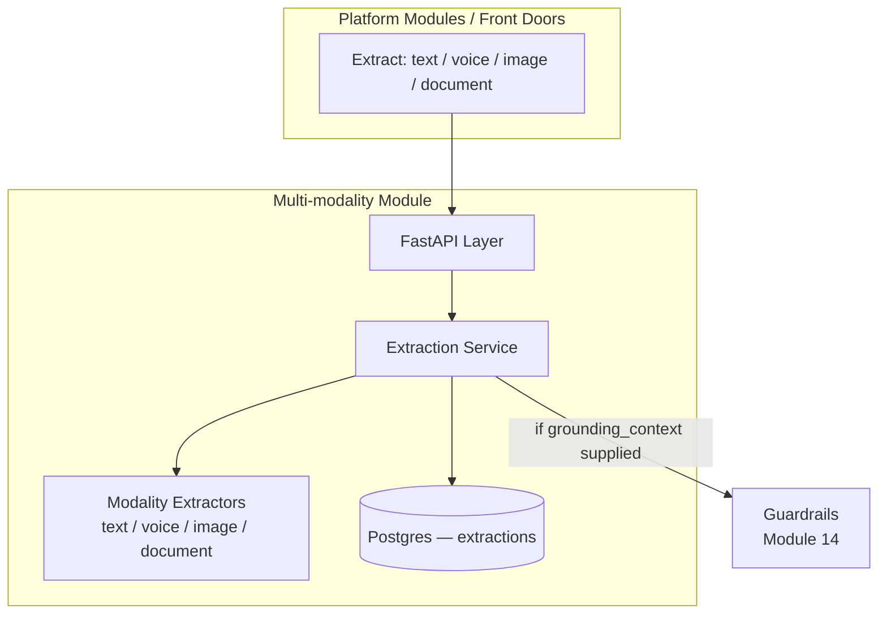
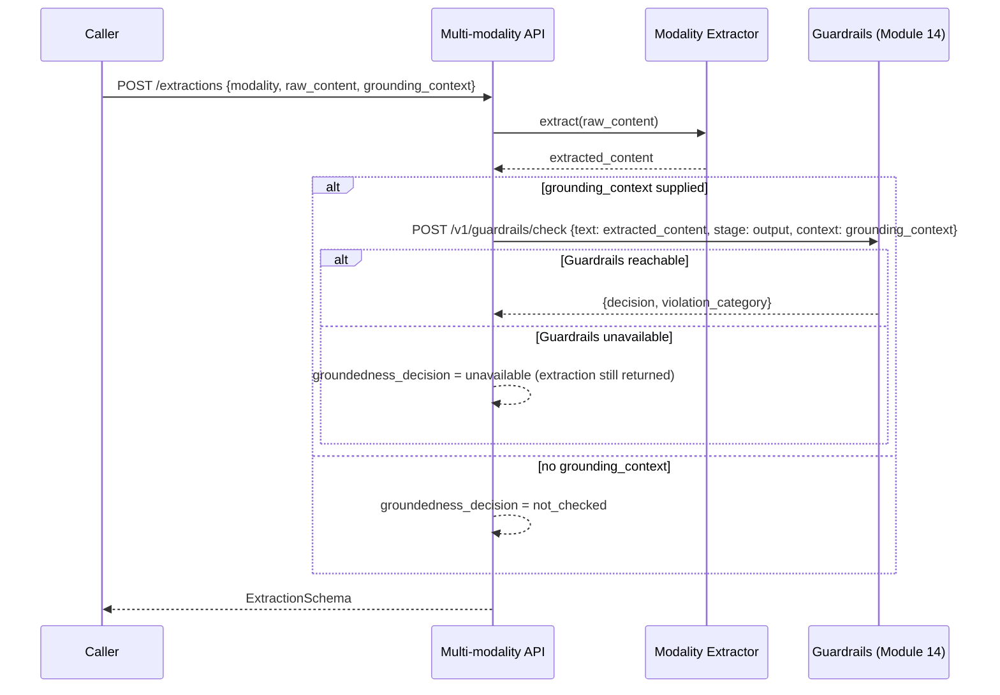

# Module 28: Multi-modality — Complete Module Specification

## Overview and Commercial Value

| Description | Inputs | Outputs | Value | Key Metrics |
|---|---|---|---|---|
| Text, voice, image, document handling with cross-modal groundedness checks | Raw media | Extracted/generated content | Widens use cases (voice banking, document-heavy claims) without separate product lines | Transcription/extraction accuracy, conversion latency |

## Differentiator Features

Baseline (table stakes): a per-modality extraction endpoint (transcribe
audio, describe an image, parse a document).

What makes this module genuinely better:

- **One unified interface across four modalities, not four bespoke
  endpoints a caller has to branch on.** `POST
  /v1/multi-modality/extractions` takes a `modality` field
  (`text`/`voice`/`image`/`document`) and returns the identical
  `ExtractionSchema` shape regardless of which pipeline ran — a caller
  building a voice-banking flow and a caller building document-heavy
  claims intake share the exact same integration code.
- **A real cross-modal groundedness gate, not a claimed one.** Every
  extraction can carry an optional `grounding_context` (a reference
  document, a claim description, an existing transcript) — when
  supplied, the extracted content is checked against it through
  Guardrails (Module 14)'s own real `POST /v1/guardrails/check`
  (`stage=output`), the identical endpoint and `groundedness_check`
  logic this platform already uses to catch ungrounded LLM output.
  This is the same "real peer, not invented" convention this platform
  established for Agent Cards' trust score and Deployment Strategy's
  canary health — a genuinely shared, tested groundedness check, not a
  second implementation of it.
- **A down Guardrails peer degrades to `unavailable`, not a crashed
  extraction.** `ExtractionService._safe_call` wraps the groundedness
  check independently of the extraction itself: if Guardrails can't be
  reached, the caller still gets their extracted content back, tagged
  `groundedness_decision=unavailable` rather than losing the whole
  request over one unavailable signal.
- **Honest about what "accuracy" means without a real ASR/vision
  provider wired.** This LLD's own `VoiceExtractor`/`ImageExtractor`
  are documented, swappable stand-ins (`core/ports.py`'s
  `ModalityExtractor` protocol) for a real cloud Speech-to-Text/Vision
  API — wiring one is real, valuable future work this LLD calls out
  explicitly, the same "documented placeholder, not a half-built
  feature" posture Agent Marketplace and LLMOps already take. This
  module's own, real, measured contribution is conversion latency and
  the groundedness-gate outcome, not a fabricated accuracy number with
  no ground truth behind it.

## Low-Level Design

### Level 1: Module Overview, Boundaries and Tech Stack

**Purpose.** The platform's unified multi-modal ingestion and
governance layer: raw media of any of four modalities is normalized
into a common `extracted_content` shape by a pluggable, per-modality
pipeline, then optionally checked for groundedness against a supplied
reference via Guardrails (Module 14)'s own real check endpoint before
being handed back to the caller. Distinct from Guardrails itself: this
module owns *extraction*, not policy; Guardrails remains the sole owner
of the groundedness-checking logic and its configured threshold, called
here exactly as any other output-stage check would be.

**Chosen stack**

| Concern | Choice | Why |
|---|---|---|
| Language/runtime | Python 3.12, FastAPI, SQLAlchemy 2.0 async | Platform consistency |
| Extraction pipelines | Pluggable `ModalityExtractor` protocol per modality; this LLD ships simple, deterministic stand-ins (light normalization) documented as placeholders for a real cloud ASR/vision/OCR provider | Real external-cloud ASR/vision integration is out of this platform's own module boundary — same "documented, swappable placeholder" posture as other modules' not-yet-wired peers, applied here to an external dependency instead of a Tectonic one |
| Groundedness gate | Reads Guardrails' real `POST /v1/guardrails/check` (`stage=output`) | Same "real peer, not invented" convention this platform already established for Agent Cards and Deployment Strategy |
| Storage | Postgres | Extraction records |
| Testing | `pytest` unit tier against an in-memory fake; real-Postgres integration tier | Platform-standard pattern |

**Deployability and testability contract.** Runs standalone against
SQLite for unit tests; the dependency-stub plays Guardrails' own `POST
/v1/guardrails/check` with a canned, controllable decision, so
`ExtractionService`'s full groundedness-gate path is exercised end to
end without Guardrails itself deployed alongside it.

### Level 2: Component Architecture and Diagrams



**Sub-components**

| Component | Responsibility | Built on |
|---|---|---|
| Modality Extractors | Per-modality normalization into a common `extracted_content` string; swappable via `core/ports.py`'s `ModalityExtractor` protocol | Pure, deterministic stand-ins today; a real cloud provider in a future deployment |
| Extraction Service | Runs the right extractor for the request's `modality`, optionally runs the groundedness gate, persists the result, tracks latency | `clients/guardrails_client.py` |

### Level 3: Detailed Design

**Data model**

| Entity | Fields |
|---|---|
| `ExtractionRecord` | `id`, `tenant_id`, `modality` (`text`/`voice`/`image`/`document`), `raw_content`, `extracted_content`, `grounding_context` (nullable), `groundedness_decision` (`allow`/`block`/`redact`/`not_checked`/`unavailable`), `groundedness_violation_category` (nullable), `latency_ms`, `created_at` |

**API surface**

| Endpoint | Method | Notes |
|---|---|---|
| `/v1/multi-modality/extractions` | POST | `{modality, raw_content, grounding_context?}` → `ExtractionSchema`. Runs the groundedness gate only when `grounding_context` is supplied |
| `/v1/multi-modality/extractions` | GET | Paginated, filterable by `tenant_id`/`modality` |
| `/v1/multi-modality/extractions/{id}` | GET | Full detail |

**The groundedness gate**



### Level 4: Telemetry, Logging, Tracing, Alerting, Configuration and Testing

**Tracing.** `multi_modality.extraction` span per request
(`multi_modality.modality`, `multi_modality.latency_ms`,
`multi_modality.groundedness_decision`).

**Logging.** `structlog` JSON; a `groundedness_decision=block` or
`redact` logs at `warning` — a real content-quality signal worth being
able to audit, emitted to Module 20 (Auditability) per this platform's
convention.

**Metrics (Prometheus)**

| Metric | Type | Labels |
|---|---|---|
| `multi_modality_extractions_total` | Counter | `modality` |
| `multi_modality_extraction_latency_seconds` | Histogram | `modality` (conversion latency, the LLD's own key metric) |
| `multi_modality_groundedness_checks_total` | Counter | `decision` (allow/block/redact/unavailable) |

**Alerting**

| Alert | Condition | Severity |
|---|---|---|
| MultiModalityGroundednessUnavailableRateHigh | `multi_modality_groundedness_checks_total{decision="unavailable"}` rate over total checked rate > 0.1, sustained 15m | Warning |
| MultiModalityExtractionLatencyHigh | `multi_modality_extraction_latency_seconds` p95 > 2s, sustained 15m, any modality | Warning |

**Configuration**

```yaml
multi-modality:
  tenant_id: "<tenant>"
  service_name: "multi-modality"
  guardrails_base_url: "http://guardrails:8093"
  jwt_shared_secret: "dev-insecure-shared-secret-change-me"  # env TECTONIC_JWT_SHARED_SECRET
```

**Testing**

| Level | Tooling |
|---|---|
| Unit | `pytest` against the in-memory fake, incl. each modality's extractor and the groundedness gate's present/absent/unavailable matrix as pure-function-shaped tests |
| Integration (isolated) | Real Postgres (dual-path fixture) |
| Contract | `schemathesis` against the REST surface |

**Non-functional targets**

| Attribute | Target |
|---|---|
| Extraction latency (p95), text/document | Under 200ms (excludes any real external ASR/vision provider's own latency once wired) |
| Availability | 99.9% |
