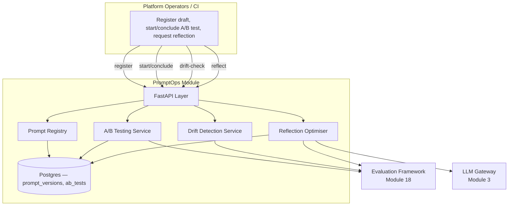
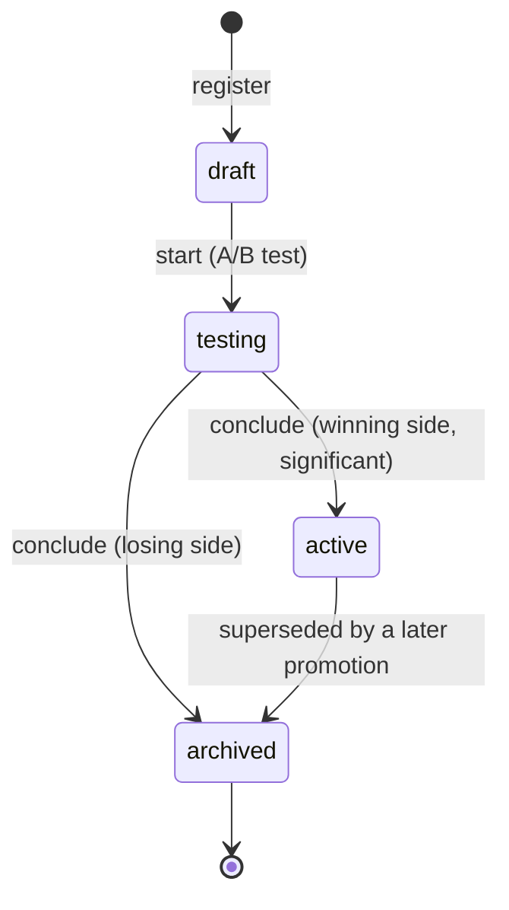

# Module 29: PromptOps — Complete Module Specification

## Overview and Commercial Value

| Description | Inputs | Outputs | Value | Key Metrics |
|---|---|---|---|---|
| Prompt versioning, A/B testing, automated reflection-based optimisation | Prompt draft, test suite | Deployed version, test results | Prompts improve over time with far less manual tuning effort | Version count, drift incidents, A/B significance rate |

## Differentiator Features

Baseline (table stakes): a prompt version registry with a `draft` →
`active` lifecycle.

What makes this module genuinely better:

- **A/B testing decided by a real statistical test, not "which number
  is bigger."** `ABTestingService.evaluate` reads both versions' real
  pass/fail history from Evaluation Framework (Module 18)'s own `GET
  /scores` and runs an honest two-proportion z-test (stdlib `math.erf`,
  no fabricated significance) — `conclude` refuses to pick a winner
  (`409 ABTestNotConclusiveError`) until the p-value actually clears
  the configured significance level, and never on a sample too small
  to mean anything (`insufficient_data` below `min_sample_size_per_arm`
  per arm). The same insufficient-data-over-fabrication posture this
  platform's Agent Cards, LLMOps and FinOps already established.
- **The same statistical primitive reused for drift detection after
  launch, not just at launch.** `DriftDetectionService` runs the
  identical two-proportion z-test comparing an active version's
  pass rate *at the moment it was promoted* against its pass rate
  *right now* — a real, computed "drift incident" (the LLD's own key
  metric), not a vague warning nobody can act on.
- **A bounded, auditable reflection optimiser — proposes, never
  auto-deploys.** `ReflectionOptimiser.propose` reads a version's real
  failing-metric summary from Evaluation Framework, asks LLM Gateway
  (Module 3)'s own real `POST /v1/chat/completions` to draft an
  improved template, and returns it as a brand-new `draft` version with
  `parent_version_id` set — it never overwrites the original, never
  starts an A/B test itself, and never promotes anything. A human or CI
  pipeline still has to explicitly `start` an A/B test against it,
  exactly the "one bounded action, everything else stays manual" shape
  FinOps (Module 26)'s own Cost Optimisation Agent already established
  for autonomous-agent safety. It also declines to act at all
  (`204`, no draft created) when the current version's pass rate is
  already at or above `max_pass_rate_before_reflection`, or when there
  isn't yet enough evaluation history to know — nothing to "optimise"
  away from.
- **A real state machine for prompt versions, the same shape Agent
  Marketplace, LLMOps and Deployment Strategy already established.**
  `draft → testing` (via `start` on an A/B test) → `active` (via
  `conclude`, only on the winning side) or `archived` (the losing
  side); `active → archived`. Promoting a new version automatically
  supersedes whatever was previously `active` for the same
  `(tenant_id, prompt_name)` slot.

## Low-Level Design

### Level 1: Module Overview, Boundaries and Tech Stack

**Purpose.** The platform's prompt registry, A/B-testing gate and
bounded reflection-based optimiser: a prompt template is registered as
a `draft` version, pitted against another version in a real,
statistically-gated A/B test read from Evaluation Framework's own
production scores, and only promoted to `active` — automatically
superseding whatever was active before — once that test actually
clears significance. A bounded optimiser agent can propose new draft
versions from a struggling version's real failure pattern, but never
promotes anything itself. Distinct from LLMOps (Module 25): that module
governs *model versions*; this module governs *prompt template
versions* — the two are complementary and can be composed (a model
swap and a prompt swap are independent, separately-gated decisions).

**Chosen stack**

| Concern | Choice | Why |
|---|---|---|
| Language/runtime | Python 3.12, FastAPI, SQLAlchemy 2.0 async | Platform consistency |
| A/B significance test | Two-proportion z-test via stdlib `math.erf` | No new dependency for one well-understood closed-form test; this platform keeps its dependency lists lean |
| Evaluation signal | Reads Evaluation Framework's real `GET /scores`, keyed by `prompt:{prompt_name}:{version}` (the same `agent_ref` attribution convention LLMOps' `evaluation_ref` and Deployment Strategy's `deployment_ref` already established) | Same "real peer, not invented" convention this platform already established |
| Reflection generation | Calls LLM Gateway's real `POST /v1/llm-gateway/chat/completions` | LLM Gateway is this platform's one real generation peer — no separate/invented LLM client |
| Storage | Postgres | Prompt versions, A/B tests |
| Testing | `pytest` unit tier against an in-memory fake; real-Postgres integration tier | Platform-standard pattern |

**Deployability and testability contract.** Runs standalone against
SQLite for unit tests; the dependency-stub plays both Evaluation
Framework's `GET /scores` and LLM Gateway's `POST /chat/completions`
with canned, controllable values, so the A/B test, drift check and
reflection paths are all exercised end to end without either real peer
deployed alongside it.

### Level 2: Component Architecture and Diagrams



**Sub-components**

| Component | Responsibility | Built on |
|---|---|---|
| Prompt Registry | Register/list/get prompt template versions | Own Postgres table |
| A/B Testing Service | Real two-proportion z-test between two versions' evaluation histories; `conclude` promotes the significant winner and auto-supersedes/archives | `clients/evaluation_framework_client.py` |
| Drift Detection Service | Reuses the same z-test to compare an active version's pass rate at promotion time against right now | `clients/evaluation_framework_client.py` |
| Reflection Optimiser | Summarizes a version's real failing metrics, asks LLM Gateway to draft an improved template, returns it as a new `draft` — never auto-deploys | `clients/evaluation_framework_client.py`, `clients/llm_gateway_client.py` |

### Level 3: Detailed Design

**Data model**

| Entity | Fields |
|---|---|
| `PromptVersionRecord` | `id`, `tenant_id`, `prompt_name` (logical slot), `version`, `template`, `status` (`draft`/`testing`/`active`/`archived`), `parent_version_id` (nullable — set when created by the Reflection Optimiser), `promoted_pass_rate` (nullable — captured at promotion, the Drift Detection Service's baseline), `promoted_sample_size` (nullable), `created_at`, `updated_at` |
| `ABTestRecord` | `id`, `tenant_id`, `prompt_name`, `version_a_id`, `version_b_id`, `status` (`running`/`concluded`), `winner_version_id` (nullable), `p_value` (nullable), `sample_size_a`, `sample_size_b`, `started_at`, `concluded_at` (nullable) |

**API surface**

| Endpoint | Method | Notes |
|---|---|---|
| `/v1/promptops/prompt-versions` | POST | Register a new draft: `{prompt_name, version, template}` |
| `/v1/promptops/prompt-versions` | GET | Paginated, filterable by `tenant_id`/`prompt_name` |
| `/v1/promptops/prompt-versions/{id}` | GET | Full detail |
| `/v1/promptops/prompt-versions/{id}/drift-check` | GET | Read-only: current pass rate vs. the promotion-time baseline, via the same z-test |
| `/v1/promptops/prompt-versions/{id}/reflect` | POST | Runs the Reflection Optimiser; `201` with the new draft, or `204` if no optimisation is warranted |
| `/v1/promptops/ab-tests` | POST | Start a test: `{prompt_name, version_a_id, version_b_id}`; both versions transition `draft → testing` |
| `/v1/promptops/ab-tests/{id}` | GET | Full detail |
| `/v1/promptops/ab-tests/{id}/result` | GET | Read-only: the current z-test verdict, without mutating state |
| `/v1/promptops/ab-tests/{id}/conclude` | POST | Re-runs the z-test; `409` if not yet significant, else promotes the winner (auto-superseding the prior active version) and archives the loser |
| `/v1/promptops/prompts/{prompt_name}/active` | GET | `{tenant_id}` → the currently `active` `PromptVersionRecord`, or `404` if none |

**The version state machine**



**A/B significance test.** A two-proportion z-test over each side's
real `passed` count from Evaluation Framework:
`p_pool = (passed_a + passed_b) / (n_a + n_b)`,
`se = sqrt(p_pool * (1 - p_pool) * (1/n_a + 1/n_b))`,
`z = (p_a - p_b) / se`, `p_value = 2 * (1 - Φ(|z|))` (`Φ` via stdlib
`math.erf`). `evaluate` returns `insufficient_data` (not a coin-flip
verdict) when either arm's sample size is below
`min_sample_size_per_arm`; `conclude` always re-runs it fresh.

### Level 4: Telemetry, Logging, Tracing, Alerting, Configuration and Testing

**Tracing.** `promptops.ab_test_evaluation` span per z-test
(`promptops.ab_test_id`, `promptops.p_value`, `promptops.significant`);
`promptops.reflection` span per optimiser run
(`promptops.prompt_version_id`, `promptops.optimised`).

**Logging.** `structlog` JSON; a concluded A/B test and a detected
drift incident both log at `warning` — real prompt-quality signals
worth being able to audit, emitted to Module 20 (Auditability) per this
platform's convention.

**Metrics (Prometheus)**

| Metric | Type | Labels |
|---|---|---|
| `promptops_prompt_versions_total` | Counter | `status` (version count, the LLD's own key metric) |
| `promptops_ab_tests_concluded_total` | Counter | `significant` (A/B significance rate = this / total concluded) |
| `promptops_drift_incidents_total` | Counter | `prompt_name` (drift incidents, the LLD's own key metric) |
| `promptops_reflection_runs_total` | Counter | `outcome` (`optimised`/`no_action_warranted`) |

**Alerting**

| Alert | Condition | Severity |
|---|---|---|
| PromptOpsDriftIncidentsHigh | `promptops_drift_incidents_total` rate > 1 per day, sustained | Warning |
| PromptOpsABSignificanceRateLow | Fewer than 20% of concluded A/B tests are significant over 7d | Info |

**Configuration**

```yaml
promptops:
  tenant_id: "<tenant>"
  service_name: "promptops"
  min_ab_sample_size_per_arm: 10
  ab_significance_level: 0.05
  drift_significance_level: 0.05
  max_pass_rate_before_reflection: 0.9
  min_reflection_sample_size: 10
  reflection_model: "gpt-4o-mini"
  evaluation_framework_base_url: "http://evaluation-framework:8097"
  llm_gateway_base_url: "http://llm-gateway:8082"
  jwt_shared_secret: "dev-insecure-shared-secret-change-me"  # env TECTONIC_JWT_SHARED_SECRET
```

**Testing**

| Level | Tooling |
|---|---|
| Unit | `pytest` against the in-memory fake, incl. the z-test's insufficient-data/significant/not-significant matrix, the reflection optimiser's act/decline matrix, and the state machine's legal/illegal transitions as pure-function-shaped tests |
| Integration (isolated) | Real Postgres (dual-path fixture) |
| Contract | `schemathesis` against the REST surface |

**Non-functional targets**

| Attribute | Target |
|---|---|
| Active-version query latency (p95) | Under 100ms |
| Availability | 99.9% |
