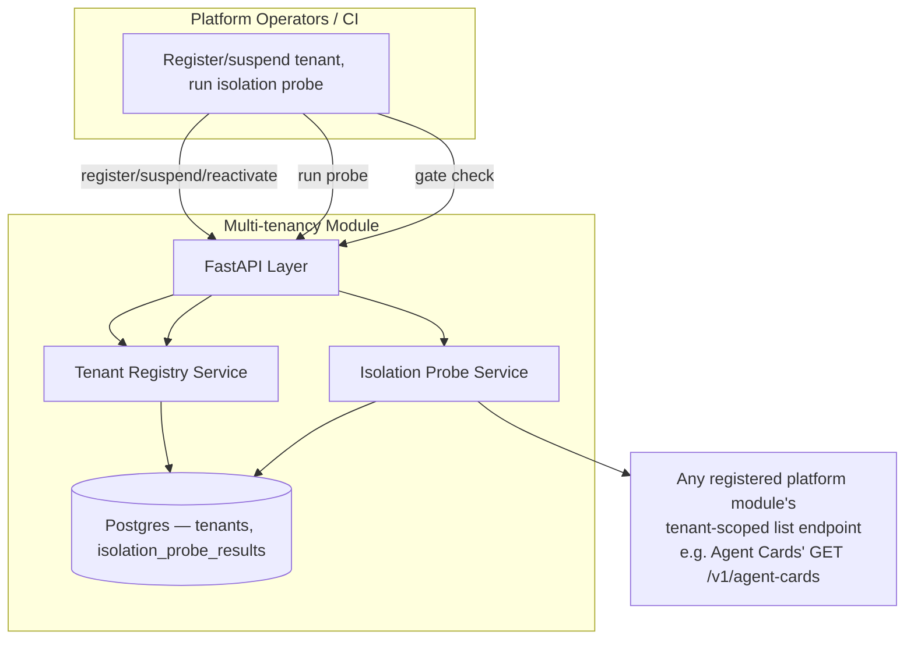
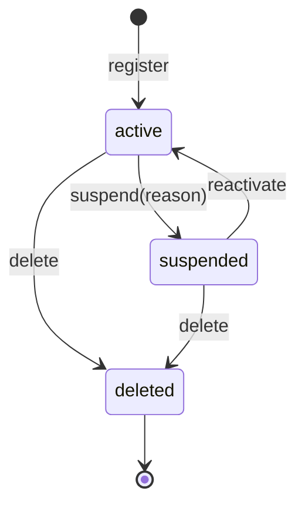

# Module 30: Multi-tenancy — Complete Module Specification

## Overview and Commercial Value

| Description | Inputs | Outputs | Value | Key Metrics |
|---|---|---|---|---|
| Data, config and usage isolation per tenant across all modules | Tenant context | Isolation enforcement result | Non-negotiable for a multi-customer SaaS platform; sells trust | Isolation breach incidents (target zero) |

## Differentiator Features

Baseline (table stakes): a tenant registry with an active/suspended
lifecycle.

What makes this module genuinely better:

- **Isolation is actively verified, not just assumed.** Every module in
  this platform already follows one identical list-endpoint contract —
  `GET .../resource?tenant_id=X` → `{"items": [...each item carrying
  its own tenant_id...]}` — because every module was built against the
  same LLD convention. `IsolationProbeService` exploits that
  consistency directly: it calls a target module's real list endpoint
  scoped to one tenant and checks that *every returned item's own
  `tenant_id` field actually matches* — a genuine, executable isolation
  check, not a design-review checkbox. No per-module adapter code is
  needed because the contract itself is already platform-wide.
- **The LLD's own key metric is a real, wired counter, not aspirational
  prose.** `multi_tenancy_isolation_breach_incidents_total` increments
  by the actual number of foreign records a probe run found — "target
  zero" is something this module can actually report a live number
  against, not a claim nobody can check.
- **Fails closed, the same insufficient-data-over-fabrication posture
  this platform's real-signal calculators already established.** A
  probe against an unreachable target is recorded as `passed=False`
  with a `probe_unavailable` reason — never a silent "assumed fine."
  Isolation can only ever be reported as verified when it was actually
  checked.
- **A real state machine for tenant lifecycle**, the same shape Agent
  Marketplace, LLMOps, Deployment Strategy and PromptOps already
  established: `active ↔ suspended`, either → `delete` (terminal).
  Anything outside that legal set is a `409` (`InvalidTransitionError`).
  `GET /tenants/{id}/gate` is the one real integration point every
  other module's request path should call before serving a
  request — `{"allowed": false, "reason": "tenant is suspended"}` is
  the concrete, machine-checkable output "request-level tenant context
  propagation" actually needs to mean.

## Low-Level Design

### Level 1: Module Overview, Boundaries and Tech Stack

**Purpose.** The platform's tenant registry and isolation-verification
layer: every tenant's lifecycle (`active`/`suspended`/`deleted`) is
governed here, and a real, executable probe periodically confirms that
a tenant-scoped query against any registered platform module actually
returns only that tenant's own records. Distinct from each individual
module's own `tenant_id`-column data partitioning (which every module
already implements at its own storage layer per this platform's
convention): this module doesn't replace that partitioning, it verifies
it actually holds, and is the one place a tenant's overall
active/suspended status is decided.

**Chosen stack**

| Concern | Choice | Why |
|---|---|---|
| Language/runtime | Python 3.12, FastAPI, SQLAlchemy 2.0 async | Platform consistency |
| Isolation probe | A single generic `TenantScopedListClient` reused against every registered target, because every module already shares the identical `?tenant_id=X` → `{"items": [...tenant_id...]}` list contract | No per-module adapter code; "real peer, not invented" applied to a whole class of peers at once |
| Storage | Postgres | Tenants, isolation probe results |
| Testing | `pytest` unit tier against an in-memory fake; real-Postgres integration tier | Platform-standard pattern |

**Deployability and testability contract.** Runs standalone against
SQLite for unit tests; the dependency-stub plays a generic
tenant-scoped list endpoint (both a clean and a deliberately-leaking
variant, so the probe's breach-detection path is exercised end to end)
without any real platform peer deployed alongside it. The default
configured probe target is Agent Cards (Module 23) — a real,
already-built peer whose `GET /v1/agent-cards` follows the exact
contract this probe relies on.

### Level 2: Component Architecture and Diagrams



**Sub-components**

| Component | Responsibility | Built on |
|---|---|---|
| Tenant Registry Service | Register/suspend/reactivate/delete tenants; the `gate` check other modules should call before serving a request | Own Postgres table |
| Isolation Probe Service | Calls a registered target's real list endpoint scoped to one tenant, flags any item whose own `tenant_id` doesn't match as a breach, persists the result and increments the breach counter | `clients/tenant_scoped_list_client.py`, one client instance per configured probe target |

### Level 3: Detailed Design

**Data model**

| Entity | Fields |
|---|---|
| `TenantRecord` | `id`, `name`, `status` (`active`/`suspended`/`deleted`), `tier` (e.g. `standard`/`enterprise`), `created_at`, `updated_at` |
| `IsolationProbeResult` | `id`, `tenant_id`, `target_name`, `passed`, `breach_count`, `sample_size`, `details`, `checked_at` |

**API surface**

| Endpoint | Method | Notes |
|---|---|---|
| `/v1/multi-tenancy/tenants` | POST | Register: `{name, tier}`, starts `active` |
| `/v1/multi-tenancy/tenants` | GET | Paginated, filterable by `status` |
| `/v1/multi-tenancy/tenants/{id}` | GET | Full detail |
| `/v1/multi-tenancy/tenants/{id}/gate` | GET | `{allowed: bool, reason: str}` — the real per-request integration point |
| `/v1/multi-tenancy/tenants/{id}/suspend` | POST | `{reason}`; `active → suspended` |
| `/v1/multi-tenancy/tenants/{id}/reactivate` | POST | `suspended → active` |
| `/v1/multi-tenancy/tenants/{id}/delete` | POST | `active`/`suspended → deleted` (terminal) |
| `/v1/multi-tenancy/isolation-probes` | POST | `{tenant_id, target_name}` → runs a probe, returns the result |
| `/v1/multi-tenancy/isolation-probes` | GET | Paginated, filterable by `tenant_id`/`target_name` |

**The tenant lifecycle state machine**



**The isolation probe.** For a `(tenant_id, target_name)` pair: call
the target's real list endpoint with `?tenant_id=<tenant_id>`; any
returned item whose own `tenant_id` field doesn't equal the requested
one is a breach. An unreachable target is recorded `passed=False` with
`probe_unavailable` — never a silent assumed-pass.

### Level 4: Telemetry, Logging, Tracing, Alerting, Configuration and Testing

**Tracing.** `multi_tenancy.isolation_probe` span per probe run
(`multi_tenancy.tenant_id`, `multi_tenancy.target_name`,
`multi_tenancy.breach_count`, `multi_tenancy.passed`).

**Logging.** `structlog` JSON; any probe with `breach_count > 0` and
every `suspend` log at `error`/`warning` respectively — real
production-incident signals worth being able to audit, emitted to
Module 20 (Auditability) per this platform's convention.

**Metrics (Prometheus)**

| Metric | Type | Labels |
|---|---|---|
| `multi_tenancy_isolation_breach_incidents_total` | Counter | `target_name` (the LLD's own key metric — incremented by the actual foreign-record count found, not just once per probe) |
| `multi_tenancy_isolation_probes_total` | Counter | `target_name`, `passed` |
| `multi_tenancy_tenants_total` | Counter | `status` |

**Alerting**

| Alert | Condition | Severity |
|---|---|---|
| MultiTenancyIsolationBreachDetected | `multi_tenancy_isolation_breach_incidents_total` rate > 0 | Critical |
| MultiTenancyProbeTargetUnreachable | `multi_tenancy_isolation_probes_total{passed="False"}` with a `probe_unavailable` reason, sustained 15m for any `target_name` | Warning |

**Configuration**

```yaml
multi-tenancy:
  tenant_id: "<tenant>"  # this module's own default tenant scope, same as every other module
  service_name: "multi-tenancy"
  probe_targets:
    - name: "agent-cards"
      base_url: "http://agent-cards:8102"
      list_path: "/v1/agent-cards"
      audience: "agent-cards"
  jwt_shared_secret: "dev-insecure-shared-secret-change-me"  # env TECTONIC_JWT_SHARED_SECRET
```

**Testing**

| Level | Tooling |
|---|---|
| Unit | `pytest` against the in-memory fake, incl. the isolation probe's clean/breach/unreachable matrix and the tenant lifecycle's legal/illegal transitions as pure-function-shaped tests |
| Integration (isolated) | Real Postgres (dual-path fixture) |
| Contract | `schemathesis` against the REST surface |

**Non-functional targets**

| Attribute | Target |
|---|---|
| Gate-check latency (p95) | Under 50ms (this is a per-request hot-path check other modules are meant to call) |
| Availability | 99.95% (a gate outage should never itself become the reason legitimate tenant traffic is blocked — see alerting) |
