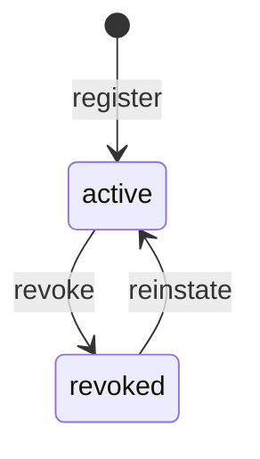

# Module 31: Identity and Access — Complete Module Specification

## Overview and Commercial Value

| Description | Inputs | Outputs | Value | Key Metrics |
|---|---|---|---|---|
| Authentication and role/scope-based access control, zero-trust agent identity | Credential/token, requested action | Auth decision, scoped token | Every agent and user individually accountable, not just a shared service account | Auth success rate, unauthorised attempts blocked |

## Differentiator Features

Baseline (table stakes): an identity registry with a role assignment
and a token-issuance endpoint.

What makes this module genuinely better:

- **Zero-trust actually means something here: revocation takes effect
  immediately, not at natural token expiry.** A bare JWT is valid until
  it expires no matter what happens to the identity that holds it —
  this module's `AuthorizationService.authorize` instead re-checks the
  issuing identity's *current* status against the live registry on
  every single call. Revoke an identity and every outstanding token it
  already holds stops authorizing on the very next request, not
  whenever it happens to expire. That live check is the actual
  difference between "zero trust" and "trust the signature."
- **Token issuance can only ever narrow, never grant.** `TokenService.
  issue` computes the union of scopes across an identity's assigned
  roles, intersects it with whatever scopes the caller requested, and
  mints a token carrying exactly that — never more than the identity
  actually holds, even if the caller asks for more. Least privilege as
  the literal intersection operation, not a policy document.
- **Two distinct secrets for two distinct trust boundaries, never
  conflated.** This module still protects its own inbound API with the
  platform-wide `TECTONIC_JWT_SHARED_SECRET` every module already
  shares (the coarse, module-to-module trust boundary) — but the
  fine-grained, per-identity tokens it issues for zero-trust
  agent-to-agent calls are signed with this module's own dedicated
  `token_signing_secret`. Compromising one secret never compromises the
  other.
- **Unauthorized attempts are a real, queryable audit trail, not just a
  counter.** Every `authorize` call — allowed or denied — is persisted,
  and every denial is also emitted as a real event to Auditability
  (Module 20)'s own `POST /v1/auditability/events`, the identical
  real-peer emission pattern this platform's earlier modules
  (Human Oversight, Sentinel Agents, Regulatory Compliance) already
  established. "Unauthorised attempts blocked," the LLD's own key
  metric, is something a security team can actually go query, not a
  number with no history behind it. A down Auditability peer never
  blocks the auth decision itself — the decision and its Prometheus
  counter are recorded regardless; only the audit emission degrades.

## Low-Level Design

### Level 1: Module Overview, Boundaries and Tech Stack

**Purpose.** The platform's identity registry and zero-trust
authorization layer: every user, agent and service gets its own
registered, individually-revocable identity (never a shared service
account), assigned one or more roles that bundle real scopes, and can
request a scoped token narrowed to the intersection of what it asked
for and what its roles actually grant. `authorize` is the one gate any
platform module can call to turn a token plus a required scope into a
real, live, auditable allow/deny decision.

**Chosen stack**

| Concern | Choice | Why |
|---|---|---|
| Language/runtime | Python 3.12, FastAPI, SQLAlchemy 2.0 async | Platform consistency |
| Token signing | `pyjwt`, HS256, this module's own dedicated `token_signing_secret` — deliberately distinct from the platform-wide `TECTONIC_JWT_SHARED_SECRET` | Two trust boundaries, two secrets; compromising the coarse platform secret never compromises per-identity tokens |
| Audit emission | Calls Auditability's real `POST /v1/auditability/events` on every denied `authorize` | Same "real peer, not invented" convention this platform already established, applied here to a genuine security signal |
| Storage | Postgres | Identities, roles, auth decision history |
| Testing | `pytest` unit tier against an in-memory fake; real-Postgres integration tier | Platform-standard pattern |

**Deployability and testability contract.** Runs standalone against
SQLite for unit tests; the dependency-stub plays Auditability's own
`POST /v1/auditability/events` so the denial-emission path is exercised
end to end without Auditability itself deployed alongside it. Token
signing/verification needs no external peer — it's pure, deterministic
cryptography, exercised directly against the real `JWTTokenSigner` in
every test tier, not a fake.

### Level 2: Component Architecture and Diagrams

```mermaid
flowchart TB
    subgraph Callers[Platform Modules / Operators]
        C1[Register identity, assign roles, request token]
        C2[Any module: authorize(token, required_scope)]
    end

    subgraph IdentityAccess[Identity and Access Module]
        API[FastAPI Layer]
        REG[Identity Registry Service]
        ROLE[Role Service]
        TOKEN[Token Service]
        AUTHZ[Authorization Service]
        SIGNER[JWT Token Signer]
        REPO[(Postgres — identities, roles, auth_decisions)]
    end

    AUDIT[Auditability<br/>Module 20]

    C1 -->|register/assign| API --> REG --> REPO
    C1 -->|create role| API --> ROLE --> REPO
    C1 -->|issue token| API --> TOKEN --> SIGNER
    TOKEN --> REPO
    C2 -->|authorize| API --> AUTHZ --> SIGNER
    AUTHZ --> REPO
    AUTHZ -->|on denial| AUDIT
```

**Sub-components**

| Component | Responsibility | Built on |
|---|---|---|
| Identity Registry Service | Register/revoke/reinstate identities; validates assigned role names exist | Own Postgres table |
| Role Service | Create/list roles, each a named bundle of real scope strings | Own Postgres table |
| Token Service | Issues a scoped token narrowed to `requested ∩ granted` | `security/token_signer.py`, Role Service |
| Authorization Service | Verifies a token, live-checks the issuing identity's current status, checks the required scope, persists and audits the decision | `security/token_signer.py`, `clients/auditability_client.py` |

### Level 3: Detailed Design

**Data model**

| Entity | Fields |
|---|---|
| `IdentityRecord` | `id`, `tenant_id`, `name`, `type` (`user`/`agent`/`service`), `status` (`active`/`revoked`), `role_names` (list of `RoleRecord.name`), `created_at`, `updated_at` |
| `RoleRecord` | `name` (primary key), `scopes` (list of scope strings, e.g. `agent-cards:read`), `description`, `created_at` |
| `AuthDecisionRecord` | `id`, `tenant_id`, `identity_id`, `required_scope`, `allowed`, `reason`, `checked_at` |

**API surface**

| Endpoint | Method | Notes |
|---|---|---|
| `/v1/identity-access/roles` | POST | Create a role: `{name, scopes, description}` |
| `/v1/identity-access/roles` | GET | Paginated |
| `/v1/identity-access/identities` | POST | Register: `{name, type, role_names}`, starts `active` |
| `/v1/identity-access/identities` | GET | Paginated, filterable by `tenant_id`/`status` |
| `/v1/identity-access/identities/{id}` | GET | Full detail |
| `/v1/identity-access/identities/{id}/revoke` | POST | `active → revoked` |
| `/v1/identity-access/identities/{id}/reinstate` | POST | `revoked → active` |
| `/v1/identity-access/tokens` | POST | `{identity_id, requested_scopes}` → `{token, granted_scopes}` |
| `/v1/identity-access/authorize` | POST | `{token, required_scope}` → `{allowed, reason}` — the one real gate other modules call |
| `/v1/identity-access/identities/{id}/auth-decisions` | GET | Paginated audit trail for one identity |

**The identity lifecycle state machine**



**The zero-trust authorize check.** Verify the token's signature and
expiry → decode `sub` (identity id) and `scopes` → look up that
identity **live**, right now, in the registry: missing or not `active`
is an immediate deny regardless of the token's own claims or remaining
lifetime → check `required_scope` is present in the token's `scopes` →
persist the decision → on deny, emit to Auditability and increment the
breach-style counter.

### Level 4: Telemetry, Logging, Tracing, Alerting, Configuration and Testing

**Tracing.** `identity_access.authorize` span per decision
(`identity_access.identity_id`, `identity_access.required_scope`,
`identity_access.allowed`).

**Logging.** `structlog` JSON; every denial and every `revoke` log at
`warning` — real security-relevant signals worth being able to audit,
in addition to the real event emitted to Auditability itself.

**Metrics (Prometheus)**

| Metric | Type | Labels |
|---|---|---|
| `identity_access_unauthorized_attempts_total` | Counter | `tenant_id`, `required_scope` (the LLD's own key metric, wired for real) |
| `identity_access_auth_decisions_total` | Counter | `allowed` (auth success rate = `allowed="True"` / total) |
| `identity_access_tokens_issued_total` | Counter | `tenant_id` |

**Alerting**

| Alert | Condition | Severity |
|---|---|---|
| IdentityAccessUnauthorizedAttemptsHigh | `identity_access_unauthorized_attempts_total` rate > 10 per minute, sustained 5m | Warning |
| IdentityAccessAuthSuccessRateLow | `allowed="True"` rate over total `identity_access_auth_decisions_total` < 50%, sustained 15m | Warning |

**Configuration**

```yaml
identity-access:
  tenant_id: "<tenant>"
  service_name: "identity-access"
  token_default_ttl_seconds: 3600
  auditability_base_url: "http://auditability:8090"
  jwt_shared_secret: "dev-insecure-shared-secret-change-me"  # env TECTONIC_JWT_SHARED_SECRET -- this module's own inbound protection
  token_signing_secret: "dev-insecure-token-signing-secret-change-me"  # env IDENTITY_ACCESS_TOKEN_SIGNING_SECRET -- distinct from the above; signs the scoped tokens this module issues
```

**Testing**

| Level | Tooling |
|---|---|
| Unit | `pytest` against the in-memory fake, incl. the token issuance's requested/granted intersection matrix, the live-revocation-check path, and the identity lifecycle's legal/illegal transitions as pure-function-shaped tests. `JWTTokenSigner` is exercised directly (real crypto, no fake needed) |
| Integration (isolated) | Real Postgres (dual-path fixture) |
| Contract | `schemathesis` against the REST surface |

**Non-functional targets**

| Attribute | Target |
|---|---|
| `authorize` latency (p95) | Under 50ms (a per-request hot-path check other modules are meant to call) |
| Availability | 99.95% |
