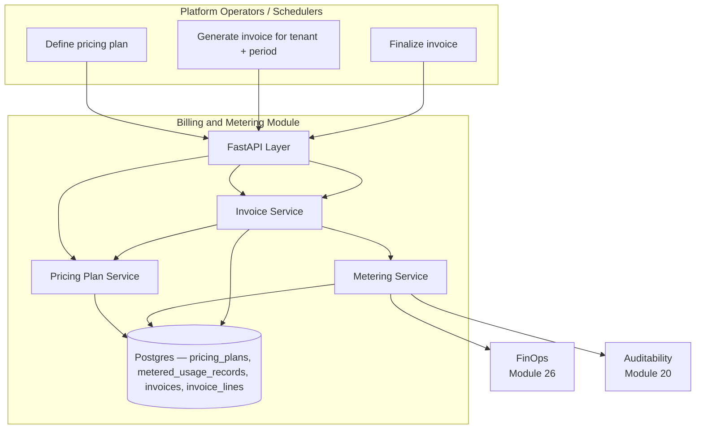

# Module 33: Billing and Metering — Complete Module Specification

## Overview and Commercial Value

| Description | Inputs | Outputs | Value | Key Metrics |
|---|---|---|---|---|
| Usage metering per module/tenant feeding subscription billing | Usage event, pricing plan | Metered usage record, invoice line | Makes the module-based subscription model real and defensible, not aspirational packaging | Metering accuracy, billing dispute rate |

## Differentiator Features

Baseline (table stakes): a per-tenant pricing plan and an invoice
generated from it.

What makes this module genuinely better:

- **Usage is metered from real platform signals, not a self-reported
  counter this module invents.** `MeteringService` reads the LLM
  dollar cost straight from FinOps (Module 26)'s own real `GET
  /v1/finops/cost-reports/{tenant_id}` — the same cost figure that
  module's own budget alerts are computed from — and reads per-module
  API usage as real event counts from Auditability (Module 20)'s own
  real `GET /v1/auditability/events?source_module=...`, using the
  `total` that endpoint already returns rather than paging through
  and counting events itself. Two already-built, independently
  audited modules are the metering source of truth; this module
  invents no usage-tracking pipeline of its own.
- **What gets metered is driven by the pricing plan, not a hardcoded
  module list.** A `PricingPlanRecord`'s `unit_prices` keys ARE the
  metered resources — `"llm.cost_usd"` is a special case read from
  FinOps, and every other key is treated as a real `source_module`
  name and metered as "how many events did that module emit to
  Auditability this period." Pricing a new module in is a plan edit,
  never a code change.
- **"Metering accuracy," the LLD's own key metric, is a real flag on
  every invoice, not an assumption.** If a metering source is down for
  part of a generation run, `InvoiceService.generate_invoice` still
  produces the invoice from what it *could* verify — but marks it
  `complete=False` rather than silently treating an unreachable peer's
  usage as zero. Insufficient data is surfaced, never fabricated as
  "no usage."
- **Invoices are a real one-way state machine, matching how invoicing
  actually works.** `DRAFT → FINALIZED` only — the same one-way
  `_LEGAL_TRANSITIONS` shape Secrets and Credential Management (Module
  32) established for its own revocation lifecycle, applied here
  because a finalized invoice being un-finalized is not a thing real
  billing systems do either.

## Low-Level Design

### Level 1: Module Overview, Boundaries and Tech Stack

**Purpose.** Turns real per-tenant usage signals already produced by
other platform modules into metered usage records against a pricing
plan, and rolls those into invoice lines and a total. Distinct from
FinOps (Module 26): that module tracks and *controls* LLM spend
(budgets, alerts, optimisation actions) for engineering/ops; this
module turns usage (LLM spend among it) into a *customer-facing
invoice* — it reads FinOps's numbers, it never recomputes them.

**Chosen stack**

| Concern | Choice | Why |
|---|---|---|
| Language/runtime | Python 3.12, FastAPI, SQLAlchemy 2.0 async | Platform consistency |
| LLM cost source | Calls FinOps's real `GET /v1/finops/cost-reports/{tenant_id}` | Same "real peer, not invented" convention; no second cost-computation pipeline |
| Other-usage source | Calls Auditability's real `GET /v1/auditability/events` (`source_module` filter, `total` in the response) | Every module already emits real events there; reusing that count avoids a second usage-tracking system |
| Storage | Postgres | Pricing plans, metered usage records, invoices, invoice lines |
| Testing | `pytest` unit tier against an in-memory fake; real-Postgres integration tier | Platform-standard pattern |

**Deployability and testability contract.** Runs standalone against
SQLite for unit tests; the dependency-stub plays both FinOps's `GET
/cost-reports/{tenant_id}` and Auditability's `GET /events` with
canned, controllable responses, so the full metering → invoice
generation path is exercised end to end without either real peer
deployed alongside it.

### Level 2: Component Architecture and Diagrams



**Sub-components**

| Component | Responsibility | Built on |
|---|---|---|
| Pricing Plan Service | Create/get/list pricing plans; resolve the active plan for a tenant (tenant-specific, falling back to the global default) | Own Postgres table |
| Metering Service | For each resource in a plan, pull real usage: FinOps for `llm.cost_usd`, Auditability event counts for everything else | `clients/finops_client.py`, `clients/auditability_client.py` |
| Invoice Service | Aggregate metered usage × unit price into invoice lines and a total; the draft → finalized lifecycle | Metering Service, Pricing Plan Service, own Postgres tables |

### Level 3: Detailed Design

**Data model**

| Entity | Fields |
|---|---|
| `PricingPlanRecord` | `id`, `tenant_id` (nullable — `None` is the global default plan), `name`, `unit_prices` (`dict[str, float]`, resource → price per unit), `created_at` |
| `MeteredUsageRecord` | `id`, `tenant_id`, `period`, `resource`, `quantity`, `source` (`"finops"`/`"auditability"`), `computed_at` |
| `InvoiceRecord` | `id`, `tenant_id`, `period`, `status` (`draft`/`finalized`), `total_amount`, `complete` (false if any metering source was unavailable), `generated_at`, `finalized_at` |
| `InvoiceLineRecord` | `id`, `invoice_id`, `resource`, `quantity`, `unit_price`, `amount` |

**API surface**

| Endpoint | Method | Notes |
|---|---|---|
| `/v1/billing/pricing-plans` | POST | `{tenant_id?, name, unit_prices}` — omit `tenant_id` for the global default plan |
| `/v1/billing/pricing-plans` | GET | Paginated, filterable by `tenant_id` |
| `/v1/billing/pricing-plans/{id}` | GET | |
| `/v1/billing/invoices/generate` | POST | `{tenant_id, period}` (`period`: `daily`/`monthly`, matching FinOps's own) → meters usage, creates a `draft` invoice + lines |
| `/v1/billing/invoices` | GET | Paginated, filterable by `tenant_id`/`status` |
| `/v1/billing/invoices/{id}` | GET | Includes lines |
| `/v1/billing/invoices/{id}/finalize` | POST | `draft → finalized`, one-way |
| `/v1/billing/usage-records` | GET | Paginated `MeteredUsageRecord` history, filterable by `tenant_id`/`period` |

**Metering path.** Resolve the tenant's active plan (tenant-specific,
else the global default; `404` if neither exists) → for each
`(resource, unit_price)` in the plan: `resource == "llm.cost_usd"`
calls FinOps's cost report and uses `total_cost`; anything else is
treated as a `source_module` name and calls Auditability's event list
with `limit=1` (only `total` is needed) scoped to the period → a
failed peer call skips that resource's usage record, logs a warning,
and flips the invoice's `complete` flag to `False` rather than
recording zero usage. Every resource that *did* meter successfully
still produces a real `MeteredUsageRecord` and its own invoice line —
one down peer degrades the invoice's completeness, never blocks
generation of the rest.

### Level 4: Telemetry, Logging, Tracing, Alerting, Configuration and Testing

**Tracing.** `billing.generate_invoice` span per generation
(`billing.tenant_id`, `billing.period`, `billing.complete`);
`billing.meter_resource` span per metered resource.

**Logging.** `structlog` JSON; a metering-source failure and every
`finalize` log at `warning`/`info` respectively — real signals worth
being able to audit.

**Metrics (Prometheus)**

| Metric | Type | Labels |
|---|---|---|
| `billing_invoices_generated_total` | Counter | `complete` (metering accuracy's raw signal) |
| `billing_period_revenue_usd` | Gauge | `tenant_id` (set from `total_amount` on every generation) |

**Alerting**

| Alert | Condition | Severity |
|---|---|---|
| BillingIncompleteInvoiceRateHigh | `billing_invoices_generated_total{complete="False"}` rate > 0 sustained 15m | Warning |

**Configuration**

```yaml
billing-and-metering:
  tenant_id: "<tenant>"
  service_name: "billing-and-metering"
  finops_base_url: "http://finops:8105"
  auditability_base_url: "http://auditability:8090"
  jwt_shared_secret: "dev-insecure-shared-secret-change-me"  # env TECTONIC_JWT_SHARED_SECRET
```

**Testing**

| Level | Tooling |
|---|---|
| Unit | `pytest` against the in-memory fake, incl. the metering allow/degrade matrix, the draft→finalized one-way transition, and invoice-total computation as pure-function-shaped tests |
| Integration (isolated) | Real Postgres (dual-path fixture) |
| Contract | `schemathesis` against the REST surface |

**Non-functional targets**

| Attribute | Target |
|---|---|
| `generate_invoice` latency (p95) | Under 500ms per metered resource (bounded by FinOps/Auditability round trips) |
| Availability | 99.9% |
