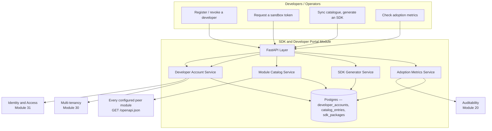

# Module 34: SDK and Developer Portal — Complete Module Specification

## Overview and Commercial Value

| Description | Inputs | Outputs | Value | Key Metrics |
|---|---|---|---|---|
| Client SDKs, API documentation, sandbox environment for customer developers | Developer account, API usage | SDK packages, documentation, sandbox access | The actual driver of adoption; without this every integration is a bespoke project, which kills the subscription model | SDK adoption rate, time-to-first-successful-call, support ticket volume |

## Differentiator Features

Baseline (table stakes): a developer account, a sandbox tenant, and a
downloadable SDK.

What makes this module genuinely better:

- **A developer's sandbox is a real tenant, not a fenced-off toy.**
  `DeveloperAccountService.register` composes two already-built real
  peers on every registration: Identity and Access (Module 31)'s own
  real `POST /v1/identity-access/identities` (`type="user"`) and
  Multi-tenancy (Module 30)'s own real `POST /v1/multi-tenancy/tenants`
  (`tier="sandbox"` — reusing that module's existing `tier` field as
  the real, queryable signal that separates trial tenants from paying
  ones, rather than inventing a second sandbox-tracking system). A
  developer's sandbox token is minted on demand by calling Identity and
  Access's own real `POST /v1/identity-access/tokens` — this module
  never mints or caches a token itself.
- **The SDK catalogue is generated from every peer module's own real,
  live OpenAPI spec, not hand-maintained docs that drift.**
  `ModuleCatalogService.sync_catalog` calls each configured peer's real
  `GET /openapi.json` (behind the same `ServiceAuthMiddleware` every
  other inter-module call in this platform goes through — even
  fetching docs respects the platform's real security model) and
  `SdkGeneratorService.generate_sdk` deterministically turns that real
  spec's `paths` into a minimal, real, working Python client — the
  same spec a developer's browser would see at that module's own
  `/docs`.
- **Regeneration is idempotent, keyed off the spec's own content.**
  Every generated SDK is stamped with a hash of the exact spec JSON it
  came from; re-running `generate_sdk` against an unchanged spec
  returns the existing package instead of manufacturing SDK churn a
  developer never asked for.
- **"Time-to-first-successful-call," the LLD's own key metric, is
  computed from Auditability's own real event history, not
  self-reported.** `AdoptionMetricsService` finds the developer
  sandbox tenant's oldest real event via Auditability (Module 20)'s
  own real `GET /v1/auditability/events` (`total` plus a targeted
  `offset` read, not a full page scan) and diffs it against the
  account's real registration timestamp. A developer with zero
  recorded activity gets `None`, never a fabricated zero.
- **Honest about what this module cannot measure.** "Support ticket
  volume" is the module table's third key metric — this platform has
  no support-ticketing module, so this LLD does not invent one to fill
  the gap. Two of the three key metrics are real; the third is
  explicitly out of scope rather than faked.

## Low-Level Design

### Level 1: Module Overview, Boundaries and Tech Stack

**Purpose.** The platform's developer-facing front door: register a
developer, provision them a real sandbox tenant, generate a working
client SDK from a real peer module's live API surface, and report on
real adoption signals. Distinct from Identity and Access and
Multi-tenancy themselves: this module never reimplements identity or
tenancy — it is a thin, real orchestration layer over both, plus the
one genuinely new capability (SDK generation) neither of them owns.

**Chosen stack**

| Concern | Choice | Why |
|---|---|---|
| Language/runtime | Python 3.12, FastAPI, SQLAlchemy 2.0 async | Platform consistency |
| Sandbox provisioning | Calls Identity and Access's real `POST /identities` + Multi-tenancy's real `POST /tenants` | Same "real peer, not invented" convention this platform already established; no second identity/tenancy system |
| Sandbox tokens | Calls Identity and Access's real `POST /tokens` on demand | Tokens stay ephemeral and peer-issued; this module never mints or stores one itself |
| SDK source | Every configured peer's real, live `GET /openapi.json` | The exact spec a developer's browser sees at that module's own `/docs` — never hand-maintained, never drifts |
| Adoption signal | Calls Auditability's real `GET /v1/auditability/events` | Same real-peer read pattern Billing and Metering (Module 33) established for its own usage metering |
| Storage | Postgres | Developer accounts, module catalogue entries, generated SDK packages |
| Testing | `pytest` unit tier against an in-memory fake; real-Postgres integration tier | Platform-standard pattern |

**Deployability and testability contract.** Runs standalone against
SQLite for unit tests; the dependency-stub plays Identity and Access's
`POST /identities`/`POST /tokens`, Multi-tenancy's `POST /tenants`,
Auditability's `GET /events`, and a real minimal `GET /openapi.json`
of its own, so the full register → sync-catalogue → generate-SDK →
adoption-metric path is exercised end to end without any real peer
deployed alongside it.

### Level 2: Component Architecture and Diagrams



**Sub-components**

| Component | Responsibility | Built on |
|---|---|---|
| Developer Account Service | Register/revoke developers, provision their sandbox, issue sandbox tokens on demand | `clients/identity_access_client.py`, `clients/multi_tenancy_client.py` |
| Module Catalog Service | Sync every configured peer's real OpenAPI spec into a local, queryable catalogue | `clients/module_spec_client.py` |
| SDK Generator Service | Deterministically turn a catalogued spec into a real, minimal client, idempotently keyed on spec hash | Own Postgres table |
| Adoption Metrics Service | Time-to-first-successful-call and portal-wide adoption rate, from real Auditability history | `clients/auditability_client.py` |

### Level 3: Detailed Design

**Data model**

| Entity | Fields |
|---|---|
| `DeveloperAccountRecord` | `id`, `name`, `email`, `tenant_id` (the real Multi-tenancy sandbox), `identity_id` (the real Identity and Access identity), `status` (`active`/`revoked`), `created_at`, `updated_at` |
| `ModuleCatalogEntryRecord` | `module_name`, `base_url`, `title`, `version`, `path_count`, `spec_json`, `spec_hash`, `last_synced_at` |
| `SdkPackageRecord` | `id`, `module_name`, `language`, `version` (int, incrementing per module+language), `source_code`, `spec_hash`, `generated_at` |

**API surface**

| Endpoint | Method | Notes |
|---|---|---|
| `/v1/sdk-portal/developers` | POST | `{name, email, role_names?}` → registers a real Identity and Access identity + a real Multi-tenancy sandbox tenant |
| `/v1/sdk-portal/developers` | GET | Paginated, filterable by `status` |
| `/v1/sdk-portal/developers/{id}` | GET | |
| `/v1/sdk-portal/developers/{id}/revoke` | POST | `active → revoked`, one-way; also calls Identity and Access's real revoke |
| `/v1/sdk-portal/developers/{id}/token` | POST | `{requested_scopes?}` → proxies Identity and Access's real `POST /tokens` for this developer's identity |
| `/v1/sdk-portal/catalog/sync` | POST | Fetches every configured peer's real `/openapi.json`, upserts the catalogue |
| `/v1/sdk-portal/catalog` | GET | Paginated catalogue listing |
| `/v1/sdk-portal/catalog/{module_name}` | GET | One entry, incl. `path_count`/`version` |
| `/v1/sdk-portal/sdks/generate` | POST | `{module_name, language}` → generates (or returns the existing, spec-hash-matched) SDK package |
| `/v1/sdk-portal/sdks` | GET | Paginated, filterable by `module_name`/`language` |
| `/v1/sdk-portal/sdks/{id}` | GET | Includes `source_code` |
| `/v1/sdk-portal/developers/{id}/adoption` | GET | `{first_call_at, time_to_first_call_seconds}` — `null` fields if no activity yet |
| `/v1/sdk-portal/adoption-rate` | GET | `{adopted_count, total_developers, rate}` — `rate` is `null` with zero developers |

**Time-to-first-successful-call, precisely.** `total` is read from a
`limit=1, offset=0` call to Auditability's events endpoint for the
developer's sandbox `tenant_id`. `total == 0` → `None`. Otherwise a
second call with `limit=1, offset=total-1` reads the single oldest
event directly (Auditability's own list order is newest-first,
platform-wide) — no page-size assumption, no full-history scan.

### Level 4: Telemetry, Logging, Tracing, Alerting, Configuration and Testing

**Tracing.** `sdk_portal.register_developer` span per registration;
`sdk_portal.sync_catalog` span per sync (`sdk_portal.module_count`);
`sdk_portal.generate_sdk` span per generation
(`sdk_portal.module_name`, `sdk_portal.language`, `sdk_portal.reused`).

**Logging.** `structlog` JSON; a failed catalogue sync for any one peer
and every `revoke` log at `warning`/`info` respectively.

**Metrics (Prometheus)**

| Metric | Type | Labels |
|---|---|---|
| `sdk_portal_developers_registered_total` | Counter | — |
| `sdk_portal_sdk_generations_total` | Counter | `outcome` (`success`/`failure`) |
| `sdk_portal_adoption_rate` | Gauge | — (portal-wide; set on every `/adoption-rate` read) |

**Alerting**

| Alert | Condition | Severity |
|---|---|---|
| SdkPortalAdoptionRateLow | `sdk_portal_adoption_rate` < 0.3, sustained 24h | Warning |
| SdkPortalGenerationFailureRateHigh | `sdk_portal_sdk_generations_total{outcome="failure"}` rate > 0, sustained 15m | Warning |

**Configuration**

```yaml
sdk-and-developer-portal:
  tenant_id: "<tenant>"
  service_name: "sdk-and-developer-portal"
  identity_access_base_url: "http://identity-and-access:8110"
  multi_tenancy_base_url: "http://multi-tenancy:8109"
  auditability_base_url: "http://auditability:8090"
  catalog_targets:
    - name: "auditability"
      base_url: "http://auditability:8090"
  jwt_shared_secret: "dev-insecure-shared-secret-change-me"  # env TECTONIC_JWT_SHARED_SECRET
```

**Testing**

| Level | Tooling |
|---|---|
| Unit | `pytest` against the in-memory fake, incl. the catalogue-sync/spec-hash idempotency matrix, the SDK-generation determinism check, the developer revoke one-way transition, and the time-to-first-call `total`/`offset` computation as pure-function-shaped tests |
| Integration (isolated) | Real Postgres (dual-path fixture) |
| Contract | `schemathesis` against the REST surface |

**Non-functional targets**

| Attribute | Target |
|---|---|
| `register` latency (p95) | Under 800ms (two real peer round trips) |
| Availability | 99.5% |
