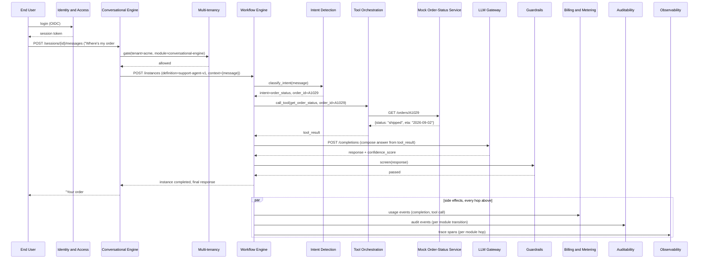

# Phase 2 Product Slice 1: Tenant Support Agent — Design Doc

## Why this slice, why now

The independent architecture assessment that scored this repository
recommended a sequenced "platform kernel, then product slices" build
order (see root `README.md`'s "Platform-kernel hardening" section).
Phase 1 built all 34 modules and closed the assessment's own
highest-severity kernel findings; Phase 2 closed the deliberate
sub-gaps those fixes had left open (real SAML, cascading offboarding,
optimistic concurrency, residency enforcement, quota pre-flight
wiring, the event backbone, and OpenAPI contract testing — tickets
#74-80). Every one of those was still kernel work: one module, or one
peer-to-peer contract, made real. None of them proves the platform
can do the thing it exists to do — carry a real end user's request
through a real multi-module agentic pipeline and produce a correct,
governed, billed, audited answer.

This doc is that proof's design. It picks one concrete, realistic
product scenario — a tenant's customer support agent — and specifies
exactly which of this platform's already-real module capabilities it
exercises, in what order, against what new (small) integration glue,
and what "this genuinely works end-to-end" means in verifiable terms.
Ticket #82 builds and verifies it against this spec.

## Why a support agent

Of the platform's 34 modules, a support agent is the smallest concrete
scenario that still touches nearly every one of them for a real
reason, not a contrived one:

- It needs multi-turn dialogue (Conversational Engine), not a single
  completion.
- It needs to actually answer from real tenant knowledge (Agentic
  RAG / Knowledge Base / Vector DB), not just the model's own
  training data.
- It needs to actually *do* something (look up an order), not just
  talk — a real Tool Orchestration call against a real (if mocked)
  external system.
- It has a genuine, real reason to escalate to a human (a refund
  request above a threshold, a low-confidence answer) — Human
  Oversight isn't decorative here.
- It is exactly the kind of interaction Guardrails, Billing, Identity
  and Access, Auditability, and Observability all exist to govern in
  production, so the slice proves those integrations for real rather
  than only at the level of one module's own unit tests.

A simpler slice (a single-turn Q&A bot) would leave Workflow Engine's
own orchestration, Human Oversight's escalation, and Tool
Orchestration's tool-calling all unexercised. A larger one (a
multi-agent research assistant, say) would take materially longer to
build without proving anything more about the kernel's own
readiness. Support agent is the right first slice.

## The scenario

**Tenant**: "Acme Corp", a mid-tier subscriber (the `Growth` plan
already seeded by `scripts/seed_subscription_tiers.py`) selling a
consumer product with online orders.

**End user**: an Acme Corp customer, authenticated against Acme's own
tenant realm via Identity and Access.

Three concrete conversations define "done" for this slice — each one
is a specific, scripted, reproducible transcript ticket #82 must be
able to run against the real, running module stack and get a correct
outcome for:

1. **Answered from knowledge, no tool, no escalation.**
   *"What's your return policy?"* → Agentic RAG retrieves the
   indexed return-policy document from Knowledge Base/Vector DB, the
   agent answers directly, Guardrails passes it, no human touches it.

2. **Answered via a tool call, no escalation.**
   *"Where's my order #A1029?"* → Intent Detection classifies this as
   an order-status intent, Tool Orchestration calls a real
   `get_order_status` tool (backed by a small mock order-status
   service — the one deliberately-new piece of infrastructure this
   slice adds, see below), the agent answers with the real tool
   result.

3. **Escalated to a human.**
   *"I want a refund for order #A1029, it's $850."* → the agent
   recognizes this exceeds Acme's configured auto-resolution
   threshold (a refund amount, not a confidence score, is the
   trigger here — a deliberately different escalation path than
   Workflow Engine's own confidence-gated one, see "Escalation
   trigger" below), pauses, and a human reviewer resolves it through
   Human Oversight's own real approval flow; the conversation then
   continues with the resolution relayed back to the user.

Every one of these three is a real HTTP conversation against real,
running module instances — no module response is mocked or
hand-assembled for the demo. The one piece of mocked infrastructure
(the order-status backend) is mocked because it represents a system
outside this platform's own 34 modules (a real merchant's own order
system), not because any platform module's own logic is faked.

## Module roles

Every module below is already built and already does real work; this
slice's job is to prove they compose, not to add capability to any of
them. Where a module needs new configuration (not new code) to
participate, that's noted.

| # | Module | Role in this slice |
|---|---|---|
| 31 | Identity and Access | Authenticates the end user (OIDC), issues the session token the Conversational Engine's own API requires |
| 30 | Multi-tenancy | `gate()`/`EntitlementGateMiddleware` on every module call; Acme Corp is a real seeded tenant with real entitlements including this slice's modules |
| 2 | Conversational Engine | Owns the multi-turn session, channel adaptation (this slice demos the web channel only), routes each turn into Workflow Engine |
| 1 | Workflow Engine | Orchestrates the per-turn pipeline: intent → retrieve-or-tool-call → guardrail → respond-or-escalate (the workflow definition this slice adds — see below) |
| 5 | Intent Detection | Classifies each user turn (`policy_question`, `order_status`, `refund_request`, ...) |
| 6 | Agentic RAG | Retrieves relevant chunks for `policy_question` turns |
| 9 | Knowledge Base | Owns Acme's indexed support documents (return policy, shipping FAQ) that Agentic RAG queries against |
| 10 | Vector DB | Backs Knowledge Base's real embedding storage/retrieval (ticket #78's own `vector_count` quota pre-flight fires for real here) |
| 4 | Tool Orchestration | Calls the real `get_order_status` tool for `order_status` turns |
| 3 | LLM Gateway | The only path to the model provider for every completion this slice makes — virtual key, budget policy, and (ticket #78) `requests_per_minute` quota pre-flight all real |
| 14 | Guardrails | Screens every agent response before it reaches the user |
| 16 | Human Oversight | Owns the real approval queue and decision callback for escalated refund requests |
| 33 | Billing and Metering | Meters real usage (completions, tool calls) against Acme's real `Growth` plan |
| 20 | Auditability | Receives a real audit event for every module transition this slice triggers (already wired platform-wide; nothing new here — this slice is what proves the existing wiring produces a coherent trail for one real interaction, not just isolated per-module events) |
| 19 | Observability | Carries one real distributed trace per conversation turn across every module hop above |

Modules deliberately **not** in this slice's critical path (a scoping
choice, not an oversight): Context Engineering, Data Source Plugins,
Graph DB, Short/Long-Term Memory, Sentinel Agents, Regulatory
Compliance, Evaluation Framework, MCP, A2A, Agent Cards, Agent
Marketplace, LLMOps, FinOps, Deployment Strategy, Multi-modality,
PromptOps, Secrets and Credential Management, SDK and Developer
Portal. Several of these are natural candidates for a *second* product
slice (Agent Marketplace + Agent Cards + A2A point at a multi-agent
scenario; SDK and Developer Portal points at a third-party-integration
scenario) — deliberately out of scope for the first one, which is
sized to prove the kernel works, not to exercise every module at once.

## New integration glue this slice adds

Every module keeps its own existing API surface unchanged. What's
genuinely new:

1. **A demo tenant and seed data.** Acme Corp: a real tenant
   (Multi-tenancy), a real `Growth`-plan entitlement set (already
   seedable via the existing `scripts/seed_subscription_tiers.py`), a
   real end-user identity (Identity and Access), and a real indexed
   knowledge base (2-3 short support documents, Knowledge Base/Vector
   DB) — a new `scripts/seed_support_agent_demo.py`, following the
   same "seed against real running module APIs" pattern
   `seed_subscription_tiers.py` already established, not a new
   fixtures format.

2. **One real Workflow Engine definition**: `support-agent-v1`, the
   DAG described in the sequence diagram below. This is real
   configuration (a `WorkflowDefinition.graph_schema` document posted
   to Workflow Engine's own `POST /definitions`), not new Workflow
   Engine code — the module's own symbolic/neural step routing and
   confidence-gated autonomy already do everything this definition
   needs.

3. **One small mock order-status service.** A minimal HTTP stub
   (mirroring this platform's own `stubs/dependency-stub` shape and
   conventions) returning canned order records for a handful of
   fixture order IDs — standing in for a real merchant's own backend,
   which is genuinely outside this platform's scope. Tool
   Orchestration calls it exactly the way it would call any real
   external tool.

4. **The refund-threshold escalation rule.** Workflow Engine's own
   confidence-gated autonomy (`defaultConfidenceThreshold`) already
   escalates *low-confidence* neural steps to Human Oversight; this
   slice's refund scenario escalates on a *business rule*
   (`refund_amount > tenant_configured_threshold`) instead, which is
   a symbolic step in the `support-agent-v1` definition evaluating
   the extracted refund amount, not a new capability anywhere in the
   kernel — Workflow Engine's own symbolic executor already handles
   arbitrary rule steps, this is just the first one this platform
   actually configures end-to-end.

Nothing above touches a module's own `core/` logic. If ticket #82 finds
that it does — if making this slice work for real surfaces a genuine
module-level gap — that finding gets fixed at the module level (the
same "reference implementation" discipline this session's whole
Phase 1/2 work already followed), not worked around in the glue layer.

## Sequence: one full turn (order-status case)

The refund scenario's own sequence is identical through
`WE->>ID: classify_intent` (intent=`refund_request`), then diverges:
`support-agent-v1`'s symbolic step evaluates the extracted refund
amount against Acme's configured threshold, and for the $850 case
routes to Human Oversight exactly the way Module 1's own LLD sequence
diagram (`docs/module-01-workflow-engine-lld.md` §3.4) already
documents for a confidence-gated pause — the same
`WorkflowInstance.paused_for_approval` → `POST
/oversight/requests` → reviewer decision → callback → resume
mechanism, driven here by a business-rule gate instead of a
confidence score.

## Definition of done (ticket #82)

All of the following, against real running instances of every module
in the table above (docker-compose or equivalent, real Postgres/Redis/
Qdrant/Kafka where each module's own README already calls for them —
no module's own dependency-stub substituted for a peer that's actually
in this slice's critical path):

1. `scripts/seed_support_agent_demo.py` runs cleanly and produces a
   real Acme Corp tenant, entitlements, end-user identity, and
   indexed knowledge base, verifiable by querying each owning
   module's own real API afterward.
2. The `support-agent-v1` workflow definition is postable to Workflow
   Engine's real `POST /definitions` and passes its own real graph
   validation.
3. All three scripted conversations above run end-to-end against the
   real stack and produce the specified correct outcome, captured as
   a real integration test (`tests/product-slices/test_support_agent.py`
   or equivalent, new — this is the one net-new automated test this
   slice adds, exercising the real HTTP surface of every module in
   the table, not each module's own existing unit/integration/contract
   tiers, which stay exactly as they are).
4. Auditability shows a real, coherent event trail for at least one
   full conversation (queryable by its own real
   `GET /v1/auditability/events` or equivalent) — a human reading it
   can reconstruct what happened without reading application logs.
5. Observability shows one real distributed trace spanning every
   module hop for at least one full conversation.
6. Billing and Metering shows real, non-zero usage recorded against
   Acme Corp's own account for the conversations run.
7. The refund scenario's escalation actually reaches a human
   reviewer's real queue in Human Oversight, and the reviewer's real
   decision resumes the conversation correctly.

Any of the above that turns up a genuine module-level gap gets fixed
at that module (with real tests, matching this session's own
established discipline), documented in that module's own README the
same way tickets #74-80 already are, before ticket #82 is considered
complete.

## What this slice deliberately does not cover

- **Multi-channel.** Conversational Engine's own WhatsApp/voice
  adaptation is real and already built, but this slice demos the web
  channel only — channel adaptation for this exact scenario is real,
  low-risk follow-up, not a kernel question.
- **A second tenant / cross-tenant isolation proof.** Multi-tenancy's
  own isolation probe already proves this platform-wide; re-proving
  it via this specific slice would duplicate, not extend, existing
  coverage.
- **A UI.** This slice is proven via the real HTTP APIs and the
  integration test in "Definition of done" above; a demo front-end is
  real, separately-scoped follow-up work (and the natural place SDK
  and Developer Portal's own public API surface gets its first real
  exercise), not required to prove the kernel.
- **Load/scale characteristics.** This slice proves correctness end-
  to-end, not throughput; that's Observability's own SLO tooling and
  a real load-test tier's job, out of scope here.
